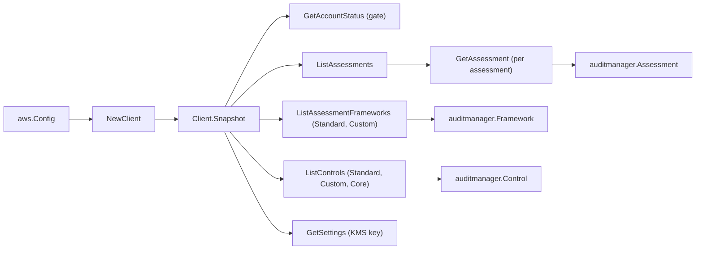

# AWS Audit Manager SDK Adapter

## Purpose

`internal/collector/awscloud/services/auditmanager/awssdk` adapts AWS SDK for Go
v2 Audit Manager responses to the scanner-owned `Client` contract. It owns the
account-status gate, assessment pagination plus per-assessment `GetAssessment`
detail, framework pagination across framework types, control pagination across
control types, the account-level settings KMS-key read, throttle classification,
and per-call AWS API telemetry.

## Ownership boundary

This package owns SDK calls for Audit Manager. It does not own workflow claims,
credential acquisition, Audit Manager fact selection, graph writes, reducer
admission, or query behavior.

## Exported surface

See `doc.go` for the godoc contract.

- `Client` - AWS SDK-backed implementation of `auditmanager.Client`.
- `NewClient` - builds a `Client` for one claimed AWS boundary.

## Dependencies

- `internal/collector/awscloud` for account, region, and service boundary labels
  plus the API-call event recorder.
- `internal/collector/awscloud/services/auditmanager` for scanner-owned result
  types.
- `internal/telemetry` for AWS API call and throttle instruments.
- AWS SDK for Go v2 `auditmanager` and Smithy error contracts.

## Telemetry

Audit Manager paginator pages and point reads are wrapped with:

- `aws.service.pagination.page`
- `eshu_dp_aws_api_calls_total`
- `eshu_dp_aws_throttle_total`

Metric labels stay bounded to service, account, region, operation, and result.
Audit Manager ARNs, names, and raw AWS error payloads stay out of metric labels.

## Gotchas / invariants

- `Snapshot` gates on `GetAccountStatus`. An account whose status is not `ACTIVE`,
  or whose status read returns AccessDenied/ResourceNotFound, yields an empty
  result with an `auditmanager_not_registered` warning rather than a scan
  failure.
- The adapter reads metadata only. It must never call `GetEvidence` or any
  evidence reader, `GetEvidenceFolder`, `GetChangeLogs`, `GetDelegations`,
  `GetAssessmentReportUrl`, `GetControl` (the control narrative), any insights
  reader, or any mutation API. The `exclusion_test` reflects over the
  `apiClient` interface and fails the build if one is added.
- `ListAssessmentFrameworks` requires a framework-type filter and `ListControls`
  requires a control-type filter; the adapter iterates every enum value to
  enumerate frameworks and controls to exhaustion.
- A denied or missing `GetSettings` read degrades to no KMS edge, not a scan
  failure.
- SDK adapters translate AWS records into scanner-owned types; scanner tests
  should not mock AWS SDK pagination.

## Related docs

- `docs/public/services/collector-aws-cloud-scanners.md`
- `docs/public/services/collector-aws-cloud-security.md`
