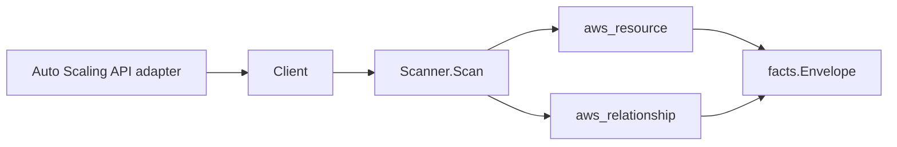

# AWS EC2 Auto Scaling Scanner

## Purpose

`internal/collector/awscloud/services/autoscaling` owns the EC2 Auto Scaling
scanner contract for the AWS cloud collector. It converts Auto Scaling groups,
launch configurations, scaling policies, lifecycle hooks, and scheduled actions
into `aws_resource` facts and emits relationship evidence for
group-to-launch-template, group-to-launch-configuration, group-to-subnet,
group-to-target-group, group-to-IAM-service-linked-role, policy-to-group,
lifecycle-hook-to-group, and scheduled-action-to-group dependencies.

This is the Tier 1 dangling-edge closer for issue #830: the Auto Scaling group
resource_id is the bare group name, which is the exact join key the CodeDeploy
scanner (`codedeploy_deployment_group_targets_auto_scaling_group`) targets, so
those edges resolve to the group resources this scanner emits.

## Ownership boundary

This package owns scanner-level Auto Scaling fact selection and identity
mapping. It does not own AWS SDK pagination, STS credentials, workflow claims,
fact persistence, graph writes, reducer admission, or query behavior.

## Exported surface

See `doc.go` for the godoc contract.

- `Client` - metadata-only Auto Scaling read surface consumed by `Scanner`. It
  exposes no CreateAutoScalingGroup, UpdateAutoScalingGroup,
  DeleteAutoScalingGroup, SetDesiredCapacity,
  TerminateInstanceInAutoScalingGroup, or any other mutation/capacity-control
  operation, and it never reads launch configuration or launch template
  UserData.
- `Scanner` - emits Auto Scaling group, launch-configuration, scaling-policy,
  lifecycle-hook, scheduled-action, and relationship facts for one boundary.
- `Group`, `LaunchConfiguration`, `ScalingPolicy`, `LifecycleHook`, and
  `ScheduledAction` - scanner-owned metadata representations. Launch
  configuration UserData and other launch detail are absent by design.

## Dependencies

- `internal/collector/awscloud` for boundaries, resource constants,
  relationship constants, and envelope builders.
- `internal/facts` for emitted fact envelope kinds.

The package depends on a small `Client` interface rather than the AWS SDK for
Go v2 so tests can use fake clients and the runtime adapter can own SDK
behavior.

## Telemetry

This scanner emits no spans or logs directly. `awsruntime.ClaimedSource`
records scan duration and emitted resource/relationship counts after
`Scanner.Scan` returns. Resource counts surface through
`eshu_dp_aws_resources_emitted_total{service="autoscaling"}` with the existing
per-resource `resource_type` label. The `awssdk` adapter records Auto Scaling
API call counts, throttles, and pagination spans.

## Gotchas / invariants

- The Auto Scaling group resource_id is the bare group name (not the ARN). This
  matches the CodeDeploy scanner's `target_resource_id` for
  `codedeploy_deployment_group_targets_auto_scaling_group`, so those edges
  resolve. Do not change the resource_id to the ARN without re-checking the
  CodeDeploy edge form.
- Launch configuration facts carry identity only. UserData, block device
  mappings, security groups, key name, and instance profile are never
  persisted. The scanner-owned `LaunchConfiguration` type declares only `ARN`
  and `Name`, so a UserData leak does not compile.
- Lifecycle hook facts omit `NotificationMetadata` because it can carry
  caller-supplied free-form data; only the transition, target, role, and
  timeout metadata are emitted.
- The scanner never mutates an Auto Scaling resource and never sets desired
  capacity or terminates instances; the adapter read surface excludes those
  operations by construction, proven by a reflective guard test.
- Every relationship sets a non-empty `target_type` matching the target
  scanner's `resource_id` form: launch templates target `aws_ec2_launch_template`
  (launch template ID, falling back to name), launch configurations target
  `aws_autoscaling_launch_configuration` (name), subnets target `aws_ec2_subnet`
  (bare subnet ID parsed from VPCZoneIdentifier), target groups target
  `aws_elbv2_target_group` (target group ARN), service-linked roles target
  `aws_iam_role` (role ARN), and policy/hook/scheduled-action edges target
  `aws_autoscaling_group` (group name).
- The scanner stops on client errors and wraps them with `%w`. Runtime adapters
  decide whether an AWS service error is retryable, terminal, or a warning fact.

## Evidence

Collector Performance Evidence: `go test ./internal/collector/awscloud/services/autoscaling/...`
covers the bounded Auto Scaling metadata path: one paginated
DescribeAutoScalingGroups stream, one paginated DescribeLaunchConfigurations
stream, one paginated DescribePolicies stream, one paginated
DescribeScheduledActions stream, and a per-group DescribeLifecycleHooks call
(DescribeLifecycleHooks is not paginated by AWS). No mutation or
capacity-control API is reachable, and the collector performs no graph writes.

No-Regression Evidence: `go test ./cmd/collector-aws-cloud ./internal/collector/awscloud/...`
covers Auto Scaling group, launch-configuration, scaling-policy,
lifecycle-hook, and scheduled-action fact emission, every relationship's
non-empty target type and grepped join key, the bare-group-name resource_id
that closes the CodeDeploy dangling edge, structural absence of launch
configuration UserData and lifecycle-hook notification metadata, runtime
registration, and command configuration. The SDK adapter reflection contract
test proves the mutation and capacity-control APIs are unreachable.

Collector Observability Evidence: Auto Scaling uses the existing AWS collector
`aws.service.pagination.page` span plus `eshu_dp_aws_api_calls_total`,
`eshu_dp_aws_throttle_total`,
`eshu_dp_aws_resources_emitted_total{service="autoscaling"}`,
`eshu_dp_aws_relationships_emitted_total`, and `aws_scan_status` rows. Metric
labels stay bounded to service, account, region, operation, result, and
resource type.

No-Observability-Change: the existing AWS collector telemetry contract already
diagnoses Auto Scaling scans through `aws.service.scan`,
`aws.service.pagination.page`, API/throttle counters, resource/relationship
counters, and `aws_scan_status`. No new instrument or label was added.

Collector Deployment Evidence: Auto Scaling runs inside the existing hosted
`collector-aws-cloud` runtime, so `/healthz`, `/readyz`, `/metrics`, and
`/admin/status` stay covered by the command wiring and Helm collector runtime.

## Related docs

- `docs/public/services/collector-aws-cloud.md`
- `docs/public/services/collector-aws-cloud-scanners.md`
- `docs/public/guides/collector-authoring.md`
