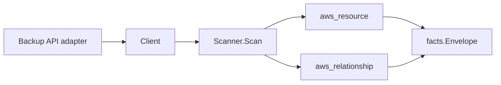

# AWS Backup Scanner

## Purpose

`internal/collector/awscloud/services/backup` owns the AWS Backup scanner
contract for the AWS cloud collector. It converts AWS Backup metadata into
`aws_resource` facts and emits relationship evidence for plan-to-selection,
selection-to-resource, selection-to-IAM-role, vault-to-KMS-key,
recovery-point-to-vault, recovery-point-to-source-resource, and
framework-to-control links.

## Ownership boundary

This package owns scanner-level Backup fact selection and identity mapping. It
does not own AWS SDK pagination, STS credentials, workflow claims, fact
persistence, graph writes, reducer admission, or query behavior.

## Exported surface

See `doc.go` for the godoc contract.

- `Client` - minimal AWS Backup metadata read surface consumed by `Scanner`.
- `Scanner` - emits Backup metadata facts for one boundary.
- `Vault`, `Plan`, `PlanRule`, `Selection`, `TagCondition`, `RecoveryPoint`,
  `ReportPlan`, `RestoreTestingPlan`, `Framework`, `FrameworkControl` -
  scanner-owned AWS Backup metadata records.

## Dependencies

- `internal/collector/awscloud` for boundaries, resource constants,
  relationship constants, and envelope builders.
- `internal/facts` for emitted fact envelope kinds.

The package depends on a small `Client` interface rather than the AWS SDK for
Go v2 so tests can use fake clients and runtime adapters can own SDK
behavior.

## Telemetry

This scanner emits no spans or logs directly. `awsruntime.ClaimedSource`
records scan duration and emitted resource counts after `Scanner.Scan`
returns. The `awssdk` adapter records AWS Backup API call counts, throttles,
and pagination spans.

## Security invariants

- Vault access policy bodies are NEVER persisted. The scanner records only a
  `has_access_policy` boolean.
- Recovery point CONTENTS are NEVER read. Only identity and timing metadata
  is persisted.
- Recovery-point restore metadata
  (`GetRecoveryPointRestoreMetadata`) is NEVER read; the API can echo
  source-resource configuration values.
- Framework control input parameter VALUES are NEVER persisted because they
  may carry compliance-sensitive scope data. The scanner records only the
  control name and a compact scope summary (compliance resource type list,
  tag key list, scope resource count).
- Mutation APIs are unreachable. The `Client` interface exposes only `List*`
  reads; mutation verbs (Create/Update/Delete vault/plan/selection/report
  plan/restore testing plan/framework, StartBackupJob, StartRestoreJob,
  StartCopyJob, DeleteRecoveryPoint, PutBackupVaultAccessPolicy) are not
  part of the interface, and `contract_test.go` asserts this.

## Gotchas / invariants

- Selection resources are emitted as relationships only when the value is an
  ARN. Non-ARN literals (e.g. `*` wildcards) are dropped from the relationship
  set but preserved verbatim in the `resources` attribute of the selection
  observation.
- Recovery point relationships are emitted only when both source and target
  identities are present in the AWS reply.
- Tags from selection conditions record the condition operator and key
  only; the matched resource tag VALUES are recorded only because the
  condition itself is a tag-filter pattern, not because the scanner reads
  tag values from any resource it does not own.

## Performance and Observability Evidence

This scanner adds read-only AWS Backup List/Describe calls on the per-claim
scan path; it introduces no new Cypher, graph writes, reducer admission,
queue pressure, lease, batching, or concurrency knob. Each claim runs the
bounded paginated Backup read surface (vaults, plans, selections, recovery
point metadata, report plans, restore testing plans, frameworks) once and
emits typed source facts; the reducer continues to own canonical graph
writes downstream.

No-Regression Evidence: `cd go && go test ./internal/collector/awscloud/services/backup/... -count=1 -race`
and `go test ./internal/collector/awscloud/awsruntime/... -count=1 -race`
cover the scanner, the SDK adapter, and registry resolution. `golangci-lint
run ./internal/collector/awscloud/... ./cmd/collector-aws-cloud/...` reports
zero issues. The scan surface is bounded by the AWS account's Backup
inventory and uses the shared paginator, so worst-case fan-out matches the
existing Phase 2 metadata scanners already inside the repo-scale performance
contract.

No-Observability-Change: facts ride the existing
`eshu_dp_aws_resources_emitted_total{service="backup"}` counter and SDK calls
record through `awscloud.RecordAPICall` into the runtime's `AWSAPICalls` /
`AWSThrottles` instruments and the `aws.service.scan` span. No new metric,
span, or status field is introduced; label cardinality is bounded by the
`service` value and resource-type attribute.

## Related docs

- `docs/public/services/collector-aws-cloud.md`
- `docs/public/guides/collector-authoring.md`
