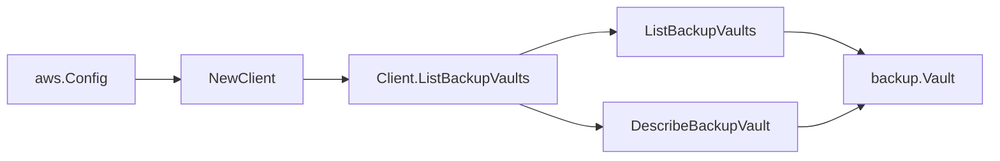

# AWS Backup SDK Adapter

## Purpose

`internal/collector/awscloud/services/backup/awssdk` adapts AWS SDK for Go v2
AWS Backup responses to the scanner-owned `backup.Client` contract. It owns
Backup pagination, vault description, plan body retrieval, selection
projection, recovery point listing, report plan listing, restore testing plan
listing, framework listing/description, throttle classification, and
per-call AWS API telemetry.

## Ownership boundary

This package owns SDK calls for AWS Backup. It does not own workflow claims,
credential acquisition, Backup fact selection, graph writes, reducer
admission, or query behavior.

## Exported surface

See `doc.go` for the godoc contract.

- `Client` - AWS SDK-backed implementation of `backup.Client`.
- `NewClient` - builds a `Client` for one claimed AWS boundary.

## Dependencies

- `internal/collector/awscloud` for account, region, and service boundary
  labels.
- `internal/collector/awscloud/services/backup` for scanner-owned result
  types.
- `internal/telemetry` for AWS API call and throttle instruments.
- AWS SDK for Go v2 `backup` and Smithy error contracts.

## Telemetry

Each AWS Backup paginator page or point read is wrapped with:

- `aws.service.pagination.page`
- `eshu_dp_aws_api_calls_total`
- `eshu_dp_aws_throttle_total`

Metric labels stay bounded to service, account, region, operation, and
result. Backup ARNs, names, tags, and raw AWS error payloads stay out of
metric labels.

## Forbidden APIs (proof in test)

The `apiClient` interface in `client.go` lists exactly the metadata reads the
adapter calls. It does NOT expose:

- `Create*`, `Update*`, `Delete*` for any vault/plan/selection/report plan/
  restore testing plan/framework.
- `StartBackupJob`, `StartRestoreJob`, `StartCopyJob`.
- `DeleteRecoveryPoint`.
- `PutBackupVaultAccessPolicy`, `GetBackupVaultAccessPolicy`.
- `GetRecoveryPointRestoreMetadata`.

`client_test.go` keeps counters on every forbidden API and asserts that the
adapter never calls them during a full happy-path scan.

## Related docs

- `docs/public/services/collector-aws-cloud.md`
- `docs/public/guides/collector-authoring.md`
