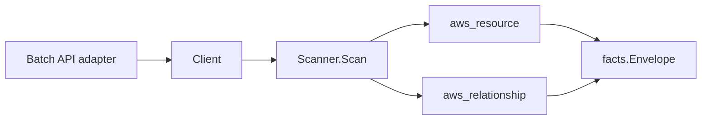

# AWS Batch Scanner

## Purpose

`internal/collector/awscloud/services/batch` owns the AWS Batch scanner
contract for the AWS cloud collector. It converts compute environments, job
queues, job definitions, scheduling policies, and recent jobs into
`aws_resource` facts and emits relationship evidence for job-queue-to-compute-
environment, compute-environment-to-subnet/security-group/launch-template/IAM-
role, job-definition-to-IAM-role, job-definition-to-container-image, and
job-definition-to-secret-reference dependencies.

## Ownership boundary

This package owns scanner-level Batch fact selection, container environment
redaction, and identity mapping. It does not own AWS SDK pagination, STS
credentials, workflow claims, fact persistence, graph writes, reducer
admission, or query behavior.

## Exported surface

See `doc.go` for the godoc contract.

- `Client` - metadata-only Batch read surface consumed by `Scanner`. It exposes
  no SubmitJob, CancelJob, TerminateJob, RegisterJobDefinition, or any
  Create/Update/Delete operation.
- `Scanner` - emits compute-environment, job-queue, job-definition,
  scheduling-policy, recent-job, and relationship facts for one boundary.
- `ComputeEnvironment`, `ComputeResource`, `JobQueue`,
  `ComputeEnvironmentOrderEntry`, `JobDefinition`, `Container`,
  `EnvironmentVariable`, `SecretReference`, `SchedulingPolicy`, and `Job` -
  scanner-owned metadata representations. Command lists, job parameters, and
  fair-share state are absent by design.

## Dependencies

- `internal/collector/awscloud` for boundaries, resource constants,
  relationship constants, and envelope builders.
- `internal/facts` for emitted fact envelope kinds.
- `internal/redact` for HMAC-SHA256 container-environment value markers.

The package depends on a small `Client` interface rather than the AWS SDK for
Go v2 so tests can use fake clients and runtime adapters can own SDK behavior.

## Telemetry

This scanner emits no spans or logs directly. `awsruntime.ClaimedSource`
records scan duration and emitted resource/relationship counts after
`Scanner.Scan` returns. Resource counts surface through
`eshu_dp_aws_resources_emitted_total{service="batch"}` with the existing
per-resource `resource_type` label. The `awssdk` adapter records Batch API call
counts, throttles, and pagination spans.

## Gotchas / invariants

- Batch job-definition container environment values are always replaced with
  `redacted:hmac-sha256:` markers before persistence. The scanner requires a
  redaction key and refuses to run without one.
- Container command lists and job parameters are never persisted. The
  scanner-owned `Container` and `JobDefinition` types do not declare those
  fields, so a leak does not compile.
- Container secret `value_from` references are preserved as Secrets Manager or
  SSM ARN reference edges (`batch_job_definition_references_secret`); the
  resolved secret value is never read.
- Scheduling policy facts carry the policy ARN and name only. The fair-share
  weight state (`FairsharePolicy`) is never persisted because priority weights
  may reveal business-sensitive tenant ranking.
- Recent job facts carry identity, status, and the job-definition reference
  only. Job parameters and container overrides are never persisted.
- Every relationship sets a non-empty `target_type` matching the target
  scanner's `resource_id` form: IAM roles target `aws_iam_role` (role ARN),
  instance-profile roles target `aws_iam_instance_profile`, subnets target
  `aws_ec2_subnet` (bare subnet ID), security groups target
  `aws_ec2_security_group`, launch templates target `aws_ec2_launch_template`
  (launch template ID), container images target `container_image`, and secret
  references target `aws_secretsmanager_secret` or `aws_ssm_parameter` by ARN
  service segment.
- The compute-environment-to-VPC join is reached transitively through the
  subnet edge plus the EC2-owned subnet-to-VPC edge, because the Batch API
  reports compute-resource subnets but no VPC ID.
- The scanner stops on client errors and wraps them with `%w`. Runtime adapters
  decide whether an AWS service error is retryable, terminal, or a warning fact.

## Evidence

Collector Performance Evidence: `go test ./internal/collector/awscloud/services/batch/...`
covers the bounded Batch metadata path: one paginated
DescribeComputeEnvironments stream, one paginated DescribeJobQueues stream, one
paginated DescribeJobDefinitions stream filtered to ACTIVE definitions, one
paginated ListSchedulingPolicies stream followed by chunked
DescribeSchedulingPolicies calls, and a per-queue ListJobs fan-out bounded per
active state. No mutation or job-control API is reachable, and the collector
performs no graph writes.

No-Regression Evidence: `go test ./cmd/collector-aws-cloud ./internal/collector/awscloud/...`
covers compute-environment, job-queue, job-definition, scheduling-policy, and
recent-job fact emission, every relationship's non-empty target type and join
key, redaction of container environment values, structural absence of command
lists and job parameters, scheduling-policy fair-share-state exclusion, runtime
registration, and command configuration. The SDK adapter reflection contract
test proves the mutation and job-control APIs are unreachable.

Collector Observability Evidence: Batch uses the existing AWS collector
`aws.service.pagination.page` span plus `eshu_dp_aws_api_calls_total`,
`eshu_dp_aws_throttle_total`,
`eshu_dp_aws_resources_emitted_total{service="batch"}`,
`eshu_dp_aws_relationships_emitted_total`, and `aws_scan_status` rows. Metric
labels stay bounded to service, account, region, operation, result, and
resource type.

No-Observability-Change: the existing AWS collector telemetry contract already
diagnoses Batch scans through `aws.service.scan`, `aws.service.pagination.page`,
API/throttle counters, resource/relationship counters, and `aws_scan_status`.
No new instrument or label was added.

Collector Deployment Evidence: Batch runs inside the existing hosted
`collector-aws-cloud` runtime, so `/healthz`, `/readyz`, `/metrics`, and
`/admin/status` stay covered by the command wiring and Helm collector runtime.

## Related docs

- `docs/public/services/collector-aws-cloud.md`
- `docs/public/services/collector-aws-cloud-scanners.md`
- `docs/public/guides/collector-authoring.md`
