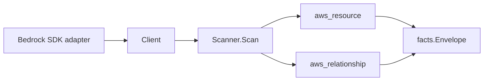

# AWS Bedrock Scanner

## Purpose

`internal/collector/awscloud/services/bedrock` owns the Bedrock scanner contract
for the AWS cloud collector. It converts Bedrock control-plane metadata for
eight resource types into `aws_resource` facts and emits the reported
relationships that tie custom models, agents, and knowledge bases to their
dependencies.

In scope: foundation model availability (read-only list), custom models, model
customization jobs, provisioned model throughputs, guardrails, agents, agent
action groups, and knowledge bases.

This is a high-redaction scanner. Agent instructions and prompt templates,
guardrail policy bodies, and knowledge base document content are valuable IP or
sensitive posture. The scanner never reads them, and the scanner-owned types
have no field to hold them.

## Ownership boundary

This package owns scanner-level Bedrock fact selection and identity mapping. It
does not own AWS SDK pagination, STS credentials, workflow claims, fact
persistence, graph writes, reducer admission, or query behavior. The SDK adapter
in `awssdk` owns every AWS call; this package consumes the small `Client`
interface only.

## Exported surface

See `doc.go` for the godoc contract.

- `Client` - the metadata-only Bedrock read surface consumed by `Scanner`. It
  exposes only `List*` reads; it has no inference call and no mutation.
- `Scanner` - emits resource and relationship facts for one boundary.
- The scanner-owned resource models (`FoundationModel`, `CustomModel`,
  `ModelCustomizationJob`, `ProvisionedModelThroughput`, `Guardrail`, `Agent`,
  `AgentActionGroup`, `KnowledgeBase`, `KnowledgeBaseDataSource`). None of them
  carry a field for a forbidden payload, so a forbidden value has nowhere to
  land.

## Dependencies

- `internal/collector/awscloud` for boundaries, resource constants,
  relationship constants, and envelope builders.
- `internal/facts` for emitted fact envelope kinds.

The package depends on the `Client` interface rather than the AWS SDK for Go v2
so tests use fake clients and the runtime adapter owns SDK behavior.

## Telemetry

This scanner emits no spans or logs directly. `awsruntime.ClaimedSource` records
scan duration and emitted resource counts after `Scanner.Scan` returns, labeled
`service="bedrock"` on `eshu_dp_aws_resources_emitted_total` and
`eshu_dp_aws_relationships_emitted_total`. The `awssdk` adapter records Bedrock
API call counts, throttles, and pagination spans.

## Gotchas / invariants

- The scanner is metadata-only. It never invokes a model (bedrock-runtime
  InvokeModel/Converse), never queries an agent or knowledge base
  (bedrock-agent-runtime InvokeAgent/Retrieve/RetrieveAndGenerate), and never
  mutates Bedrock state. The bedrock-runtime and bedrock-agent-runtime modules
  are never imported.
- The scanner never persists agent instructions (system prompts),
  prompt-override configurations, guardrail topic or content policy bodies,
  knowledge base ingested document content or chunks, action-group API schema
  bodies, custom-model hyperparameter values, or training input data. These are
  excluded by omission from the scanner-owned types, not by post-hoc redaction.
- Relationships carry a non-empty `target_type` and a `target_resource_id` that
  matches the target scanner's resource id: action-group-to-Lambda targets
  `aws_lambda_function` with the function ARN; custom-model-to-S3-output and
  knowledge-base-to-S3 targets `aws_s3_bucket` with a bucket ARN. The bucket ARN
  partition is taken from the source ARN, never hardcoded, so GovCloud and China
  resources resolve correctly.
- IAM-role, base-model, Lambda, and S3 relationship targets are guarded so a
  free-form name is never emitted as an ARN. Emit a relationship only when AWS
  reports both ends.
- Action groups have no ARN; the scanner builds a stable synthetic id from the
  parent agent id and action-group id.
- Tags are raw AWS tag evidence. Do not infer environment, owner, workload, or
  deployable-unit truth from tags or resource names in this package.

## Evidence

Collector Performance Evidence: `go test ./internal/collector/awscloud/services/bedrock/... -count=1 -race`
covers the bounded Bedrock metadata path. The SDK adapter API fanout per claim
is: one `ListFoundationModels` (single call, no Describe fanout), one paginated
`List*` per remaining resource type, one `GetCustomModel` per custom model (for
the job ARN and output S3 reference), one `GetAgent` plus one
`ListAgentKnowledgeBases` per agent, one `ListAgentActionGroups` plus one
`GetAgentActionGroup` per action group (for the Lambda executor), one
`GetKnowledgeBase` per knowledge base, and one `ListDataSources` plus one
`GetDataSource` per data source (for the endpoint reference). Action groups are
read per agent, so the action-group fanout scales with the agent count. There is
no graph write, queue, lease, or worker change: the scanner returns a fact slice
for the existing claim runtime to commit, so this slice adds no new concurrency
surface.

No-Regression Evidence: `go test ./internal/collector/awscloud/services/bedrock/... ./internal/collector/awscloud/awsruntime/... ./cmd/collector-aws-cloud/... -count=1`
covers resource fact emission for all eight types, the twelve required
relationships, sensitive-payload omission, the struct-reflection redaction gate
proving no scanner type can carry agent prompts / guardrail policies / KB
content / action-group schemas / hyperparameters, the SDK exclusion gate proving
InvokeModel / InvokeAgent / Retrieve / RetrieveAndGenerate and every mutation
are unreachable, runtime self-registration through the derived guard, and
command-side Bedrock target validation.

Collector Observability Evidence: Bedrock uses the existing AWS collector
`aws.service.pagination.page` span plus `eshu_dp_aws_api_calls_total`,
`eshu_dp_aws_throttle_total`, `eshu_dp_aws_resources_emitted_total{service="bedrock"}`,
`eshu_dp_aws_relationships_emitted_total`, and `aws_scan_status` rows. Metric
labels stay bounded to service, account, region, operation, result, and status.

No-Observability-Change: the existing AWS collector telemetry contract already
diagnoses Bedrock scans through `aws.service.scan`,
`aws.service.pagination.page`, API/throttle counters, resource/relationship
counters, and `aws_scan_status`. This scanner adds no new instrument.

Collector Deployment Evidence: Bedrock runs inside the existing hosted
`collector-aws-cloud` runtime, so `/healthz`, `/readyz`, `/metrics`, and
`/admin/status` stay covered by the command wiring and Helm collector runtime.

### Partition-aware ARNs (#866)

No-Regression Evidence: `go test ./internal/collector/awscloud/services/bedrock/... -count=1`
covers the existing partition assertions, now backed by the shared helper. The
synthesized S3 bucket and knowledge-base-source ARNs inherit the partition of
the referencing model/knowledge-base ARN via `awscloud.PartitionFromARN`
(replacing the package-local `arnPartition` helper) instead of hardcoding `aws`.
Commercial output is byte-for-byte unchanged; this is a metadata-only
correctness fix with no graph-write, queue, or hot-path behavior change.

No-Observability-Change: the fix only changes the partition substring of a
synthesized ARN value; no instrument, span, metric label, or `aws_scan_status`
row changes.

## Related docs

- `docs/public/services/collector-aws-cloud-scanners.md`
- `docs/public/guides/collector-authoring.md`
