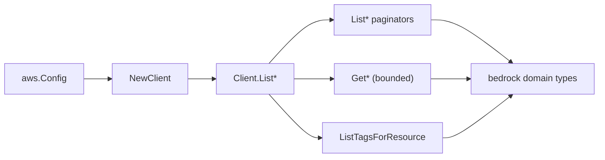

# AWS Bedrock SDK Adapter

## Purpose

`internal/collector/awscloud/services/bedrock/awssdk` adapts AWS SDK for Go v2
Bedrock control-plane responses to the scanner-owned `bedrock.Client` contract.
It owns Bedrock `List*` pagination, the bounded `Get*` reads that resolve
required relationships and references, `ListTagsForResource` reads, throttle
classification, and per-call AWS API telemetry.

It uses two control-plane SDK clients: `aws-sdk-go-v2/service/bedrock` (models,
jobs, throughputs, guardrails) and `aws-sdk-go-v2/service/bedrockagent` (agents,
action groups, knowledge bases, data sources).

## Ownership boundary

This package owns SDK calls for Bedrock. It does not own workflow claims,
credential acquisition, Bedrock fact selection, graph writes, reducer admission,
or query behavior.

## Exported surface

See `doc.go` for the godoc contract.

- `Client` - AWS SDK-backed implementation of `bedrock.Client`.
- `NewClient` - builds a `Client` for one claimed AWS boundary, constructing the
  bedrock and bedrock-agent control-plane clients only.

The adapter-local `bedrockAPIClient` and `bedrockAgentAPIClient` interfaces
(unexported) are the auditable read surfaces. `exclusion_test.go` reflects over
both and fails the build if any inference or mutation method ever appears on
either.

## Dependencies

- `internal/collector/awscloud` for account, region, and service boundary
  labels.
- `internal/collector/awscloud/services/bedrock` for scanner-owned result types.
- `internal/telemetry` for AWS API call and throttle instruments.
- AWS SDK for Go v2 `bedrock` and `bedrockagent` plus Smithy error contracts.
  The adapter never imports `bedrockruntime` or `bedrockagentruntime`, which are
  where InvokeModel, InvokeAgent, Retrieve, and RetrieveAndGenerate live.

## Telemetry

Bedrock paginator pages and point reads are wrapped with:

- `aws.service.pagination.page`
- `eshu_dp_aws_api_calls_total`
- `eshu_dp_aws_throttle_total`

Metric labels stay bounded to service, account, region, operation, and result.
ARNs, names, tags, URLs, and raw AWS error payloads stay out of metric labels.

## Gotchas / invariants

- The adapter calls only `List*`, `Get*`, and `ListTagsForResource`. It must
  never call InvokeModel, InvokeAgent, Retrieve, RetrieveAndGenerate, or any
  mutation (Create/Delete/Update/Prepare/StartIngestionJob/...). The reflection
  gate enforces this.
- `Get*` reads copy only the fields needed for a relationship or reference. They
  never copy agent instructions (`Agent.Instruction`), prompt-override
  configurations, guardrail policy bodies, knowledge base document content,
  action-group API schema bodies, custom-model hyperparameter values, or
  training input data references. The scanner-owned types have no field for
  those values.
- The adapter never calls `GetGuardrail` (the only operation returning policy
  bodies) and never calls `GetKnowledgeBaseDocuments` /
  `ListKnowledgeBaseDocuments` (the only operations returning ingested content).
- `ListFoundationModels` is a single call with no paginator; every other `List*`
  uses an SDK paginator with correct continuation.
- Action groups and agent knowledge bases are read against the agent `DRAFT`
  version, where the editable configuration lives.
- bedrock and bedrock-agent expose different `ListTagsForResource` shapes (a
  key/value list versus a map), so the adapter has two tag readers.
- SDK adapters translate AWS records into scanner-owned types; scanner tests
  should not mock AWS SDK paginators.

## Related docs

- `docs/public/services/collector-aws-cloud-scanners.md`
- `docs/public/guides/collector-authoring.md`
