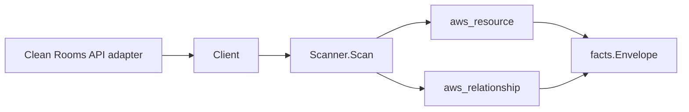

# AWS Clean Rooms Scanner

## Purpose

`internal/collector/awscloud/services/cleanrooms` owns the AWS Clean Rooms
scanner contract for the AWS cloud collector. It converts Clean Rooms
collaboration, configured-table, and membership metadata into `aws_resource`
facts and emits relationship evidence for a configured table's backing AWS Glue
Data Catalog table and a membership's association with its collaboration.

## Ownership boundary

This package owns scanner-level Clean Rooms fact selection and identity mapping.
It does not own AWS SDK pagination, STS credentials, workflow claims, fact
persistence, graph writes, reducer admission, or query behavior.

## Exported surface

See `doc.go` for the godoc contract.

- `Client` - minimal Clean Rooms metadata read surface consumed by `Scanner`.
- `Scanner` - emits collaboration, configured-table, and membership resources
  plus their relationships for one boundary.
- `Snapshot`, `Collaboration`, `ConfiguredTable`, `Membership` - scanner-owned
  views with analysis-rule SQL, query results, allowed-column names, and member
  secrets intentionally absent.

## Dependencies

- `internal/collector/awscloud` for boundaries, resource constants,
  relationship constants, and envelope builders.
- `internal/facts` for emitted fact envelope kinds.

The package depends on a small `Client` interface rather than the AWS SDK for
Go v2 so tests can use fake clients and the runtime adapter can own SDK
behavior.

## Telemetry

This scanner emits no spans or logs directly. `awsruntime.ClaimedSource`
records scan duration and emitted resource counts after `Scanner.Scan` returns.
The `awssdk` adapter records Clean Rooms API call counts, throttles, and
pagination spans.

## Gotchas / invariants

- Clean Rooms facts are metadata only. The scanner must never read or persist
  analysis-rule SQL, protected-query bodies or results, allowed-column names
  (only their count), or member secrets such as the Snowflake `SecretArn`, and
  must never call any mutation or query-execution API.
- The collaboration node publishes its resource_id as the collaboration ARN
  (falling back to the collaboration id). The membership-in-collaboration edge
  is keyed by that same collaboration ARN so it joins the collaboration node
  instead of dangling.
- The configured-table-to-Glue-table edge is emitted only when the backing
  table is a Glue table and the Glue table name is present. The target is keyed
  by the `<database>/<table>` resource_id the Glue scanner publishes for a table
  node, falling back to just `<table>` when the database name is missing. This
  mirrors the Glue scanner's own table-node resource_id fallback, so the edge
  still joins. The target is name-keyed, NOT an ARN, so `target_arn` stays empty.
  Athena and Snowflake backing tables record their reference kind only and emit
  no edge (no Athena/Snowflake table scanner exists to join).
- Emit reported evidence only. Do not infer deployment, workload, repository
  ownership, environment, or deployable-unit truth from collaboration, table, or
  membership names, or AWS tags.

## Evidence

Collector Performance Evidence:
`go test ./internal/collector/awscloud/services/cleanrooms/...` covers the
bounded Clean Rooms metadata path: one paginated ListCollaborations stream, one
paginated ListConfiguredTables stream with one GetConfiguredTable detail read
per configured table (needed only to resolve the Glue backing-table reference),
one paginated ListMemberships stream, one ListTagsForResource point read per
resource, no protected-query runs, no result reads, no mutations, and no graph
writes in the collector.

No-Regression Evidence: metadata-only control-plane scanner; new read path, no change to existing hot paths. `go test ./internal/collector/awscloud/services/cleanrooms/...` green.

No-Observability-Change: reuses shared AWS pagination span + API-call/throttle counters; no telemetry contract change.

Collector Deployment Evidence: Clean Rooms runs inside the existing hosted
`collector-aws-cloud` runtime, so `/healthz`, `/readyz`, `/metrics`, and
`/admin/status` stay covered by the command wiring and Helm collector runtime.

## Related docs

- `docs/public/services/collector-aws-cloud.md`
- `docs/public/services/collector-aws-cloud-scanners.md`
- `docs/public/services/collector-aws-cloud-security.md`
