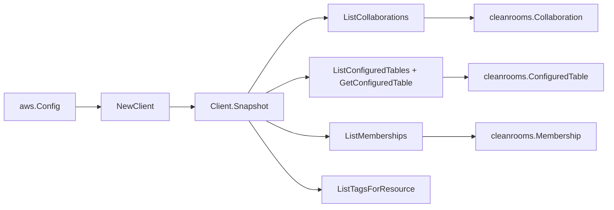

# AWS Clean Rooms SDK Adapter

## Purpose

`internal/collector/awscloud/services/cleanrooms/awssdk` adapts AWS SDK for Go
v2 Clean Rooms responses to the scanner-owned `Client` contract. It owns
collaboration pagination, configured-table pagination plus the single
configured-table detail read needed to resolve the Glue backing-table reference,
membership pagination, resource-tag reads, throttle classification, and per-call
AWS API telemetry.

## Ownership boundary

This package owns SDK calls for Clean Rooms. It does not own workflow claims,
credential acquisition, Clean Rooms fact selection, graph writes, reducer
admission, or query behavior.

## Exported surface

See `doc.go` for the godoc contract.

- `Client` - AWS SDK-backed implementation of `cleanrooms.Client`.
- `NewClient` - builds a `Client` for one claimed AWS boundary.

## Dependencies

- `internal/collector/awscloud` for account, region, and service boundary
  labels.
- `internal/collector/awscloud/services/cleanrooms` for scanner-owned result
  types.
- `internal/telemetry` for AWS API call and throttle instruments.
- AWS SDK for Go v2 `cleanrooms` and Smithy error contracts.

## Telemetry

Clean Rooms paginator pages and point reads are wrapped with:

- `aws.service.pagination.page`
- `eshu_dp_aws_api_calls_total`
- `eshu_dp_aws_throttle_total`

Metric labels stay bounded to service, account, region, operation, and result.
Clean Rooms resource ARNs, names, tags, and raw AWS error payloads stay out of
metric labels.

## Gotchas / invariants

- The adapter reads metadata only. It must never run a protected query or job,
  read a protected-query result, read an analysis-rule or analysis-template
  body, or call any Create/Update/Delete mutation API.
- `GetConfiguredTable` is called only to learn the backing-table reference kind
  and, for a Glue table, the database/table names plus the allowed-column count.
  The adapter records the allowed-column *count* only; it never copies the
  allowed-column names. It never maps a Snowflake `SecretArn`, an Athena
  `OutputLocation`, or any query/connection identifier.
- `ListTagsForResource` is a metadata read; Clean Rooms tags carry no query or
  result content.
- The accepted SDK surface is List/Get reads only by construction, proven by the
  reflection guard in `exclusion_test.go`; do not loosen it.
- SDK adapters translate AWS records into scanner-owned types; scanner tests
  should not mock AWS SDK pagination.

## Related docs

- `docs/public/services/collector-aws-cloud-scanners.md`
- `docs/public/services/collector-aws-cloud-security.md`
