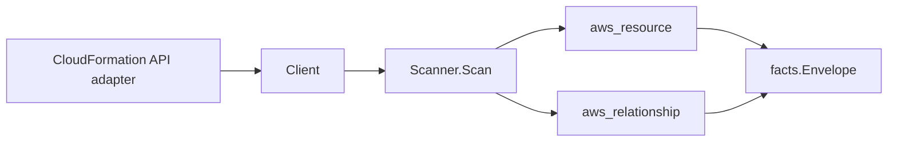

# AWS CloudFormation Scanner

## Purpose

`internal/collector/awscloud/services/cloudformation` owns the CloudFormation
scanner contract for the AWS cloud collector. CloudFormation is the highest
template-body redaction surface in the collector: stack and stack-set templates
can carry inline IAM policy bodies, NoEcho parameter values, and embedded
secrets. The scanner emits stack, stack-set, change-set, drift-result,
stack-instance, and registered-type configuration metadata only. Template
bodies, parameter values, change-set bodies, drift property documents, and
secret-like stack output values are never read or persisted through this
scanner.

## Ownership boundary

This package owns scanner-level CloudFormation fact selection for stacks (active
and recently deleted), stack sets, change sets (metadata only), drift detection
results (status and per-status counts), stack-set instances, and registered
extension types, plus reported stack-to-resource-type, stack-set-to-instance,
stack-to-IAM-role, and stack-to-S3-template-URL relationships. It does not own
AWS SDK pagination, credential acquisition, workflow claims, fact persistence,
graph writes, reducer admission, or query behavior.

## Exported surface

See `doc.go` for the godoc contract.

- `Client` - minimal CloudFormation read surface consumed by `Scanner`. The
  interface intentionally excludes `GetTemplate`, `GetTemplateSummary`, the
  change-set body APIs, the stack-policy body API, and every mutation API. A
  guard test fails the build if any of those slip onto the interface.
- `Scanner` - emits CloudFormation metadata and reported relationship facts for
  one boundary. Requires a non-zero `RedactionKey` for output redaction.
- `Stack` - scanner-owned stack configuration. Carries parameter keys only and
  no template body; output values are redacted by key before emission.
- `StackOutput` - one stack output reference. The scanner redacts the value when
  the output key matches the shared AWS sensitive-key policy.
- `StackResource` - per-stack resource type summary (type plus identity, no
  property body).
- `StackSet` - stack-set configuration with no template body.
- `ChangeSet` - change-set metadata with no change body.
- `StackDriftResult` - drift detection summary as per-status counts only.
- `StackInstance` - stack-set instance account, region, and status.
- `RegisteredType` - registered extension identity and activation state.

## Dependencies

- `internal/collector/awscloud` for boundaries, resource constants,
  relationship constants, envelope builders, and the `ClassifyStackOutput`
  output redaction helper.
- `internal/facts` for emitted fact envelope kinds.
- `internal/redact` for the redaction key type held by `Scanner`.

The package depends on a small `Client` interface rather than the AWS SDK for
Go v2 so tests can use fake clients and runtime adapters can own SDK behavior.

## Telemetry

This scanner emits no spans or logs directly. `awsruntime.ClaimedSource`
records scan duration and emitted resource counts after `Scanner.Scan` returns.
The `awssdk` adapter records CloudFormation API call counts, throttles, and
pagination spans. The required resource signal is
`eshu_dp_aws_resources_emitted_total{service="cloudformation"}` with the
existing bounded AWS collector labels.

## Gotchas / invariants

- CloudFormation facts are metadata only. The scanner must never call
  `GetTemplate` or `GetTemplateSummary`, never read parameter values, never read
  change-set bodies (`DescribeChangeSet`), and never persist drift property
  documents.
- The `Client` interface is the security boundary. Adding any template-body or
  mutation method to it must be caught by
  `TestClientInterfaceExcludesMutationAndTemplateAPIs`.
- Stack output values are redacted by key. The output-key classifier is
  stricter than the shared exact-match path: it also redacts compound
  PascalCase keys such as `DatabasePassword`, so a secret-shaped output value
  never reaches a durable fact.
- The SDK adapter cannot populate `Stack.TemplateURL`: a deployed stack does not
  expose its template location without a forbidden `GetTemplateSummary` call.
  The `TemplateURL` field and its relationship stay in the model for callers
  with a legitimate non-body source, but the metadata-only adapter leaves it
  empty.
- Tags are raw AWS tag evidence. Do not infer environment, owner, workload,
  repository, or deployable-unit truth from tags in this package.

## Evidence

Collector Performance Evidence: `go test ./internal/collector/awscloud/services/cloudformation/...`
covers the bounded CloudFormation metadata path: paginated stack discovery
(active and deleted), per-stack resource-type, change-set, and drift-result
reads, stack-set discovery with per-set describe, stack-instance discovery,
registered-type discovery, and the guard tests for forbidden template and
mutation APIs. No template body, parameter value, change-set body, or drift
property document appears anywhere in the test surface.

No-Regression Evidence: `go test ./cmd/collector-aws-cloud ./internal/collector/awscloud/...`
covers CloudFormation resource and relationship fact emission, output
redaction, the runtimebind registration, command configuration, and the SDK
adapter contract.

Collector Observability Evidence: CloudFormation uses the existing AWS collector
`aws.service.pagination.page` span plus `eshu_dp_aws_api_calls_total`,
`eshu_dp_aws_throttle_total`, `eshu_dp_aws_resources_emitted_total`,
`eshu_dp_aws_relationships_emitted_total`, and `aws_scan_status` rows.

No-Observability-Change: the existing AWS collector telemetry contract already
diagnoses CloudFormation scans through `aws.service.scan`,
`aws.service.pagination.page`, API/throttle counters, resource/relationship
counters, and `aws_scan_status`.

Collector Deployment Evidence: CloudFormation runs inside the existing hosted
`collector-aws-cloud` runtime, so `/healthz`, `/readyz`, `/metrics`, and
`/admin/status` stay covered by the command wiring and Helm collector runtime.

## Related docs

- `docs/public/services/collector-aws-cloud.md`
- `docs/public/services/collector-aws-cloud-scanners.md`
- `docs/public/guides/collector-authoring.md`
