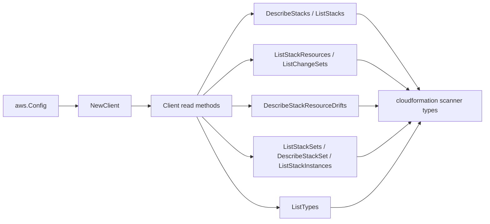

# AWS CloudFormation SDK Adapter

## Purpose

`internal/collector/awscloud/services/cloudformation/awssdk` adapts AWS SDK for
Go v2 CloudFormation responses to the scanner-owned `cloudformation.Client`
contract. It owns stack, stack-set, change-set, drift, instance, and type
pagination; metadata reads; throttle classification; and per-call AWS API
telemetry. It is the metadata-only boundary that keeps template bodies,
parameter values, change-set bodies, and drift property documents out of the
scanner type.

## Ownership boundary

This package owns SDK calls for CloudFormation. It does not own workflow claims,
credential acquisition, CloudFormation fact selection, output redaction, graph
writes, reducer admission, or query behavior.

## Exported surface

See `doc.go` for the godoc contract.

- `Client` - AWS SDK-backed implementation of `cloudformation.Client`.
- `NewClient` - builds a `Client` for one claimed AWS boundary.

## Dependencies

- `internal/collector/awscloud` for account, region, and service boundary
  labels.
- `internal/collector/awscloud/services/cloudformation` for scanner-owned result
  types.
- `internal/telemetry` for AWS API call and throttle instruments.
- AWS SDK for Go v2 `cloudformation` and Smithy error contracts.

## Telemetry

CloudFormation paginator pages and point reads are wrapped with:

- `aws.service.pagination.page`
- `eshu_dp_aws_api_calls_total`
- `eshu_dp_aws_throttle_total`

Metric labels stay bounded to service, account, region, operation, and result.
ARNs, stack names, output values, parameter keys, and raw AWS error payloads
stay out of metric labels.

## Gotchas / invariants

- `DescribeStacks` returns active stacks; recently deleted stacks come from a
  status-filtered `ListStacks` (DELETE_COMPLETE) and carry identity and status
  only.
- The adapter must never call `GetTemplate`, `GetTemplateSummary`,
  `DescribeChangeSet`, `GetStackPolicy`, any `Detect*Drift` API, or any
  stack/stack-set/change-set/instance/type mutation API. The accepted SDK
  surface (`apiClient`) is the boundary; the guard test
  `TestAPIClientInterfaceExcludesTemplateAndMutationAPIs` fails the build if a
  forbidden method is added.
- `DescribeStackResourceDrifts` reads the last drift detection result; it does
  not trigger a new detection run. Actual and expected property documents are
  discarded during mapping; only per-status counts survive.
- Parameter mapping keeps keys only. Parameter values, resolved SSM values, and
  NoEcho values are dropped and never reach the scanner type.
- The stack-set `TemplateBody` is never carried into `cloudformation.StackSet`.
- Output values are passed through raw; the scanner applies key-based redaction.
  This adapter performs no output classification of its own.

## Related docs

- `docs/public/services/collector-aws-cloud.md`
- `docs/public/guides/collector-authoring.md`
