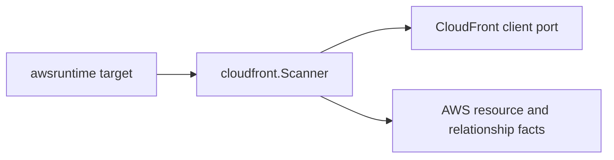

# CloudFront AWS Collector Service

## Purpose

`cloudfront` owns metadata-only CloudFront distribution fact emission for the
AWS collector. It turns scanner-owned distribution projections into AWS
resource and relationship envelopes.

## Ownership boundary

This package owns CloudFront distribution identity, safe metadata projection,
and directly reported ACM certificate and WAF web ACL relationship evidence. It
does not call AWS APIs, schedule claims, load credentials, write facts, or infer
workload, environment, repository, or deployable-unit truth.



The scanner emits one `aws_cloudfront_distribution` resource per distribution
reported by the client. Origin custom header values are not part of the package
contract; only custom header names are retained so operators can see that a
header contract exists without storing secrets.

## Exported surface

See `doc.go` for the godoc-rendered package contract.

- `Scanner` validates the `cloudfront` service boundary and emits fact
  envelopes.
- `Client` is the scanner-owned metadata port implemented by the AWS SDK
  adapter.
- `Distribution`, `Origin`, `CacheBehavior`, and `ViewerCertificate` are safe
  control-plane projections used by tests and adapters.

## Dependencies

- `internal/collector/awscloud` for boundaries, service constants, and
  resource and relationship observation contracts.
- `internal/facts` for the fact envelope returned by `Scanner`.

## Telemetry

The scanner itself emits no new metrics. The AWS SDK adapter records API calls
with the shared AWS collector API-call events, spans, throttle counters, and
operation labels.

## Gotchas / invariants

- CloudFront is treated as a global service. The boundary region should be the
  configured global label, commonly `aws-global`.
- ACM certificate ARNs and WAF web ACL identifiers are reported source
  evidence. Reducers own any later canonical ownership or workload inference.
- WAF Classic identifiers are not ARNs. The relationship keeps
  `TargetResourceID` populated and leaves `TargetARN` empty for those values.
- Origin custom header names are safe metadata; origin custom header values are
  not.

## Verification

```bash
go test ./internal/collector/awscloud/services/cloudfront/... -count=1
go test ./cmd/collector-aws-cloud ./internal/collector/awscloud/... -count=1
go run ./cmd/eshu docs verify ../go/internal/collector/awscloud/services/cloudfront --limit 1000 \
  --fail-on contradicted,missing_evidence
```

Run the AWS runtime tests when scan warnings or partial-status behavior changes.

## Related docs

- `docs/public/services/collector-aws-cloud.md`
- `docs/public/guides/collector-authoring.md`
