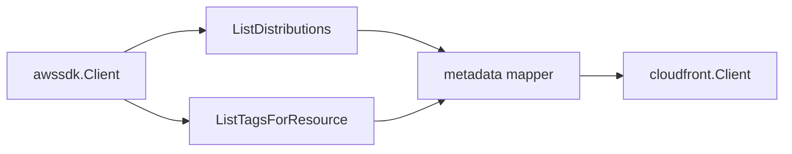

# CloudFront AWS SDK Adapter

## Purpose

`awssdk` owns the AWS SDK for Go v2 adapter for CloudFront distribution
metadata. It implements the scanner-owned `Client` port in the parent package.

## Ownership boundary

This package owns CloudFront SDK pagination, tag reads, API-call telemetry, and
mapping from AWS SDK response shapes into safe scanner projections. It does not
emit fact envelopes, schedule claims, load credentials, or infer workload,
environment, repository, or deployable-unit truth.

The adapter pages `ListDistributions` with a bounded `MaxItems` value and calls
`ListTagsForResource` for each distribution ARN. It maps only control-plane
metadata already present in the distribution summary plus tags.

Custom origin header values are dropped. The adapter keeps header names so
operators can identify that an origin header contract exists without persisting
secret-bearing values.

## Exported surface

See `doc.go` for the godoc-rendered package contract.

- `Client` implements the parent package client port with AWS SDK calls.
- `NewClient` builds the production adapter from an AWS SDK config and
  collector boundary.

## Dependencies

- AWS SDK for Go v2 CloudFront client and CloudFront response types.
- `internal/collector/awscloud` for boundaries and API-call status events.
- `internal/collector/awscloud/services/cloudfront` for scanner-owned models.
- `internal/telemetry` for shared AWS collector API-call metrics and spans.

## Telemetry

Each AWS API call records the shared AWS collector call event and, when
available, the shared API-call metric, throttle counter, and pagination span
using the service, account, region, operation, and result labels.

No-Observability-Change: the existing AWS collector API-call metrics,
throttle counters, `SpanAWSServicePaginationPage` span, and API call event log
cover CloudFront pagination and tag reads.

## Gotchas / invariants

- Do not add `GetDistributionConfig` without a separate issue and evidence
  note. The current contract uses the distribution summary and tags only.
- Do not persist origin custom header values; mapper tests cover names-only
  behavior.
- Pagination must stay bounded with `listDistributionsLimit`.
- Keep `recordAPICall` wrapped around every AWS operation so scan status and
  throttle counters stay useful.

## Related docs

- `docs/docs/adrs/2026-04-20-aws-cloud-scanner-collector.md`
- `docs/docs/reference/telemetry/index.md`
