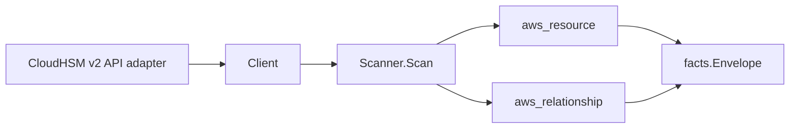

# AWS CloudHSM v2 Scanner

## Purpose

`internal/collector/awscloud/services/cloudhsmv2` owns the AWS CloudHSM v2
scanner contract for the AWS cloud collector. It converts CloudHSM v2 cluster
and backup control-plane metadata into `aws_resource` facts and emits
relationship evidence for cluster-in-VPC, cluster-in-subnet,
cluster-uses-security-group, and backup-of-cluster joins.

## Ownership boundary

This package owns scanner-level CloudHSM v2 fact selection and identity mapping.
It does not own AWS SDK pagination, STS credentials, workflow claims, fact
persistence, graph writes, reducer admission, or query behavior.

## Exported surface

See `doc.go` for the godoc contract.

- `Client` - minimal CloudHSM v2 metadata read surface consumed by `Scanner`.
- `Scanner` - emits cluster and backup resources plus their relationships for
  one boundary.
- `Snapshot`, `Cluster`, `Backup`, `HSM`, `SubnetMapping`,
  `CertificatePresence` - scanner-owned views with key material, certificate
  bodies, CSR bodies, and the Pre-Crypto Officer password intentionally absent.

## Dependencies

- `internal/collector/awscloud` for boundaries, resource constants,
  relationship constants, partition helpers, and envelope builders.
- `internal/facts` for emitted fact envelope kinds.

The package depends on a small `Client` interface rather than the AWS SDK for
Go v2 so tests can use fake clients and the runtime adapter can own SDK
behavior.

## Telemetry

This scanner emits no spans or logs directly. `awsruntime.ClaimedSource`
records scan duration and emitted resource counts after `Scanner.Scan` returns.
The `awssdk` adapter records CloudHSM v2 API call counts, throttles, and
pagination spans.

## Gotchas / invariants

- CloudHSM v2 facts are metadata only. The scanner must NEVER read or persist
  cryptographic key material, certificate PEM bodies, the cluster certificate
  signing request body, or the cluster's Pre-Crypto Officer password.
  Certificate state is recorded as a boolean presence flag per field, never the
  body.
- CloudHSM v2 clusters have no API ARN. The cluster node publishes the bare
  cluster id (`cluster-…`) as its resource_id, and the backup-of-cluster edge
  keys that same bare cluster id so it joins the cluster node.
- The backup node publishes the bare backup id (`backup-…`) as its resource_id;
  the backup ARN is carried in the `arn` field but is not the join key.
- The cluster-in-VPC, cluster-in-subnet, and cluster-uses-security-group edges
  are keyed by the bare AWS id (`vpc-…`, `subnet-…`, `sg-…`), which is exactly
  the resource_id the EC2 scanner publishes for those nodes. No ARN is
  synthesized for these edges, so they resolve in every partition.
- Subnet edges are de-duplicated across availability zones so a cluster spanning
  the same subnet in two zones does not emit two identical edges.
- Emit reported evidence only. Do not infer deployment, workload, repository
  ownership, environment, or deployable-unit truth from cluster, backup, or tag
  values.

## Evidence

Collector Performance Evidence:
`go test ./internal/collector/awscloud/services/cloudhsmv2/...` covers the
bounded CloudHSM v2 metadata path: one paginated DescribeClusters stream and one
paginated DescribeBackups stream, both returning tags inline, no key-material
read, no certificate-body read, no InitializeCluster, no mutation, and no graph
writes in the collector.

No-Regression Evidence: metadata-only control-plane scanner; new read path, no change to existing hot paths. `go test ./internal/collector/awscloud/services/cloudhsmv2/...` green.

No-Observability-Change: reuses shared AWS pagination span + API-call/throttle counters; no telemetry contract change.

Collector Deployment Evidence: CloudHSM v2 runs inside the existing hosted
`collector-aws-cloud` runtime, so `/healthz`, `/readyz`, `/metrics`, and
`/admin/status` stay covered by the command wiring and Helm collector runtime.

## Related docs

- `docs/public/services/collector-aws-cloud.md`
- `docs/public/services/collector-aws-cloud-scanners.md`
- `docs/public/services/collector-aws-cloud-security.md`
