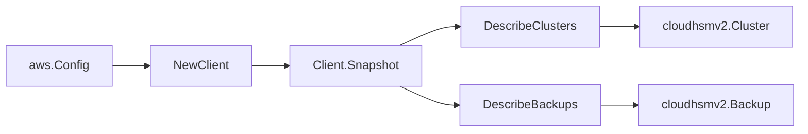

# AWS CloudHSM v2 SDK Adapter

## Purpose

`internal/collector/awscloud/services/cloudhsmv2/awssdk` adapts AWS SDK for Go
v2 CloudHSM v2 responses to the scanner-owned `Client` contract. It owns cluster
pagination, backup pagination, inline resource-tag mapping, certificate-presence
detection, throttle classification, and per-call AWS API telemetry.

## Ownership boundary

This package owns SDK calls for CloudHSM v2. It does not own workflow claims,
credential acquisition, CloudHSM v2 fact selection, graph writes, reducer
admission, or query behavior.

## Exported surface

See `doc.go` for the godoc contract.

- `Client` - AWS SDK-backed implementation of `cloudhsmv2.Client`.
- `NewClient` - builds a `Client` for one claimed AWS boundary.

## Dependencies

- `internal/collector/awscloud` for account, region, and service boundary
  labels.
- `internal/collector/awscloud/services/cloudhsmv2` for scanner-owned result
  types.
- `internal/telemetry` for AWS API call and throttle instruments.
- AWS SDK for Go v2 `cloudhsmv2` and Smithy error contracts.

## Telemetry

CloudHSM v2 paginator pages are wrapped with:

- `aws.service.pagination.page`
- `eshu_dp_aws_api_calls_total`
- `eshu_dp_aws_throttle_total`

Metric labels stay bounded to service, account, region, operation, and result.
CloudHSM v2 ARNs, ids, certificate state, tags, and raw AWS error payloads stay
out of metric labels.

## Gotchas / invariants

- The adapter reads metadata only. It must never call `CreateCluster`,
  `CreateHsm`, `DeleteCluster`, `DeleteHsm`, `DeleteBackup`, `RestoreBackup`,
  `CopyBackupToRegion`, `ModifyCluster`, `ModifyBackupAttributes`,
  `InitializeCluster` (the flow that surfaces the Pre-Crypto Officer password),
  `GetResourcePolicy`, `PutResourcePolicy`, `DeleteResourcePolicy`, `TagResource`,
  or `UntagResource`.
- `DescribeClusters` and `DescribeBackups` both return the resource tag list
  inline, so the adapter never issues a separate tag call.
- Certificate and CSR fields are inspected only to test presence; the adapter
  records a boolean per field and never copies the PEM or CSR body out. The
  `PreCoPassword` field on a cluster is never mapped.
- The exclusion test fails the build if any method on the adapter interface is
  not a `Describe` read or matches a mutation/initialize/policy name.

## Related docs

- `docs/public/services/collector-aws-cloud-scanners.md`
- `docs/public/services/collector-aws-cloud-security.md`
