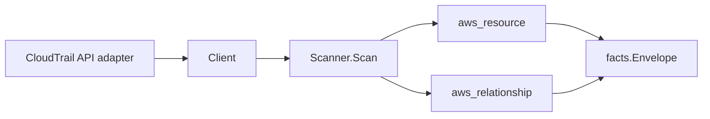

# AWS CloudTrail Scanner

## Purpose

`internal/collector/awscloud/services/cloudtrail` owns the CloudTrail scanner
contract for the AWS cloud collector. CloudTrail is the audit-config service:
the scanner emits trail and Lake configuration only. The audit event payloads
themselves are the protected data class for this service and are never read
or persisted through this scanner.

## Ownership boundary

This package owns scanner-level CloudTrail fact selection for trails (both
multi-region and per-region), Lake event data stores, channels, Lake dashboard
configurations, plus reported trail-to-S3-bucket, trail-to-CloudWatch-Logs,
trail-to-KMS-key, trail-to-SNS-topic, and event-data-store-to-KMS-key
relationships. It does not own AWS SDK pagination, credential acquisition,
workflow claims, fact persistence, graph writes, reducer admission, or query
behavior.

## Exported surface

See `doc.go` for the godoc contract.

- `Client` - minimal CloudTrail read surface consumed by `Scanner`. The
  interface intentionally excludes `LookupEvents`, `StartQuery`,
  `GetQueryResults`, and the trail/store/channel/dashboard mutation surface,
  and a guard test fails the build if any of those slip onto the interface.
- `Scanner` - emits CloudTrail metadata and reported relationship facts for
  one boundary.
- `Trail` - scanner-owned trail configuration summary. Event selector bodies
  are summarized into bounded counts via `EventSelectorSummary` and never
  persisted as raw selector documents.
- `EventDataStore` - Lake event data store configuration and selector-count
  summary; advanced selector bodies and Lake query strings are not part of
  the contract.
- `Channel` - CloudTrail channel identity and destination metadata.
- `Dashboard` - Lake dashboard configuration without widget query bodies.
- `EventSelectorSummary` - bounded counts for trail event selectors.

## Dependencies

- `internal/collector/awscloud` for boundaries, resource constants,
  relationship constants, and envelope builders.
- `internal/facts` for emitted fact envelope kinds.

The package depends on a small `Client` interface rather than the AWS SDK for
Go v2 so tests can use fake clients and runtime adapters can own SDK behavior.

## Telemetry

This scanner emits no spans or logs directly. `awsruntime.ClaimedSource`
records scan duration and emitted resource counts after `Scanner.Scan` returns.
The `awssdk` adapter records CloudTrail API call counts, throttles, and
pagination spans. The required resource signal is
`eshu_dp_aws_resources_emitted_total{service="cloudtrail"}` with the existing
bounded AWS collector labels.

## Gotchas / invariants

- CloudTrail facts are metadata only. The scanner must never call
  `LookupEvents`, never call Lake query data-plane APIs (`StartQuery`,
  `GetQueryResults`), and never persist CloudTrail event payloads.
- The `Client` interface is the security boundary. Adding any forbidden
  method to it must be caught by
  `TestClientInterfaceExcludesEventPayloadAndMutationAPIs`.
- Event selectors and advanced event selectors are summarized as counts and
  per-resource-type counts. Selector bodies, field lists, and value matchers
  must not be persisted because they reveal classification rules for audit
  events.
- Insight selector lists carry only the insight type names (e.g.
  `ApiCallRateInsight`, `ApiErrorRateInsight`); no insight result data is
  persisted.
- Tags are raw AWS tag evidence. Do not infer environment, owner, workload,
  repository, or deployable-unit truth from tags in this package.

## Evidence

Collector Performance Evidence: `go test ./internal/collector/awscloud/services/cloudtrail/...`
covers the bounded CloudTrail metadata path: paginated trail discovery,
trail configuration reads, event data store discovery, channel discovery, Lake
dashboard discovery, and the guard test for forbidden APIs. No event payload
or query data-plane call appears anywhere in the test surface.

No-Regression Evidence: `go test ./cmd/collector-aws-cloud ./internal/collector/awscloud/...`
covers CloudTrail resource and relationship fact emission, the runtimebind
registration, command configuration, and the SDK adapter contract.

Collector Observability Evidence: CloudTrail uses the existing AWS collector
`aws.service.pagination.page` span plus `eshu_dp_aws_api_calls_total`,
`eshu_dp_aws_throttle_total`, `eshu_dp_aws_resources_emitted_total`,
`eshu_dp_aws_relationships_emitted_total`, and `aws_scan_status` rows.

No-Observability-Change: the existing AWS collector telemetry contract already
diagnoses CloudTrail scans through `aws.service.scan`,
`aws.service.pagination.page`, API/throttle counters, resource/relationship
counters, and `aws_scan_status`.

Collector Deployment Evidence: CloudTrail runs inside the existing hosted
`collector-aws-cloud` runtime, so `/healthz`, `/readyz`, `/metrics`, and
`/admin/status` stay covered by the command wiring and Helm collector runtime.

## Related docs

- `docs/public/services/collector-aws-cloud.md`
- `docs/public/services/collector-aws-cloud-scanners.md`
- `docs/public/guides/collector-authoring.md`
