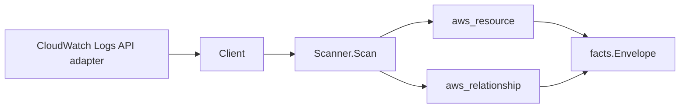

# AWS CloudWatch Logs Scanner

## Purpose

`internal/collector/awscloud/services/cloudwatchlogs` owns the Amazon
CloudWatch Logs scanner contract for the AWS cloud collector. It converts log
group control-plane metadata into `aws_resource` facts and emits relationship
evidence when CloudWatch Logs directly reports a KMS key identifier.

## Ownership boundary

This package owns scanner-level CloudWatch Logs fact selection and identity
mapping. It does not own AWS SDK pagination, STS credentials, workflow claims,
fact persistence, graph writes, reducer admission, workload ownership, or query
behavior.



## Exported surface

See `doc.go` for the godoc contract.

- `Client` - minimal CloudWatch Logs metadata read surface consumed by
  `Scanner`.
- `Scanner` - emits log group metadata and direct KMS relationship facts for
  one boundary.
- `LogGroup` - scanner-owned metadata-only log group representation.

## Dependencies

- `internal/collector/awscloud` for boundaries, resource constants,
  relationship constants, and envelope builders.
- `internal/facts` for emitted fact envelope kinds.

The package depends on a small `Client` interface rather than the AWS SDK for Go
v2 so tests can use fake clients and runtime adapters can own SDK behavior.

## Telemetry

This scanner emits no spans or logs directly. `awsruntime.ClaimedSource`
records scan duration and emitted resource counts after `Scanner.Scan` returns.
The `awssdk` adapter records CloudWatch Logs API call counts, throttles, and
pagination spans.

## Gotchas / invariants

- CloudWatch Logs facts are metadata only. The scanner must not read log events,
  log stream payloads, Insights query results, export payloads, resource
  policies, subscription payloads, or mutate resources.
- Log group identity, retention, stored byte count, metric filter count, log
  group class, data protection status, inherited properties, KMS key identifier,
  deletion protection, bearer-token authentication state, and tags are reported
  control-plane metadata.
- Tags are raw AWS tag evidence. Do not infer environment, owner, workload,
  repository, or deployable-unit truth from tags in this package.
- The KMS relationship is reported join evidence only. Correlation belongs in
  reducers.

## Verification

```bash
go test ./internal/collector/awscloud/services/cloudwatchlogs/... -count=1
go test ./cmd/collector-aws-cloud ./internal/collector/awscloud/... -count=1
go run ./cmd/eshu docs verify ../go/internal/collector/awscloud/services/cloudwatchlogs --limit 1000 \
  --fail-on contradicted,missing_evidence
```

Run the AWS runtime tests when scan warnings or partial-status behavior changes.

## Related docs

- `docs/public/services/collector-aws-cloud.md`
- `docs/public/guides/collector-authoring.md`
