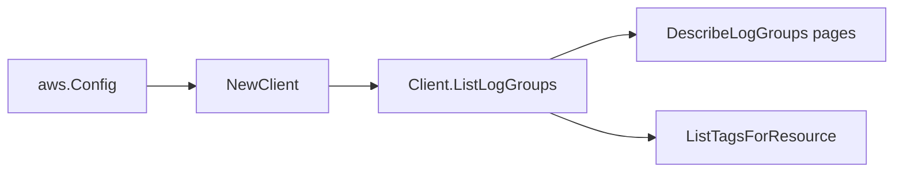

# AWS CloudWatch Logs SDK Adapter

## Purpose

`internal/collector/awscloud/services/cloudwatchlogs/awssdk` adapts AWS SDK for
Go v2 CloudWatch Logs responses to the scanner-owned `Client` contract. It owns
DescribeLogGroups pagination, resource tag reads, throttle classification, and
per-call AWS API telemetry.

## Ownership boundary

This package owns SDK calls for CloudWatch Logs. It does not own workflow
claims, credential acquisition, CloudWatch Logs fact selection, graph writes,
reducer admission, workload ownership, or query behavior.

## Exported surface

See `doc.go` for the godoc contract.

- `Client` - AWS SDK-backed implementation of `cloudwatchlogs.Client`.
- `NewClient` - builds a `Client` for one claimed AWS boundary.

## Dependencies

- `internal/collector/awscloud` for account, region, and service boundary
  labels.
- `internal/collector/awscloud/services/cloudwatchlogs` for scanner-owned
  result types.
- `internal/telemetry` for AWS API call and throttle instruments.
- AWS SDK for Go v2 `cloudwatchlogs` and Smithy error contracts.

## Telemetry

CloudWatch Logs list pages and tag reads are wrapped with:

- `aws.service.pagination.page`
- `eshu_dp_aws_api_calls_total`
- `eshu_dp_aws_throttle_total`

Metric labels stay bounded to service, account, region, operation, and result.
Log group names, ARNs, tags, KMS key IDs, and raw AWS error payloads stay out
of metric labels.

## Gotchas / invariants

- The adapter calls only `DescribeLogGroups` and `ListTagsForResource`.
- `DescribeLogGroups` sets `Limit=50`, the documented default and maximum
  page shape used for bounded scans, and follows `NextToken`.
- `ListTagsForResource` is called only when AWS returned an ARN-addressable log
  group. When AWS returns the wildcard `arn` form with a trailing `:*`, the
  adapter trims it before tag reads because tagging APIs require the non-wildcard
  ARN.
- The adapter maps safe control-plane fields: identity, creation time,
  retention, stored bytes, metric filter count, log group class, data
  protection status, inherited properties, KMS key identifier, deletion
  protection, bearer-token authentication state, and tags. It drops log events,
  log stream payloads, Insights query results, export payloads, resource
  policies, subscription payloads, and mutation surfaces.
- The adapter must not call `DescribeLogStreams`, `GetLogEvents`,
  `FilterLogEvents`, `StartQuery`, `GetQueryResults`, `DescribeExportTasks`,
  resource-policy APIs, subscription payload APIs, or mutation APIs.

## Related docs

- `docs/docs/adrs/2026-04-20-aws-cloud-scanner-collector.md`
- `docs/docs/guides/collector-authoring.md`
