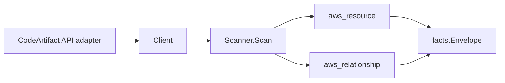

# AWS CodeArtifact Scanner

## Purpose

`internal/collector/awscloud/services/codeartifact` owns the CodeArtifact
scanner contract for the AWS cloud collector. It converts package-registry
domain and repository metadata into `aws_resource` facts and emits relationship
evidence for repository-to-domain membership, domain-to-KMS-key encryption,
repository-to-upstream-repository routing, and repository-to-external-connection
(public registry) links.

## Ownership boundary

This package owns scanner-level CodeArtifact fact selection and identity
mapping. It does not own AWS SDK pagination, STS credentials, workflow claims,
fact persistence, graph writes, reducer admission, or query behavior.

## Exported surface

See `doc.go` for the godoc contract.

- `Client` - minimal CodeArtifact metadata read surface consumed by `Scanner`.
- `Scanner` - emits domain and repository resources plus their relationships for
  one boundary.
- `Domain`, `Repository`, `ExternalConnection` - scanner-owned views carrying
  identity and metadata only, never package contents.

## Dependencies

- `internal/collector/awscloud` for boundaries, resource constants,
  relationship constants, and envelope builders.
- `internal/facts` for emitted fact envelope kinds.

The package depends on a small `Client` interface rather than the AWS SDK for
Go v2 so tests can use fake clients and runtime adapters can own SDK behavior.

## Telemetry

This scanner emits no spans or logs directly. `awsruntime.ClaimedSource`
records scan duration and emitted resource counts after `Scanner.Scan` returns.
The `awssdk` adapter records CodeArtifact API call counts, throttles, and
pagination spans.

## Gotchas / invariants

- CodeArtifact facts are metadata only. The scanner must never read, download,
  publish, copy, or delete a package version or package asset. The scanner-owned
  `Client` interface exposes only `List`/`Describe` reads, and a reflection
  guard test fails the build if any payload-reading or mutation method appears.
- Domain and repository ARNs and the KMS encryption-key ARN come from the
  CodeArtifact API and are used directly, so they carry the correct partition
  (`aws`, `aws-us-gov`, `aws-cn`) without synthesis. The scanner synthesizes no
  ARN and never hardcodes `arn:aws:`; if a future edge ever needs a synthesized
  identity, derive the partition through `awscloud.PartitionForBoundary` rather
  than a literal partition.
- The domain resource_id is the domain name, which is the join key repositories
  reference as their owning domain.
- The repository resource_id is the repository ARN when AWS reports one, with
  the `<domain>/<name>` domain-qualified identity and the bare name as
  correlation anchors. Repository names are unique only within a domain, so the
  upstream-repository edge keys on `<domain>/<upstream>` to disambiguate.
- The domain-to-KMS-key edge is emitted only when AWS reports an ARN-shaped
  encryption key, and it carries that ARN as both `target_resource_id` and
  `target_arn`, matching the `firstNonEmpty(keyID, keyARN)` resource_id the KMS
  scanner publishes so the edge joins the key node directly.
- The repository-to-external-connection edge targets a labeled non-AWS
  `public_package_registry` identity (for example `public:npmjs`), documented in
  `relguard.KnownTargetTypeAllowlist`, with no synthesized ARN.
- Upstream and external-connection edges deduplicate by target so duplicate
  reported entries collapse to one edge.
- Tags are not yet emitted because the CodeArtifact tag APIs sit outside the
  metadata read paths used here. When tags are added, treat them as raw AWS tag
  evidence and do not infer environment, owner, workload, or deployable-unit
  truth in this package.

## Evidence

Collector Performance Evidence:
`go test ./internal/collector/awscloud/services/codeartifact/...` covers the
bounded CodeArtifact metadata path: one paginated `ListDomains` stream with one
`DescribeDomain` point read per domain, one paginated `ListRepositories` stream
with one `DescribeRepository` point read per repository, no `ListPackages`,
`ListPackageVersions`, `GetPackageVersionAsset`, `GetPackageVersionReadme`,
`PublishPackageVersion`, or `CopyPackageVersions` calls, no mutations, and no
graph writes in the collector.

No-Regression Evidence:
`go test ./internal/collector/awscloud/services/codeartifact/... ./internal/collector/awscloud/internal/relguard/... ./cmd/collector-aws-cloud/... -count=1`
covers CodeArtifact domain and repository metadata fact emission,
repository-to-domain membership, domain-to-KMS-key,
repository-to-upstream-repository, and repository-to-external-connection relationship emission with
each edge's `target_type` and `target_resource_id` asserted, the metadata-only
reflection guard on the scanner-owned `Client` and the SDK adapter `apiClient`
interfaces, the relguard runtime graph-join contract over every emitted edge,
runtime registration, the SDK adapter's safe metadata mapping, and the derived
supported-service guard. This is a new metadata-only scanner with no change to
any existing fact, relationship, queue, graph-write, or hot-path behavior.

Collector Observability Evidence: CodeArtifact uses the existing AWS collector
`aws.service.pagination.page` span plus `eshu_dp_aws_api_calls_total`,
`eshu_dp_aws_throttle_total`, `eshu_dp_aws_resources_emitted_total`,
`eshu_dp_aws_relationships_emitted_total`, and `aws_scan_status` rows. Metric
labels stay bounded to service, account, region, operation, result, and status.

No-Observability-Change: the existing AWS collector telemetry contract already
diagnoses CodeArtifact scans through `aws.service.scan`,
`aws.service.pagination.page`, API/throttle counters, resource/relationship
counters, and `aws_scan_status`. This scanner adds no new instrument, span,
metric label, or status row.

Collector Deployment Evidence: CodeArtifact runs inside the existing hosted
`collector-aws-cloud` runtime, so `/healthz`, `/readyz`, `/metrics`, and
`/admin/status` stay covered by the command wiring and Helm collector runtime.

## Related docs

- `docs/public/services/collector-aws-cloud.md`
- `docs/public/services/collector-aws-cloud-scanners.md`
- `docs/public/guides/collector-authoring.md`
