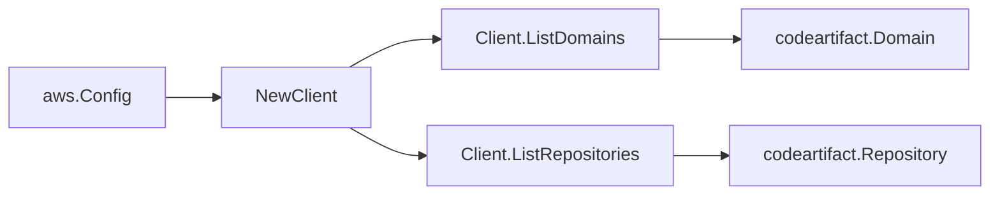

# AWS CodeArtifact SDK Adapter

## Purpose

`internal/collector/awscloud/services/codeartifact/awssdk` adapts AWS SDK for
Go v2 CodeArtifact responses to the scanner-owned `codeartifact.Client`
contract. It owns CodeArtifact API pagination, domain and repository describe
reads, throttle classification, and per-call AWS API telemetry.

## Ownership boundary

This package owns SDK calls for CodeArtifact. It does not own workflow claims,
credential acquisition, CodeArtifact fact selection, graph writes, reducer
admission, or query behavior.

## Exported surface

See `doc.go` for the godoc contract.

- `Client` - AWS SDK-backed implementation of `codeartifact.Client`.
- `NewClient` - builds a `Client` for one claimed AWS boundary.

## Dependencies

- `internal/collector/awscloud` for account, region, and service boundary
  labels and the API-call recorder.
- `internal/collector/awscloud/services/codeartifact` for scanner-owned result
  types.
- `internal/telemetry` for AWS API call and throttle instruments.
- AWS SDK for Go v2 `codeartifact` and Smithy error contracts.

## Telemetry

CodeArtifact paginator pages and point reads are wrapped with:

- `aws.service.pagination.page`
- `eshu_dp_aws_api_calls_total`
- `eshu_dp_aws_throttle_total`

Metric labels stay bounded to service, account, region, operation, and result.
Domain and repository ARNs, encryption-key ARNs, descriptions, and raw AWS
error payloads stay out of metric labels.

## Gotchas / invariants

- The adapter-local `apiClient` interface is limited to `ListDomains`,
  `DescribeDomain`, `ListRepositories`, and `DescribeRepository`. A reflection
  guard test (`TestAdapterAPIClientForbidsPackagePayloadAndMutation`) fails the
  build if any package-payload read (anything matching `package`, `asset`,
  `version`, `readme`, `dependencies`) or any mutation
  (`Create`/`Update`/`Delete`/`Put`/`Publish`/`Copy`/`Dispose`/...) becomes
  reachable, so package contents are unreachable by construction.
- `DescribeDomain` supplies the encryption-key ARN, owner, repository count,
  asset size, and S3 bucket ARN that `ListDomains` summaries omit.
- `DescribeRepository` supplies the external connections and upstream
  repositories that `ListRepositories` summaries omit.
- The `S3BucketArn` and `EncryptionKey` ARNs are passed through unchanged; the
  scanner uses the reported ARNs directly so they stay partition-aware.
- SDK adapters translate AWS records into scanner-owned types; scanner tests
  should not mock AWS SDK paginators.

## Related docs

- `docs/public/services/collector-aws-cloud.md`
- `docs/public/guides/collector-authoring.md`
