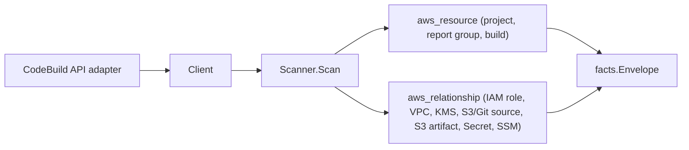

# AWS CodeBuild Scanner

## Purpose

`internal/collector/awscloud/services/codebuild` owns the CodeBuild scanner
contract for the AWS cloud collector. It converts build-project, report-group,
and recent-build metadata into `aws_resource` facts and emits `aws_relationship`
facts for the project edges CodeBuild reports directly.

## Ownership boundary

This package owns scanner-level CodeBuild fact selection and identity mapping.
It does not own AWS SDK pagination, STS credentials, workflow claims, fact
persistence, graph writes, reducer admission, or query behavior.

## Exported surface

See `doc.go` for the godoc contract.

- `Client` - metadata-only CodeBuild read surface consumed by `Scanner`.
- `Scanner` - emits CodeBuild metadata facts for one boundary; requires a
  redaction key.
- `Project`, `ReportGroup`, `Build` - scanner-owned CodeBuild records.
- `ProjectSource`, `ProjectEnvironment`, `EnvironmentVariable`,
  `ProjectArtifacts`, `VPCConfig` - supporting metadata records. `ProjectSource`
  has no buildspec field; `EnvironmentVariable` carries name + type plus either a
  redaction marker (PLAINTEXT) or a resource reference (PARAMETER_STORE,
  SECRETS_MANAGER), never a raw value.

## Dependencies

- `internal/collector/awscloud` for boundaries, resource constants,
  relationship constants, envelope builders, and the shared `RedactString`
  redaction helper.
- `internal/facts` for emitted fact envelope kinds.
- `internal/redact` for the redaction key the scanner requires.

The package depends on a small `Client` interface rather than the AWS SDK for
Go v2 so tests can use fake clients and runtime adapters can own SDK behavior.

## Telemetry

This scanner emits no spans or logs directly. `awsruntime.ClaimedSource`
records scan duration and emitted resource counts after `Scanner.Scan` returns
(`eshu_dp_aws_resources_emitted_total{service="codebuild"}`). The `awssdk`
adapter records CodeBuild API call counts, throttles, and pagination spans.

## Gotchas / invariants

- CodeBuild facts are metadata only. The scanner must never read or persist
  buildspec.yml bodies (`Source.Buildspec` / `BuildspecOverride`),
  environment-variable PLAINTEXT values, build logs, or source-credential
  tokens.
- PLAINTEXT environment-variable values are redacted by the SDK adapter before
  they reach `EnvironmentVariable`. `Scanner.Scan` fails closed when the
  redaction key is zero so secret-shaped values cannot leak.
- PARAMETER_STORE and SECRETS_MANAGER environment variables keep their
  reference (parameter name or secret ARN/name) because that is a resource
  reference, not a secret value; it drives the SSM and Secrets Manager
  relationship edges.
- Relationship targets carry a non-empty `target_type` and a target resource id
  matching the owning scanner's `resource_id`: IAM role ARN (`aws_iam_role`),
  VPC id (`aws_ec2_vpc`), subnet id (`aws_ec2_subnet`), security-group id
  (`aws_ec2_security_group`), KMS key id/ARN (`aws_kms_key`), S3 bucket ARN
  (`aws_s3_bucket`), secret ARN/name (`aws_secretsmanager_secret`), and
  parameter ARN/name (`aws_ssm_parameter`). Git provider sources target an
  external `git_repository` endpoint.
- S3 bucket ARNs derived from source/artifact locations use the partition-
  agnostic `arn:aws:s3:::bucket` form; no region or account partition is
  synthesized.
- Tags are raw AWS tag evidence. Do not infer environment, owner, workload, or
  deployable-unit truth from tags in this package.

## Evidence

Collector Performance Evidence:
`go test ./internal/collector/awscloud/services/codebuild/... -count=1 -race`
covers the bounded CodeBuild metadata path: paginated project and report-group
listings; one batch resolve per ≤100-item group; recent builds bounded to one
ListBuilds page and the `BatchGetBuilds` cap; no buildspec-body reads; no log
reads; no source-credential reads; no mutations.

No-Regression Evidence:
`go test ./cmd/collector-aws-cloud/... ./internal/collector/awscloud/awsruntime/... -count=1`
covers CodeBuild resource and relationship emission, PLAINTEXT env-value
redaction, buildspec-body exclusion, runtime registration through the derived
service guard, and command configuration requiring a redaction key.

Collector Observability Evidence: CodeBuild uses the existing AWS collector
`aws.service.pagination.page` span plus `eshu_dp_aws_api_calls_total`,
`eshu_dp_aws_throttle_total`, `eshu_dp_aws_resources_emitted_total`,
`eshu_dp_aws_relationships_emitted_total`, and `aws_scan_status` rows. Metric
labels stay bounded to service, account, region, operation, result, and status.

No-Observability-Change: CodeBuild adds no new telemetry contract. The existing
AWS collector signals already diagnose CodeBuild scans through the
`aws.service.scan` and `aws.service.pagination.page` spans,
`eshu_dp_aws_api_calls_total`, `eshu_dp_aws_throttle_total`,
`eshu_dp_aws_resources_emitted_total{service="codebuild"}`,
`eshu_dp_aws_relationships_emitted_total{service="codebuild"}`, and
`aws_scan_status` rows. CodeBuild only adds the bounded `service="codebuild"`
label value to those existing instruments.

Collector Deployment Evidence: CodeBuild runs inside the existing hosted
`collector-aws-cloud` runtime, so `/healthz`, `/readyz`, `/metrics`, and
`/admin/status` stay covered by the command wiring and Helm collector runtime.

## Related docs

- `docs/public/services/collector-aws-cloud.md`
- `docs/public/guides/collector-authoring.md`
