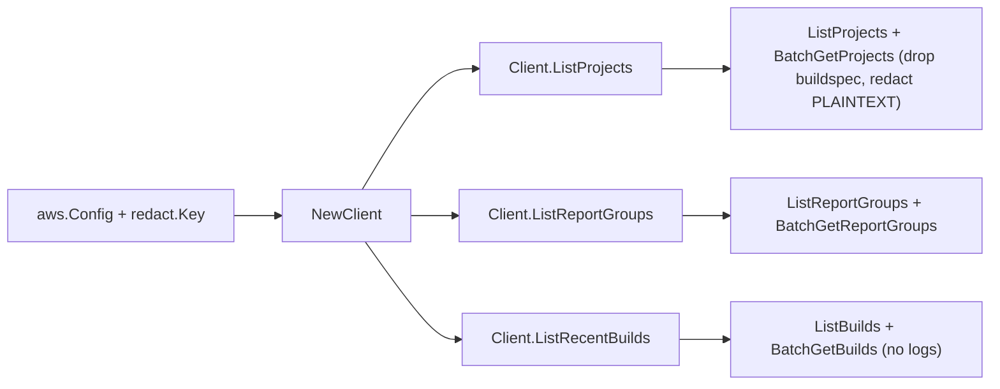

# AWS CodeBuild SDK Adapter

## Purpose

`internal/collector/awscloud/services/codebuild/awssdk` adapts AWS SDK for Go
v2 CodeBuild responses to the scanner-owned `codebuild.Client` contract. It owns
CodeBuild pagination, batch metadata resolution, PLAINTEXT environment-value
redaction, buildspec-body and log exclusion, throttle classification, and
per-call AWS API telemetry.

## Ownership boundary

This package owns SDK calls for CodeBuild. It does not own workflow claims,
credential acquisition, CodeBuild fact selection, graph writes, reducer
admission, or query behavior.

## Exported surface

See `doc.go` for the godoc contract.

- `Client` - AWS SDK-backed implementation of `codebuild.Client`.
- `NewClient` - builds a `Client` for one claimed AWS boundary and redaction
  key.

## Dependencies

- `internal/collector/awscloud` for account, region, and service boundary
  labels and the shared `RedactString` redaction helper.
- `internal/collector/awscloud/services/codebuild` for scanner-owned result
  types.
- `internal/redact` for the redaction key applied to PLAINTEXT env values.
- `internal/telemetry` for AWS API call and throttle instruments.
- AWS SDK for Go v2 `codebuild` and Smithy error contracts.

## Telemetry

CodeBuild paginator pages and batch reads are wrapped with:

- `aws.service.pagination.page`
- `eshu_dp_aws_api_calls_total`
- `eshu_dp_aws_throttle_total`

Metric labels stay bounded to service, account, region, operation, and result.
ARNs, tags, source references, and raw AWS error payloads stay out of metric
labels.

## Gotchas / invariants

- The `apiClient` interface lists only metadata reads. A reflection guard test
  (`TestAPIClientInterfaceExcludesMutationCredentialAndLogAPIs`) fails if any
  mutation, build data-plane, source-credential, or log-content method becomes
  callable.
- `mapSource` copies the source type, location, and identifier only. It must
  never copy `ProjectSource.Buildspec` because that field carries the
  buildspec.yml body or path.
- `mapEnvironmentVariables` routes PLAINTEXT values (and any unknown future
  type) through `awscloud.RedactString`. PARAMETER_STORE and SECRETS_MANAGER
  values are kept as references because they name a resource, not a secret.
- `mapBuild` copies build identity, status, and duration metadata only; it must
  never copy log group/stream references or log content.
- `BatchGetProjects`, `BatchGetReportGroups`, and `BatchGetBuilds` are chunked
  by the AWS 100-item cap, and their `*NotFound` lists are surfaced as errors so
  an unresolved item is never silently dropped.
- Recent builds are bounded to `recentBuildLimit` (one ListBuilds page) so the
  scan stays metadata-sized.
- SDK adapters translate AWS records into scanner-owned types; scanner tests
  should not mock AWS SDK paginators.

## Related docs

- `docs/public/services/collector-aws-cloud.md`
- `docs/public/guides/collector-authoring.md`
