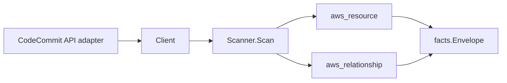

# AWS CodeCommit Scanner

## Purpose

`internal/collector/awscloud/services/codecommit` owns the CodeCommit scanner
contract for the AWS cloud collector. It converts repository metadata into
`aws_resource` facts and emits relationship evidence for repository encryption
(KMS key) and repository triggers (SNS topic). The repository resource is a
code-to-cloud correlation anchor: it publishes the repository name and clone
URLs as correlation anchors so a CodeBuild project, CodePipeline source action,
or Amplify app whose Git source points at the repository joins it.

AWS no longer onboards new CodeCommit customers, but existing repositories
remain in scope as correlation anchors between source control and CI/CD.

## Ownership boundary

This package owns scanner-level CodeCommit fact selection and identity mapping.
It does not own AWS SDK pagination, STS credentials, workflow claims, fact
persistence, graph writes, reducer admission, or query behavior.

## Exported surface

See `doc.go` for the godoc contract.

- `Client` - minimal CodeCommit metadata read surface consumed by `Scanner`.
- `Scanner` - emits one repository resource plus its KMS-key and SNS-topic
  relationship facts for one boundary.
- `Repository` - scanner-owned repository view (name, ARN, id, default branch,
  clone URLs, KMS key id, timestamps, triggers, tags).
- `Trigger` - scanner-owned repository trigger view (name, destination ARN,
  events, branches).

## Dependencies

- `internal/collector/awscloud` for boundaries, resource constants,
  relationship constants, and envelope builders.
- `internal/facts` for emitted fact envelope kinds.

The package depends on a small `Client` interface rather than the AWS SDK for
Go v2 so tests can use fake clients and runtime adapters can own SDK behavior.

## Telemetry

This scanner emits no spans or logs directly. `awsruntime.ClaimedSource`
records scan duration and emitted resource counts after `Scanner.Scan` returns.
The `awssdk` adapter records CodeCommit API call counts, throttles, and
pagination spans.

## Gotchas / invariants

- Metadata only. The scanner never reads commits, refs, blobs, file contents,
  pull-request bodies, or comment text, and never mutates any CodeCommit
  resource. The SDK adapter's read surface excludes those operations by
  construction, proven by a reflection guard test.
- Clone-URL evidence is host-only. The repository resource attributes carry
  `clone_url_http_host` / `clone_url_ssh_host`, never the full URL path, so a
  clone URL string's path or any embedded userinfo never persists as an
  attribute. The full clone URLs are published as correlation anchors instead,
  because they are the join keys a CI Git source reports.
- Code-to-cloud anchor. The repository correlation anchors are the repository
  name and full clone URLs. The CodeBuild scanner emits a
  `codebuild_project_sourced_from_repository` edge whose `target_resource_id`
  is the reported Git source location (a clone URL); publishing the clone URLs
  as anchors here lets that edge resolve to the repository node.
- The repository-to-KMS-key edge uses the key AWS reports directly. CodeCommit
  returns the key as either a bare key id or a key ARN; the edge keys on the
  bare id when bare (matching the KMS scanner's `resource_id`) and is ARN-keyed
  when ARN-shaped. No ARN is synthesized, so the `partitionguard` test does not
  apply: every ARN on a CodeCommit fact comes from the API.
- Only SNS-topic trigger destinations produce an edge. CodeCommit triggers can
  target an SNS topic or a Lambda function; a non-SNS destination stays as
  resource evidence (trigger count) and is not promoted to a dangling edge.
  Duplicate SNS destinations across triggers collapse to one edge.
- Repositories without a customer KMS key (the AWS-managed key default) emit no
  KMS edge.

## Evidence

Collector Performance Evidence:
`go test ./internal/collector/awscloud/services/codecommit/...` covers the
bounded CodeCommit metadata path: one paginated `ListRepositories` stream, one
`BatchGetRepositories` call per 25-name chunk, one `GetRepositoryTriggers`
point read per repository, one paginated `ListTagsForResource` stream per
repository, no commit/ref/blob/file-content reads, no mutations, and no graph
writes in the collector.

No-Regression Evidence:
`go test ./internal/collector/awscloud/services/codecommit/... ./internal/collector/awscloud/internal/relguard/... ./cmd/collector-aws-cloud/... -count=1`
covers repository metadata fact emission, host-only clone-URL evidence,
code-to-cloud correlation-anchor publication (repository name + clone URLs),
the repository-to-KMS-key edge (ARN-keyed and bare-key-id-keyed), the
repository-to-SNS-topic trigger edge, non-SNS-destination and
no-key edge suppression, duplicate-trigger collapse, the metadata-only SDK
adapter exclusion reflection guard, the SDK adapter batch-chunking and mapping,
runtime registration, and the derived supported-service guard in
`cmd/collector-aws-cloud`. The change adds only the
`github.com/aws/aws-sdk-go-v2/service/codecommit v1.33.0` module; no shared
AWS SDK or smithy-go dependency version changes, so no existing scanner path is
affected. This is a metadata-only additive scanner with no graph-write, queue,
or hot-path behavior change.

No-Observability-Change: CodeCommit uses the existing AWS collector
`aws.service.pagination.page` span plus `eshu_dp_aws_api_calls_total`,
`eshu_dp_aws_throttle_total`, `eshu_dp_aws_resources_emitted_total`,
`eshu_dp_aws_relationships_emitted_total`, and `aws_scan_status` rows. Metric
labels stay bounded to service, account, region, operation, result, and status.
No instrument, span, metric label, or `aws_scan_status` row is added or
changed.

Collector Deployment Evidence: CodeCommit runs inside the existing hosted
`collector-aws-cloud` runtime, so `/healthz`, `/readyz`, `/metrics`, and
`/admin/status` stay covered by the command wiring and Helm collector runtime.

## Related docs

- `docs/public/services/collector-aws-cloud.md`
- `docs/public/services/collector-aws-cloud-scanners.md`
- `docs/public/guides/collector-authoring.md`
