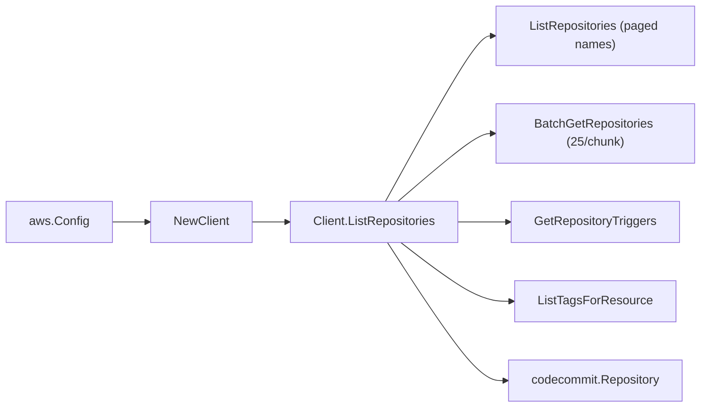

# AWS CodeCommit SDK Adapter

## Purpose

`internal/collector/awscloud/services/codecommit/awssdk` adapts AWS SDK for Go
v2 CodeCommit responses to the scanner-owned `codecommit.Client` contract. It
owns CodeCommit API pagination, `BatchGetRepositories` chunking, repository
trigger reads, repository tag reads, throttle classification, and per-call AWS
API telemetry.

## Ownership boundary

This package owns SDK calls for CodeCommit. It does not own workflow claims,
credential acquisition, CodeCommit fact selection, graph writes, reducer
admission, or query behavior.

## Exported surface

See `doc.go` for the godoc contract.

- `Client` - AWS SDK-backed implementation of `codecommit.Client`.
- `NewClient` - builds a `Client` for one claimed AWS boundary.

## Dependencies

- `internal/collector/awscloud` for account, region, and service boundary
  labels and API-call recording.
- `internal/collector/awscloud/services/codecommit` for scanner-owned result
  types.
- `internal/telemetry` for AWS API call and throttle instruments.
- AWS SDK for Go v2 `codecommit` and Smithy error contracts.

## Telemetry

CodeCommit paginator pages and point reads are wrapped with:

- `aws.service.pagination.page`
- `eshu_dp_aws_api_calls_total`
- `eshu_dp_aws_throttle_total`

Metric labels stay bounded to service, account, region, operation, and result.
Repository ARNs, tags, clone URLs, KMS key ids, and raw AWS error payloads stay
out of metric labels.

## Gotchas / invariants

- Metadata only. The `apiClient` interface exposes exactly `ListRepositories`,
  `BatchGetRepositories`, `GetRepositoryTriggers`, and `ListTagsForResource`.
  It exposes no commit, ref, blob, file-content, pull-request, comment, or
  mutation method. `exclusion_test.go` reflects over `apiClient` and fails the
  build if any forbidden method becomes reachable.
- `ListRepositories` returns only repository name/id pairs, so repository
  metadata (ARN, default branch, clone URLs, KMS key id, timestamps) is
  resolved with `BatchGetRepositories`, chunked to the AWS 25-name limit so a
  repository-heavy account does not fail the whole scan.
- `GetRepositoryTriggers` is a point read per repository; trigger destination
  ARNs drive the repository-to-SNS-topic relationship.
- `ListTagsForResource` is paginated per repository ARN because
  `BatchGetRepositories` does not return tags.
- SDK adapters translate AWS records into scanner-owned types; scanner tests
  use fake clients and do not mock AWS SDK paginators.

## Related docs

- `../README.md` for the CodeCommit scanner contract.
- `docs/public/services/collector-aws-cloud-scanners.md`
- `docs/public/guides/collector-authoring.md`
