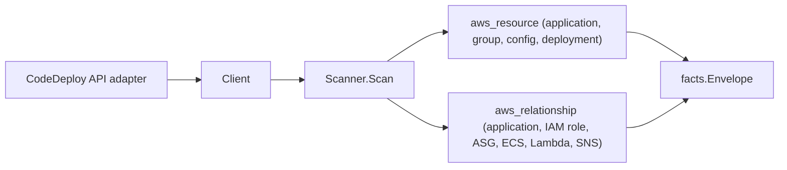

# AWS CodeDeploy Scanner

## Purpose

`internal/collector/awscloud/services/codedeploy` owns the CodeDeploy scanner
contract for the AWS cloud collector. It converts application, deployment-group,
deployment-config, and recent-deployment metadata into `aws_resource` facts and
emits `aws_relationship` facts for the deployment-group edges CodeDeploy reports
directly.

## Ownership boundary

This package owns scanner-level CodeDeploy fact selection and identity mapping.
It does not own AWS SDK pagination, STS credentials, workflow claims, fact
persistence, graph writes, reducer admission, or query behavior.

## Exported surface

See `doc.go` for the godoc contract.

- `Client` - metadata-only CodeDeploy read surface consumed by `Scanner`.
- `Scanner` - emits CodeDeploy metadata facts for one boundary; requires a
  redaction key.
- `Application`, `DeploymentGroup`, `DeploymentConfig`, `Deployment` -
  scanner-owned CodeDeploy records.
- `DeploymentStyle`, `AutoRollbackConfig`, `ECSServiceTarget`, `SNSTrigger`,
  `TagFilterSummary`, `RevisionSummary` - supporting metadata records. The
  appspec.yml body has no field; revision-source references only.

## Dependencies

- `internal/collector/awscloud` for boundaries, resource constants,
  relationship constants, envelope builders, and the shared `RedactString`
  redaction helper.
- `internal/facts` for emitted fact envelope kinds.
- `internal/redact` for the redaction key the scanner requires.

The package depends on a small `Client` interface rather than the AWS SDK for
Go v2 so tests can use fake clients and runtime adapters can own SDK behavior.

## Telemetry

This scanner emits no spans or logs directly. `awsruntime.ClaimedSource`
records scan duration and emitted resource counts after `Scanner.Scan` returns
(`eshu_dp_aws_resources_emitted_total{service="codedeploy"}`). The `awssdk`
adapter records CodeDeploy API call counts, throttles, and pagination spans.

## Gotchas / invariants

- CodeDeploy facts are metadata only. The scanner must never read or persist
  appspec.yml lifecycle-hook bodies; `RevisionSummary` keeps only revision type
  and S3/GitHub source references.
- On-premises instance tag values are redacted by the SDK adapter before they
  reach `TagFilterSummary`. `Scanner.Scan` fails closed when the redaction key
  is zero so PII-shaped values cannot leak.
- EC2 and on-premises tag filters are summarized as key/type evidence on the
  deployment-group resource, not as relationships, because a tag filter names
  no concrete resource.
- CodeDeploy list/batch APIs do not return ARNs. The scanner derives stable
  identities using the documented CodeDeploy ARN format from the boundary
  account and region.
- Tags are raw AWS tag evidence. Do not infer environment, owner, workload, or
  deployable-unit truth from tags in this package.

## Evidence

Collector Performance Evidence:
`go test ./internal/collector/awscloud/services/codedeploy/... -count=1 -race`
covers the bounded CodeDeploy metadata path: paginated application, deployment
group, deployment config, and deployment listings; one batch resolve per name
group; one tag read per resource; recent deployments bounded to the
`BatchGetDeployments` cap of 25; no revision-body reads; no mutations.

No-Regression Evidence:
`go test ./cmd/collector-aws-cloud/... ./internal/collector/awscloud/awsruntime/... -count=1`
covers CodeDeploy resource and relationship emission, on-premises tag value
redaction, appspec-body exclusion, runtime registration through the derived
service guard, and command configuration requiring a redaction key.

Collector Observability Evidence: CodeDeploy uses the existing AWS collector
`aws.service.pagination.page` span plus `eshu_dp_aws_api_calls_total`,
`eshu_dp_aws_throttle_total`, `eshu_dp_aws_resources_emitted_total`,
`eshu_dp_aws_relationships_emitted_total`, and `aws_scan_status` rows. Metric
labels stay bounded to service, account, region, operation, result, and status.

No-Observability-Change: CodeDeploy adds no new telemetry contract. The
existing AWS collector signals already diagnose CodeDeploy scans through the
`aws.service.scan` and `aws.service.pagination.page` spans,
`eshu_dp_aws_api_calls_total`, `eshu_dp_aws_throttle_total`,
`eshu_dp_aws_resources_emitted_total{service="codedeploy"}`,
`eshu_dp_aws_relationships_emitted_total{service="codedeploy"}`, and
`aws_scan_status` rows. CodeDeploy only adds the bounded `service="codedeploy"`
label value to those existing instruments.

Collector Deployment Evidence: CodeDeploy runs inside the existing hosted
`collector-aws-cloud` runtime, so `/healthz`, `/readyz`, `/metrics`, and
`/admin/status` stay covered by the command wiring and Helm collector runtime.

### Partition-aware ARNs (#866)

No-Regression Evidence: `go test ./internal/collector/awscloud/services/codedeploy/... -count=1`
covers the new `TestCodeDeploySynthesizedARNsDerivePartition` and
`TestClientSynthesizedARNsDerivePartition` (commercial / `aws-us-gov` /
`aws-cn` / blank-region-fallback) alongside the existing assertions. The
CodeDeploy list/batch APIs return no ARNs, so every synthesized ARN
(application, deployment group, deployment config, deployment, and the ECS
service / Lambda function deployment targets) now derives the partition from the
scan boundary via `awscloud.PartitionForBoundary` instead of hardcoding `aws`.
Commercial output (`us-east-1`) is byte-for-byte unchanged; this is a
metadata-only correctness fix with no graph-write, queue, or hot-path behavior
change.

No-Observability-Change: the fix only changes the partition substring of a
synthesized ARN value; no instrument, span, metric label, or `aws_scan_status`
row changes.

## Related docs

- `docs/public/services/collector-aws-cloud.md`
- `docs/public/guides/collector-authoring.md`
