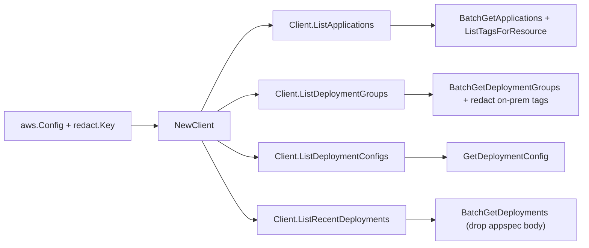

# AWS CodeDeploy SDK Adapter

## Purpose

`internal/collector/awscloud/services/codedeploy/awssdk` adapts AWS SDK for Go
v2 CodeDeploy responses to the scanner-owned `codedeploy.Client` contract. It
owns CodeDeploy pagination, batch metadata resolution, tag reads, on-premises
tag value redaction, throttle classification, and per-call AWS API telemetry.

## Ownership boundary

This package owns SDK calls for CodeDeploy. It does not own workflow claims,
credential acquisition, CodeDeploy fact selection, graph writes, reducer
admission, or query behavior.

## Exported surface

See `doc.go` for the godoc contract.

- `Client` - AWS SDK-backed implementation of `codedeploy.Client`.
- `NewClient` - builds a `Client` for one claimed AWS boundary and redaction
  key.

## Dependencies

- `internal/collector/awscloud` for account, region, and service boundary
  labels and the shared `RedactString` redaction helper.
- `internal/collector/awscloud/services/codedeploy` for scanner-owned result
  types.
- `internal/redact` for the redaction key applied to on-premises tag values.
- `internal/telemetry` for AWS API call and throttle instruments.
- AWS SDK for Go v2 `codedeploy` and Smithy error contracts.

## Telemetry

CodeDeploy paginator pages and point reads are wrapped with:

- `aws.service.pagination.page`
- `eshu_dp_aws_api_calls_total`
- `eshu_dp_aws_throttle_total`

Metric labels stay bounded to service, account, region, operation, and result.
ARNs, tags, revision references, and raw AWS error payloads stay out of metric
labels.

## Gotchas / invariants

- The `apiClient` interface lists only metadata reads. A reflection guard test
  (`TestAPIClientInterfaceExcludesMutationAndRevisionAPIs`) fails if any
  mutation, deployment/target instance data-plane, or revision-body method
  becomes callable.
- `mapRevisionSummary` copies only the revision type plus S3/GitHub source
  references. It must never copy `AppSpecContent.Content` or `String_.Content`
  because those carry appspec.yml lifecycle-hook bodies.
- `mapOnPremisesTagFilters` routes every on-premises tag value through
  `awscloud.RedactString`. EC2 tag filters are summarized as key/type only.
- Recent deployments are bounded to `recentDeploymentLimit` (25), the
  `BatchGetDeployments` cap, so the scan stays metadata-sized.
- CodeDeploy list/batch APIs return no ARNs; the adapter derives the documented
  application and deployment-group ARNs to read tags.
- SDK adapters translate AWS records into scanner-owned types; scanner tests
  should not mock AWS SDK paginators.

## Related docs

- `docs/public/services/collector-aws-cloud.md`
- `docs/public/guides/collector-authoring.md`
