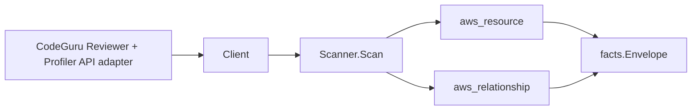

# Amazon CodeGuru Scanner

## Purpose

`internal/collector/awscloud/services/codeguru` owns the Amazon CodeGuru scanner
contract for the AWS cloud collector. It covers both CodeGuru Reviewer
(repository associations) and CodeGuru Profiler (profiling groups). It converts
that control-plane metadata into `aws_resource` facts and emits relationship
evidence for a Reviewer association whose source provider is AWS CodeCommit.

## Ownership boundary

This package owns scanner-level CodeGuru fact selection and identity mapping. It
does not own AWS SDK pagination, STS credentials, workflow claims, fact
persistence, graph writes, reducer admission, or query behavior.

## Exported surface

See `doc.go` for the godoc contract.

- `Client` - minimal CodeGuru metadata read surface consumed by `Scanner`.
- `Scanner` - emits repository-association and profiling-group resources plus the
  CodeCommit edge for one boundary.
- `Snapshot`, `RepositoryAssociation`, `ProfilingGroup` - scanner-owned views
  with findings, recommendation, profiling-sample, and agent-telemetry fields
  intentionally absent.

## Dependencies

- `internal/collector/awscloud` for boundaries, resource constants, relationship
  constants, partition helpers, and envelope builders.
- `internal/facts` for emitted fact envelope kinds.

The package depends on a small `Client` interface rather than the AWS SDK for Go
v2 so tests can use fake clients and the runtime adapter can own SDK behavior.

## Telemetry

This scanner emits no spans or logs directly. `awsruntime.ClaimedSource` records
scan duration and emitted resource counts after `Scanner.Scan` returns. The
`awssdk` adapter records CodeGuru Reviewer and Profiler API call counts,
throttles, and pagination spans.

## Gotchas / invariants

- CodeGuru facts are metadata only. The scanner must never read code-review
  findings, recommendation content, analyzed source, profiling samples,
  aggregated profiles, flame graphs, recommendation reports, or agent telemetry,
  and must never call any mutation API.
- A single `service_kind` (`codeguru`) covers both Reviewer and Profiler. The
  Scan switch trims whitespace and writes the canonical value back so padded
  input never leaks into emitted facts.
- The association node publishes its resource_id as the association ARN (falling
  back to the association id, then the name). The profiling-group node publishes
  its ARN (falling back to the name).
- The association-to-CodeCommit-repository edge is emitted only when the provider
  type is CodeCommit. CodeGuru reports only the repository name and the owning
  account, so the scanner synthesizes the partition-aware CodeCommit repository
  ARN (`arn:<partition>:codecommit:<region>:<owner>:<name>`) via
  `awscloud.PartitionForBoundary` to match the CodeCommit scanner's published
  repository resource_id in GovCloud and China, not just commercial. The edge is
  skipped when the owner account or region is missing rather than dangled.
- Non-CodeCommit providers (GitHub, Bitbucket, GitHub Enterprise Server, S3) and
  the CodeStar connection ARN / S3 bucket name are recorded as resource
  attributes only, never promoted to an edge, so no edge dangles to an unscanned
  third-party endpoint.
- The profiling-group compute platform (Default / AWSLambda) is recorded as a
  resource attribute; CodeGuru reports no structured compute resource identifier
  to key an edge on.
- Emit reported evidence only. Do not infer deployment, workload, repository
  ownership, environment, or deployable-unit truth from names or AWS tags.

## Evidence

Collector Performance Evidence:
`go test ./internal/collector/awscloud/services/codeguru/...` covers the bounded
CodeGuru metadata path: one paginated ListRepositoryAssociations stream
(Reviewer) and one paginated ListProfilingGroups stream with full descriptions
(Profiler), one ListTagsForResource point read per association and per group, no
findings reads, no recommendation reads, no profiling-sample reads, no
mutations, and no graph writes in the collector.

No-Regression Evidence: metadata-only control-plane scanner; new read path, no
change to existing hot paths. `go test ./internal/collector/awscloud/services/codeguru/...`
green.

No-Observability-Change: reuses shared AWS pagination span + API-call/throttle
counters; no telemetry contract change.

Collector Deployment Evidence: CodeGuru runs inside the existing hosted
`collector-aws-cloud` runtime, so `/healthz`, `/readyz`, `/metrics`, and
`/admin/status` stay covered by the command wiring and Helm collector runtime.

## Related docs

- `docs/public/services/collector-aws-cloud.md`
- `docs/public/services/collector-aws-cloud-scanners.md`
- `docs/public/services/collector-aws-cloud-security.md`
