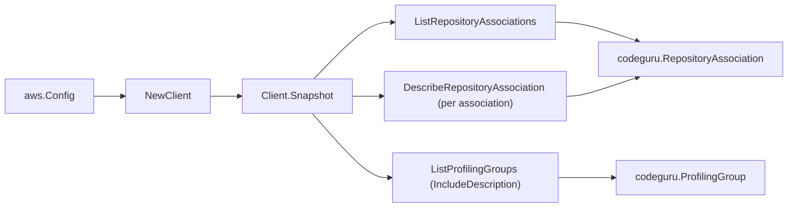

# Amazon CodeGuru SDK Adapter

## Purpose

`internal/collector/awscloud/services/codeguru/awssdk` adapts AWS SDK for Go v2
CodeGuru Reviewer and CodeGuru Profiler responses to the scanner-owned `Client`
contract. It owns repository-association pagination, per-association
describe-only enrichment, profiling-group pagination with inline descriptions,
throttle classification, and per-call AWS API telemetry.

## Ownership boundary

This package owns SDK calls for CodeGuru. It does not own workflow claims,
credential acquisition, CodeGuru fact selection, graph writes, reducer
admission, or query behavior.

## Exported surface

See `doc.go` for the godoc contract.

- `Client` - AWS SDK-backed implementation of `codeguru.Client`.
- `NewClient` - builds a `Client` (Reviewer + Profiler) for one claimed AWS
  boundary.

## Dependencies

- `internal/collector/awscloud` for account, region, and service boundary
  labels.
- `internal/collector/awscloud/services/codeguru` for scanner-owned result
  types.
- `internal/telemetry` for AWS API call and throttle instruments.
- AWS SDK for Go v2 `codegurureviewer`, `codeguruprofiler`, and Smithy error
  contracts.

## Telemetry

CodeGuru paginator pages and point reads are wrapped with:

- `aws.service.pagination.page`
- `eshu_dp_aws_api_calls_total`
- `eshu_dp_aws_throttle_total`

Metric labels stay bounded to service, account, region, operation, and result.
CodeGuru resource ARNs, names, tags, and raw AWS error payloads stay out of
metric labels.

## Gotchas / invariants

- The adapter reads metadata only. It must never call `GetProfile`,
  `ListFindingsReports`, `ListProfileTimes`, `BatchGetFrameMetricData`,
  `ListCodeReviews`, `DescribeCodeReview`, `ListRecommendations`,
  `ListRecommendationFeedback`, any `Associate*`/`Disassociate*`, or any
  `Create*`/`Update*`/`Delete*`/`Put*`/`Configure*` mutation API.
- `ListProfilingGroups` is called with `IncludeDescription=true` so the full
  profiling-group description (compute platform, orchestration config, lifecycle
  timestamps, tags) arrives inline; no per-group `DescribeProfilingGroup` round
  trip is needed.
- `DescribeRepositoryAssociation` enriches each summary with the customer-managed
  KMS key id, encryption option, and S3 backing bucket name plus resource tags.
  The adapter records only those metadata references, never the analyzed source
  object keys or code body.
- The adapter wires two SDK modules (Reviewer and Profiler) from one shared
  `aws.Config`; both control planes are read under the single `codeguru`
  service_kind.
- SDK adapters translate AWS responses into scanner-owned types; scanner tests
  should not mock AWS SDK pagination.

## Related docs

- `docs/public/services/collector-aws-cloud-scanners.md`
- `docs/public/services/collector-aws-cloud-security.md`
