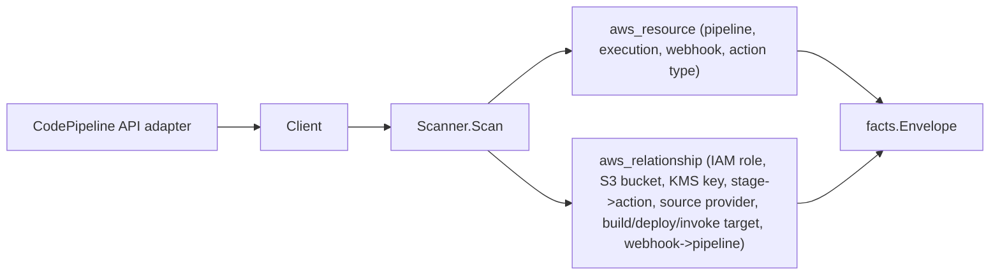

# AWS CodePipeline Scanner

## Purpose

`internal/collector/awscloud/services/codepipeline` owns the CodePipeline
scanner contract for the AWS cloud collector. It converts pipeline,
recent-execution, webhook, and custom-action-type metadata into `aws_resource`
facts and emits `aws_relationship` facts for the pipeline, stage, and action
edges CodePipeline reports.

## Ownership boundary

This package owns scanner-level CodePipeline fact selection and identity
mapping. It does not own AWS SDK pagination, STS credentials, workflow claims,
fact persistence, graph writes, reducer admission, or query behavior.

## Exported surface

See `doc.go` for the godoc contract.

- `Client` - metadata-only CodePipeline read surface consumed by `Scanner`.
- `Scanner` - emits CodePipeline metadata facts for one boundary; requires a
  redaction key.
- `Pipeline`, `Execution`, `Webhook`, `ActionType` - scanner-owned CodePipeline
  records.
- `ArtifactStoreSummary`, `Stage`, `Action`, `SourceRevision` - supporting
  metadata records. None carries an action configuration value, a webhook
  authentication secret token, or a GitHub OAuth token.
- `ResourceTypeCodePipelineSourceProvider` - the provider-category target type a
  source-action edge points at when the concrete repository lives in
  unpersistable action configuration values.

## Dependencies

- `internal/collector/awscloud` for boundaries, resource constants,
  relationship constants, envelope builders, and the shared `RedactString`
  redaction helper.
- `internal/facts` for emitted fact envelope kinds.
- `internal/redact` for the redaction key the scanner requires.

The package depends on a small `Client` interface rather than the AWS SDK for
Go v2 so tests can use fake clients and runtime adapters can own SDK behavior.

## Telemetry

This scanner emits no spans or logs directly. `awsruntime.ClaimedSource`
records scan duration and emitted resource counts after `Scanner.Scan` returns
(`eshu_dp_aws_resources_emitted_total{service="codepipeline"}`). The `awssdk`
adapter records CodePipeline API call counts, throttles, and pagination spans.

## Gotchas / invariants

- CodePipeline facts are metadata only. The scanner must never persist an action
  configuration value: `action.Configuration` often holds inline GitHub OAuth
  tokens, webhook secrets, and provider credentials. The scanner-owned `Action`
  keeps configuration KEY names only and has no value field.
- The webhook authentication secret token and the GitHub source-action
  OAuthToken are never read into scanner types. `Webhook` carries the
  authentication type, target pipeline, and target action only.
- Source-revision summaries (commit messages, user-provided summaries) may echo
  developer-pasted secrets, so the SDK adapter redacts them before they reach
  `SourceRevision`. `Scanner.Scan` fails closed when the redaction key is zero so
  a pasted secret cannot leak.
- Build/deploy/invoke target relationships are derived from an explicit
  allowlist of non-secret identifier configuration keys (`ProjectName`,
  `ApplicationName`, `FunctionName`, `StackName`, `ClusterName` + `ServiceName`).
  The adapter reads only those keys to resolve a graph join; every other value
  is dropped. Relationship targets carry the matching target scanner's
  resource_id (CodeBuild/CodeDeploy/Lambda ARN, S3 bucket ARN, ECS service ARN,
  CloudFormation stack name, IAM role ARN, KMS key id/ARN) so no edge has an
  empty `target_type`.
- The artifact-store encryption-key edge inspects the reported key shape: an
  alias ARN (`:alias/`) targets `aws_kms_alias` so it joins the KMS scanner's
  alias node, while a key ARN or bare key id targets `aws_kms_key`. KMS key
  nodes never carry an alias ARN in their correlation anchors, so an alias
  reference mislabeled as a key target would dangle.
- The source-provider edge documents the provider class only
  (`aws_codepipeline_source_provider`) because a source action's concrete bucket
  or repository lives in unpersistable configuration values.
- Synthesized ARNs derive the partition from the boundary region
  (`aws`, `aws-us-gov`, `aws-cn`), never a hardcoded `arn:aws:` prefix, because
  CodePipeline references cross-partition targets in GovCloud and China.
- The CloudFormation stack edge targets the stack name, not a synthesized ARN,
  because the real stack id ARN carries an account-generated UUID this scanner
  cannot know. The CloudFormation stack node carries its name as a correlation
  anchor, so the name joins.
- Tags are raw AWS tag evidence. Do not infer environment, owner, workload, or
  deployable-unit truth from tags in this package.

## Evidence

Collector Performance Evidence:
`go test ./internal/collector/awscloud/services/codepipeline/... -count=1 -race`
covers the bounded CodePipeline metadata path: paginated pipeline, webhook, and
action-type listings; one GetPipeline plus one tag read per pipeline; recent
executions bounded to the `ListPipelineExecutions` cap of 25 per pipeline; no
job-worker reads; no mutations. The scan cost is O(pipelines) GetPipeline and
ListPipelineExecutions calls plus O(pages) list calls, with no per-action API
fan-out.

No-Regression Evidence:
`go test ./cmd/collector-aws-cloud/... ./internal/collector/awscloud/awsruntime/... -count=1`
covers CodePipeline resource and relationship emission, action-configuration
value exclusion, webhook secret-token exclusion, source-revision summary
redaction, runtime registration through the derived service guard, and command
configuration requiring a redaction key.

Collector Observability Evidence: CodePipeline uses the existing AWS collector
`aws.service.pagination.page` span plus `eshu_dp_aws_api_calls_total`,
`eshu_dp_aws_throttle_total`, `eshu_dp_aws_resources_emitted_total`,
`eshu_dp_aws_relationships_emitted_total`, and `aws_scan_status` rows. Metric
labels stay bounded to service, account, region, operation, result, and status.

No-Observability-Change: CodePipeline adds no new telemetry contract. The
existing AWS collector signals already diagnose CodePipeline scans through the
`aws.service.scan` and `aws.service.pagination.page` spans,
`eshu_dp_aws_api_calls_total`, `eshu_dp_aws_throttle_total`,
`eshu_dp_aws_resources_emitted_total{service="codepipeline"}`,
`eshu_dp_aws_relationships_emitted_total{service="codepipeline"}`, and
`aws_scan_status` rows. CodePipeline only adds the bounded
`service="codepipeline"` label value to those existing instruments.

Collector Deployment Evidence: CodePipeline runs inside the existing hosted
`collector-aws-cloud` runtime, so `/healthz`, `/readyz`, `/metrics`, and
`/admin/status` stay covered by the command wiring and Helm collector runtime.

## Related docs

- `docs/public/services/collector-aws-cloud.md`
- `docs/public/guides/collector-authoring.md`
