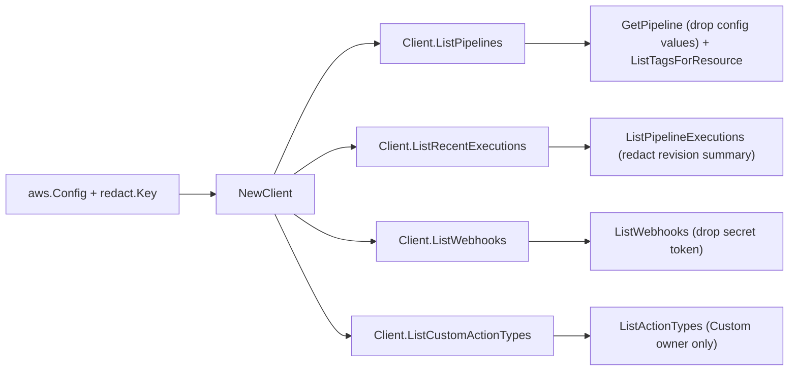

# AWS CodePipeline SDK Adapter

## Purpose

`internal/collector/awscloud/services/codepipeline/awssdk` adapts AWS SDK for Go
v2 CodePipeline responses to the scanner-owned `codepipeline.Client` contract.
It owns CodePipeline pagination, pipeline-declaration resolution, tag reads,
action-configuration value dropping, target-identifier allowlisting,
source-revision summary redaction, throttle classification, and per-call AWS API
telemetry.

## Ownership boundary

This package owns SDK calls for CodePipeline. It does not own workflow claims,
credential acquisition, CodePipeline fact selection, graph writes, reducer
admission, or query behavior.

## Exported surface

See `doc.go` for the godoc contract.

- `Client` - AWS SDK-backed implementation of `codepipeline.Client`.
- `NewClient` - builds a `Client` for one claimed AWS boundary and redaction
  key.

## Dependencies

- `internal/collector/awscloud` for account, region, and service boundary
  labels and the shared `RedactString` redaction helper.
- `internal/collector/awscloud/services/codepipeline` for scanner-owned result
  types.
- `internal/redact` for the redaction key applied to source-revision summaries.
- `internal/telemetry` for AWS API call and throttle instruments.
- AWS SDK for Go v2 `codepipeline` and Smithy error contracts.

## Telemetry

CodePipeline paginator pages and point reads are wrapped with:

- `aws.service.pagination.page`
- `eshu_dp_aws_api_calls_total`
- `eshu_dp_aws_throttle_total`

Metric labels stay bounded to service, account, region, operation, and result.
ARNs, tags, configuration keys, and raw AWS error payloads stay out of metric
labels.

## Gotchas / invariants

- The `apiClient` interface lists only metadata reads. A reflection guard test
  (`TestAPIClientInterfaceExcludesMutationAndJobAPIs`) fails if any mutation,
  execution-control, webhook-management, custom-action-mutation, or job-worker
  method becomes callable. The job-worker plane is excluded because
  `PollForJobs`, `GetJobDetails`, and the third-party variants return action
  configuration secret values.
- `mapAction` retains the sorted configuration KEY names only and never copies a
  configuration VALUE into the scanner type. `TestGetPipelineDropsActionConfigurationValues`
  feeds an inline OAuth token and a webhook secret and asserts the pipeline tree
  holds neither.
- `resolveTargetName` reads only the allowlisted non-secret identifier keys in
  `targetConfigKeys` (`ProjectName`, `ApplicationName`, `FunctionName`,
  `StackName`, `ClusterName` + `ServiceName`). These keys carry resource
  identifiers, never tokens. Do not add a key that can hold a secret.
- `mapWebhook` never reads `AuthenticationConfiguration.SecretToken`. It keeps
  the authentication type, target pipeline, and target action only.
- `mapSourceRevisions` routes the commit-message summary through
  `awscloud.RedactString`; the raw summary never reaches the scanner type.
- `ListCustomActionTypes` filters to `ActionOwnerCustom` so AWS-owned and
  ThirdParty action types are excluded.
- Recent executions are bounded to `recentExecutionLimit` (25) per pipeline so
  the scan stays metadata-sized.
- SDK adapters translate AWS records into scanner-owned types; scanner tests
  should not mock AWS SDK paginators.

## Related docs

- `docs/public/services/collector-aws-cloud.md`
- `docs/public/guides/collector-authoring.md`
