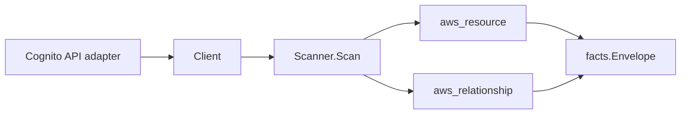

# AWS Cognito Scanner

## Purpose

`internal/collector/awscloud/services/cognito` owns the Cognito scanner contract
for the AWS cloud collector. It converts Cognito user pools, user pool app
clients, identity providers, resource servers, groups, and Cognito identity
pools into AWS cloud fact envelopes. It covers both the user-pool control plane
(`cognito-idp`) and the identity-pool control plane (`cognito-identity`).

## Ownership boundary

This package owns scanner-level Cognito fact selection, free-text redaction, and
identity mapping. It does not own AWS SDK pagination, STS credentials, workflow
claims, fact persistence, graph writes, reducer admission, or query behavior.

## Exported surface

See `doc.go` for the godoc contract.

- `Client` - minimal Cognito read surface consumed by `Scanner`. It exposes no
  user-record reads and no mutations.
- `Scanner` - emits Cognito resource and relationship envelopes for one boundary;
  requires a non-zero redaction key.
- `UserPool`, `UserPoolClient`, `IdentityProvider`, `ResourceServer`, `Group`,
  and `IdentityPool` - scanner-owned Cognito resource representations.
- `PasswordPolicy`, `LambdaTrigger`, and `IdentityPoolUserPoolProvider` -
  scanner-owned nested Cognito records.

## Dependencies

- `internal/collector/awscloud` for boundaries, resource constants, relationship
  constants, and envelope builders.
- `internal/facts` for emitted fact envelope kinds.
- `internal/redact` for HMAC-SHA256 markers on developer provider names and group
  descriptions.

The package depends on a small `Client` interface rather than the AWS SDK for Go
v2 so tests can use fake clients and runtime adapters can own SDK behavior.

## Telemetry

This scanner emits no spans or logs directly. `awsruntime.ClaimedSource` records
scan duration and emitted resource/relationship counts after `Scanner.Scan`
returns. The `awssdk` adapter records Cognito API call counts, throttles, and
pagination spans. The collector counts emitted facts under
`eshu_dp_aws_resources_emitted_total{service="cognito"}` and
`eshu_dp_aws_relationships_emitted_total{service="cognito"}`.

## Gotchas / invariants

- The scanner is metadata-only. It never reads Cognito user records. ListUsers,
  AdminGetUser, AdminListGroupsForUser, and ListUsersInGroup are absent from the
  `Client` interface and from the SDK adapter's API interfaces; reflection tests
  in both packages fail the build if any such method is added.
- App-client ClientSecret is never mapped into `UserPoolClient` and never
  persisted. The SDK adapter reads `DescribeUserPoolClient` for OAuth and
  callback metadata but drops the secret at the mapping boundary.
- Identity-provider ProviderDetails (client_secret, google_client_secret, and
  similar federation secrets) are never mapped into `IdentityProvider` and never
  persisted.
- Custom sender Lambda configs (CustomEmailSender, CustomSMSSender) and the
  custom-sender KMS key ID are dropped; only ARN-shaped trigger slots become
  `cognito_user_pool_uses_lambda_trigger` relationships.
- Identity pools have no ARN from the API, so the SDK adapter synthesizes one
  from the claim boundary for stable identity.
- AWS reports a Cognito login provider on an identity pool as
  `cognito-idp.<region>.amazonaws.com/<userPoolId>`. The
  `cognito_identity_pool_uses_user_pool` edge targets the extracted `<userPoolId>`
  so it joins the user pool resource fact (whose `resource_id` and correlation
  anchor is the bare pool ID); the full provider name and app client ID are kept
  as edge attributes for provenance. Emitting the compound provider name as the
  target would dangle.
- The scanner stops on client errors. Runtime adapters decide whether an AWS
  service error is retryable, terminal, or a warning fact.

## Evidence

Collector Performance Evidence: `go test ./internal/collector/awscloud/services/cognito/...`
covers the bounded Cognito metadata path: paginated ListUserPools (MaxResults=60)
followed by DescribeUserPool, ListUserPoolClients plus DescribeUserPoolClient,
ListIdentityProviders, ListResourceServers, ListGroups, and ListIdentityPools
plus DescribeIdentityPool and GetIdentityPoolRoles. No ListUsers, AdminGetUser,
ListUsersInGroup, ListUserPoolClientSecrets, mutation calls, or graph writes
exist in the collector. Fanout is bounded by the user-pool and identity-pool
count per claim.

No-Regression Evidence: `go test ./cmd/collector-aws-cloud ./internal/collector/awscloud/...`
covers Cognito metadata fact emission, user-pool-client, lambda-trigger, and
identity-pool relationship emission, omission of ClientSecret and
ProviderDetails, SDK pagination, runtime registration, the redaction-key guard,
command configuration, and the SDK adapter's safe metadata mapping.

Collector Observability Evidence: Cognito uses the existing AWS collector
`aws.service.pagination.page` span plus `eshu_dp_aws_api_calls_total`,
`eshu_dp_aws_throttle_total`, `eshu_dp_aws_resources_emitted_total`,
`eshu_dp_aws_relationships_emitted_total`, and `aws_scan_status` rows. Metric
labels stay bounded to service, account, region, operation, result, and status.

No-Observability-Change: the existing AWS collector telemetry contract already
diagnoses Cognito scans through `aws.service.scan`,
`aws.service.pagination.page`, API/throttle counters, resource/relationship
counters, and `aws_scan_status`.

Collector Deployment Evidence: Cognito runs inside the existing hosted
`collector-aws-cloud` runtime, so `/healthz`, `/readyz`, `/metrics`, and
`/admin/status` stay covered by the command wiring and Helm collector runtime.

## Related docs

- `docs/public/services/collector-aws-cloud-scanners.md`
- `docs/public/guides/collector-authoring.md`
