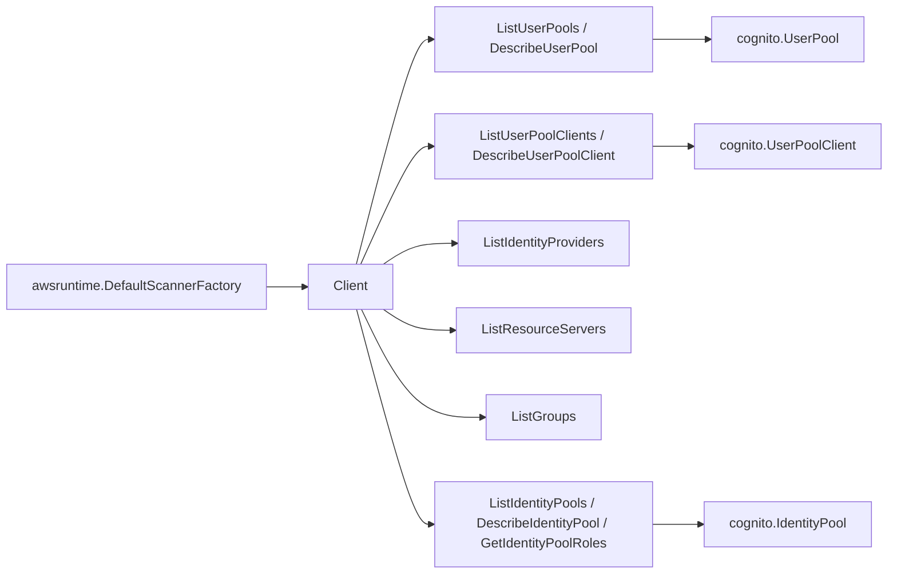

# AWS Cognito SDK Adapter

## Purpose

`internal/collector/awscloud/services/cognito/awssdk` adapts AWS SDK for Go v2
Cognito responses to the scanner-owned `cognito.Client` contract. It owns
Cognito user-pool and identity-pool API pagination, describe calls, response
mapping, throttle classification, and per-call telemetry across both the
`cognito-idp` and `cognito-identity` services.

## Ownership boundary

This package owns SDK calls for Cognito. It does not own workflow claims,
credential acquisition, Cognito fact selection, redaction policy, graph writes,
reducer admission, or query behavior.

## Exported surface

See `doc.go` for the godoc contract.

- `Client` - Cognito SDK adapter implementing `services/cognito.Client`.
- `NewClient` - constructs a claim-scoped Cognito adapter from AWS SDK config,
  boundary, tracer, and telemetry instruments. It builds both a `cognito-idp`
  and a `cognito-identity` SDK client.

## Dependencies

- AWS SDK for Go v2 `service/cognitoidentityprovider` and
  `service/cognitoidentity`.
- `internal/collector/awscloud` for claim boundary labels and API-call recording.
- `internal/collector/awscloud/services/cognito` for scanner-owned target types.
- `internal/telemetry` for AWS API counters, throttle counters, and pagination
  spans.

## Telemetry

Cognito list and describe calls are wrapped with:

- `aws.service.pagination.page`
- `eshu_dp_aws_api_calls_total{service="cognito",operation,result}`
- `eshu_dp_aws_throttle_total{service="cognito"}`

Pool IDs, client IDs, provider names, secrets, and tags are never metric labels.

## Gotchas / invariants

- The cognito-idp list APIs have no SDK paginator type; the adapter walks
  `NextToken` manually. `ListUserPools` requires an explicit `MaxResults`.
- `DescribeUserPoolClient` returns ClientSecret. The adapter maps app-client
  metadata without it; `cognito.UserPoolClient` has no secret field.
- Identity providers are mapped from `ProviderDescription` (name, type, dates).
  The adapter never calls `DescribeIdentityProvider` and never touches
  ProviderDetails.
- Custom sender Lambda configs and the custom-sender KMS key are dropped during
  trigger mapping; only ARN-shaped trigger slots survive.
- Identity pools carry no ARN from the API. The adapter synthesizes
  `arn:aws:cognito-identity:<region>:<account>:identitypool/<id>` from the claim
  boundary so reducers have stable identity.
- `GetIdentityPoolRoles` is reduced to a role-key -> role-ARN summary map; role
  mappings (rule bodies) are not persisted.
- Forbidden methods (ListUsers, AdminGetUser, ListUsersInGroup,
  ListUserPoolClientSecrets, ListIdentities, GetCredentialsForIdentity, all
  mutations) are absent from the adapter's SDK interfaces; reflection tests
  enforce this.

## Related docs

- `docs/public/services/collector-aws-cloud-scanners.md`
- `docs/public/reference/telemetry/index.md`
