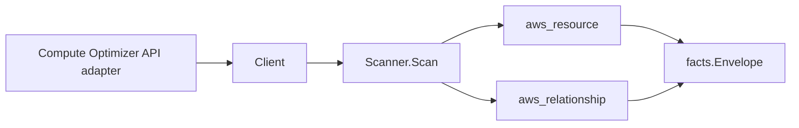

# AWS Compute Optimizer Scanner

## Purpose

`internal/collector/awscloud/services/computeoptimizer` owns the AWS Compute
Optimizer scanner contract for the AWS cloud collector. It converts Compute
Optimizer recommendation metadata into `aws_resource` facts and emits
relationship evidence connecting each recommendation to the analyzed EC2
instance, Auto Scaling group, and Lambda function.

## Ownership boundary

This package owns scanner-level Compute Optimizer fact selection and identity
mapping. It does not own AWS SDK pagination, STS credentials, workflow claims,
fact persistence, graph writes, reducer admission, or query behavior.

## Exported surface

See `doc.go` for the godoc contract.

- `Client` - minimal Compute Optimizer metadata read surface consumed by
  `Scanner`.
- `Scanner` - emits recommendation summaries and per-resource recommendations
  plus their target relationships for one boundary.
- `Snapshot`, `RecommendationSummary`, `InstanceRecommendation`,
  `AutoScalingGroupRecommendation`, `VolumeRecommendation`,
  `LambdaFunctionRecommendation` - scanner-owned views with CloudWatch
  utilization metric data points and customer cost values intentionally absent.

## Dependencies

- `internal/collector/awscloud` for boundaries, resource constants,
  relationship constants, partition helpers, and envelope builders.
- `internal/facts` for emitted fact envelope kinds.

The package depends on a small `Client` interface rather than the AWS SDK for
Go v2 so tests can use fake clients and the runtime adapter can own SDK
behavior.

## Resource and edge keying

- Recommendation summaries publish a synthetic, account/region/resource-type
  scoped resource_id (Compute Optimizer summaries have no ARN).
- Each per-resource recommendation publishes the analyzed resource ARN as its
  resource_id.
- The recommendation-to-instance edge is keyed by the BARE EC2 instance id
  (`i-...`), extracted from the analyzed instance ARN, because EC2 instance
  relationship targets are published by bare id. `target_arn` is left unset.
- The recommendation-to-Auto-Scaling-group edge is keyed by the group NAME (not
  the ARN), because the autoscaling scanner publishes its group resource_id as
  the bare name. The analyzed group ARN is carried as an edge attribute.
- The recommendation-to-function edge is keyed by the function ARN, matching the
  lambda scanner's published function resource_id.
- EBS volume recommendations carry NO edge in this scanner yet. The volume ARN
  and bare volume id are recorded as recommendation metadata; the
  recommendation-to-`aws_ec2_volume` relationship remains a separate follow-up.

## Telemetry

This scanner emits no spans or logs directly. `awsruntime.ClaimedSource`
records scan duration and emitted resource counts after `Scanner.Scan` returns.
The `awssdk` adapter records Compute Optimizer API call counts, throttles, and
pagination spans.

## Gotchas / invariants

- Compute Optimizer facts are metadata only. The scanner must never mutate
  Compute Optimizer state, change enrollment, start an export, or persist the
  CloudWatch utilization metric data points behind a recommendation.
- An account not enrolled in Compute Optimizer is not an error. The adapter
  returns an empty snapshot and the scan completes cleanly with no facts.
- Every relationship sets a `target_type` naming a declared
  `awscloud.ResourceType*` constant (or the documented `aws_ec2_instance`
  forward-reference anchor) and a `target_resource_id` matching how the target
  scanner publishes its resource_id.
- Emit reported evidence only. Do not infer deployment, workload, repository
  ownership, environment, or deployable-unit truth from recommendation findings
  or AWS tags.

## Evidence

Collector Performance Evidence:
`go test ./internal/collector/awscloud/services/computeoptimizer/...` covers the
bounded Compute Optimizer metadata path: one paginated GetRecommendationSummaries
stream and one paginated stream each for GetEC2InstanceRecommendations,
GetAutoScalingGroupRecommendations, GetEBSVolumeRecommendations, and
GetLambdaFunctionRecommendations, no metric-data reads, no enrollment mutation,
and no graph writes in the collector.

No-Regression Evidence: metadata-only control-plane scanner; new read path, no change to existing hot paths. `go test ./internal/collector/awscloud/services/computeoptimizer/...` green.

No-Observability-Change: reuses shared AWS pagination span + API-call/throttle counters; no telemetry contract change.

Collector Deployment Evidence: Compute Optimizer runs inside the existing hosted
`collector-aws-cloud` runtime, so `/healthz`, `/readyz`, `/metrics`, and
`/admin/status` stay covered by the command wiring and Helm collector runtime.

## Related docs

- `docs/public/services/collector-aws-cloud.md`
- `docs/public/services/collector-aws-cloud-scanners.md`
- `docs/public/services/collector-aws-cloud-security.md`
