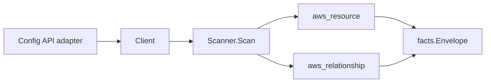

# AWS Config Scanner

## Purpose

`internal/collector/awscloud/services/config` owns the AWS Config scanner
contract for the AWS cloud collector. It converts configuration recorders,
delivery channels, config rules, conformance packs, configuration aggregators,
and retention configurations into reported AWS facts and relationship evidence.
The rule resource-type scope is carried as a rule attribute, not as a
relationship to a synthetic resource-type node.

## Ownership boundary

This package owns scanner-level AWS Config fact selection and identity mapping.
It does not own AWS SDK pagination, credential acquisition, workflow claims,
fact persistence, graph writes, reducer admission, or query behavior.

## Exported surface

See `doc.go` for the godoc contract.

- `Client` - minimal AWS Config metadata read surface consumed by `Scanner`.
- `Scanner` - emits configuration recorder, delivery channel, config rule,
  conformance pack, configuration aggregator, and retention configuration facts
  plus the conformance-pack-to-rule, custom-rule-to-Lambda, and
  aggregator-to-source-account relationships for one boundary.
- `ConfigurationRecorder` - recorder name and recorded resource-type scope; no
  recorded configuration item bodies.
- `DeliveryChannel` - S3 destination, optional SNS topic, and snapshot delivery
  interval.
- `ConfigRule` - rule identity, owner (AWS managed, custom Lambda, custom
  policy), managed-rule source identifier or custom-Lambda function ARN, and the
  resource-type scope; no compliance evaluation result bodies.
- `ConformancePack` - pack identity, deployment status, and member-rule name set
  used for the rule count and containment relationships.
- `ConfigurationAggregator` - aggregated source account and region set.
- `RetentionConfiguration` - configuration item history retention period.

## Dependencies

- `internal/collector/awscloud` for boundaries, resource constants,
  relationship constants, and envelope builders.
- `internal/facts` for emitted fact envelope kinds.

The package depends on a small `Client` interface rather than the AWS SDK for Go
v2 so tests can use fake clients and runtime adapters can own SDK behavior.

## Telemetry

This scanner emits no spans or logs directly. `awsruntime.ClaimedSource`
records scan duration and emitted resource counts after `Scanner.Scan` returns.
The `awssdk` adapter records Config API call counts, throttles, and pagination
spans. The required resource signal is
`eshu_dp_aws_resources_emitted_total{service="config"}` with the existing
bounded AWS collector labels.

## Gotchas / invariants

- AWS Config facts are control-plane metadata only. The scanner must never read
  or persist recorded configuration item bodies. A configuration item is a full
  resource snapshot, which is inventory state, not Config metadata.
- The scanner makes no `GetResourceConfigHistory`,
  `GetComplianceDetailsByConfigRule`, `GetDiscoveredResourceCounts`,
  `BatchGetResourceConfig`, or discovered-resource-listing call. Aggregate
  per-rule compliance from `DescribeConformancePackCompliance` is used only to
  derive the member-rule set and count.
- Custom-rule Lambda code is never fetched. `GetCustomRulePolicy` and
  `GetOrganizationCustomRulePolicy` are out of scope.
- The rule resource-type scope is a rule attribute, not a relationship. A Config
  rule scope value such as `AWS::EC2::Instance` is a CloudFormation-style
  resource-type string, not an ARN of an emitted node, so an edge to it would
  dangle.
- Relationship targets reference real nodes: the conformance-pack-to-rule edge
  targets the `aws_config_rule` resource keyed by rule name; the
  custom-rule-to-Lambda edge targets the `aws_lambda_function` resource keyed by
  the Lambda function ARN; the aggregator-to-source-account edge targets the
  `aws_account` resource keyed by the account root ARN.
- Synthesized account root ARNs derive the partition from the aggregator ARN.
  The scanner never hardcodes `arn:aws:` so GovCloud (`aws-us-gov`) and China
  (`aws-cn`) edges stay correct. When the partition cannot be derived, the
  account edge is skipped rather than guessed.

## Evidence

Collector Performance Evidence: `go test ./internal/collector/awscloud/services/config/...`
covers the bounded AWS Config metadata path: two single-shot describes
(recorders, delivery channels), four paginated describes (rules, conformance
packs, aggregators, retention), and one paginated per-pack compliance describe
used only to derive member-rule names. Relationship fan-out is bounded by the
conformance pack member-rule set, the custom-Lambda rule set, and the aggregator
source-account set. The scanner issues no per-resource configuration-history or
compliance-detail read, so handler cost scales with Config object cardinality,
not with the number of recorded resources in the account.

No-Regression Evidence: `go test ./cmd/collector-aws-cloud ./internal/collector/awscloud/...`
covers Config resource and relationship fact emission, omission of recorded
configuration item bodies, partition derivation for cross-partition account
edges, custom-rule-to-Lambda edge gating, runtime registration, command
configuration, and the SDK adapter's safe metadata mapping plus the
configuration-item-body and mutation exclusion gate.

Collector Observability Evidence: AWS Config uses the existing AWS collector
`aws.service.pagination.page` span plus `eshu_dp_aws_api_calls_total`,
`eshu_dp_aws_throttle_total`, `eshu_dp_aws_resources_emitted_total`,
`eshu_dp_aws_relationships_emitted_total`, and `aws_scan_status` rows. Metric
labels stay bounded to service, account, region, operation, result, resource
type, and status.

No-Observability-Change: the existing AWS collector telemetry contract already
diagnoses Config scans through `aws.service.scan`,
`aws.service.pagination.page`, API/throttle counters, resource/relationship
counters, and `aws_scan_status`.

Collector Deployment Evidence: AWS Config runs inside the existing hosted
`collector-aws-cloud` runtime, so `/healthz`, `/readyz`, `/metrics`, and
`/admin/status` stay covered by the command wiring and Helm collector runtime.

## Related docs

- `docs/public/services/collector-aws-cloud.md`
- `docs/public/services/collector-aws-cloud-scanners.md`
- `docs/public/guides/collector-authoring.md`
