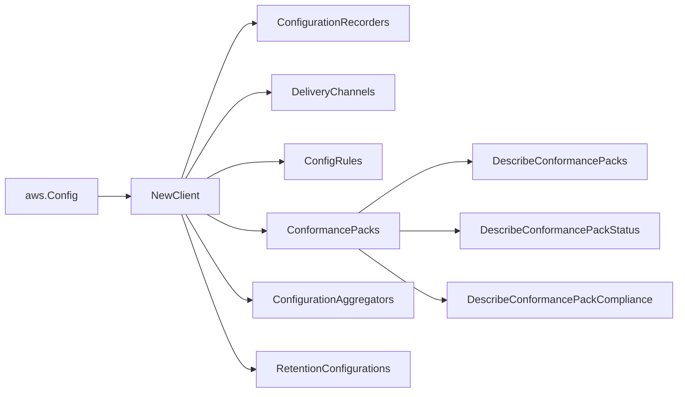

# AWS Config SDK Adapter

## Purpose

`internal/collector/awscloud/services/config/awssdk` adapts AWS SDK for Go v2
Config responses to the scanner-owned `config.Client` contract. It owns Config
pagination, the configuration recorder and delivery channel describes, the
config rule describe, the conformance pack describe joined with deployment
status and member-rule names, the configuration aggregator describe, the
retention configuration describe, throttle classification, and per-call AWS API
telemetry.

## Ownership boundary

This package owns SDK calls for AWS Config. It does not own workflow claims,
credential acquisition, Config fact selection, graph writes, reducer admission,
or query behavior.

## Exported surface

See `doc.go` for the godoc contract.

- `Client` - AWS SDK-backed implementation of `config.Client`.
- `NewClient` - builds a `Client` for one claimed AWS boundary.

## Dependencies

- `internal/collector/awscloud` for account, region, and service boundary
  labels.
- `internal/collector/awscloud/services/config` for scanner-owned result types.
- `internal/telemetry` for AWS API call and throttle instruments.
- AWS SDK for Go v2 `configservice` and Smithy error contracts.

## Telemetry

Config paginator pages and point reads are wrapped with:

- `aws.service.pagination.page`
- `eshu_dp_aws_api_calls_total`
- `eshu_dp_aws_throttle_total`

Metric labels stay bounded to service, account, region, operation, and result.
Account IDs, rule ARNs, conformance pack ARNs, aggregator ARNs, and raw AWS
error payloads stay out of metric labels.

## Gotchas / invariants

- The allowed call surface is `DescribeConfigurationRecorders`,
  `DescribeDeliveryChannels`, `DescribeConfigRules`, `DescribeConformancePacks`,
  `DescribeConformancePackStatus`, `DescribeConformancePackCompliance`,
  `DescribeConfigurationAggregators`, and `DescribeRetentionConfigurations`. The
  `apiClient` interface exposes nothing else, and `client_test.go` reflects over
  it to fail on any forbidden method by substring match.
- The adapter makes no recorded configuration-item read
  (`GetResourceConfigHistory`, `BatchGetResourceConfig`,
  `GetDiscoveredResourceCounts`), no per-resource compliance-detail read, and no
  custom-rule policy-body read. Recorded configuration items are full resource
  snapshots and stay out of scope.
- `DescribeConformancePackCompliance` is used only to enumerate member-rule
  names for the rule count and containment edges. The adapter reads the rule
  name field and ignores the per-rule aggregate compliance type. It never reads
  per-resource compliance detail.
- For a `CUSTOM_LAMBDA` rule, `Source.SourceIdentifier` carries the evaluator
  Lambda function ARN; the adapter routes it to `LambdaFunctionARN`. Managed and
  custom-policy rules keep the value in `SourceIdentifier`.
- `DescribeConfigurationRecorders` and `DescribeDeliveryChannels` are
  single-shot; the rule, conformance pack, aggregator, retention, and per-pack
  compliance describes paginate on `NextToken` with nil-page guards.
- SDK adapters translate AWS records into scanner-owned types; scanner tests
  should not mock AWS SDK pagination.

## Related docs

- `docs/public/services/collector-aws-cloud.md`
- `docs/public/services/collector-aws-cloud-scanners.md`
- `docs/public/guides/collector-authoring.md`
