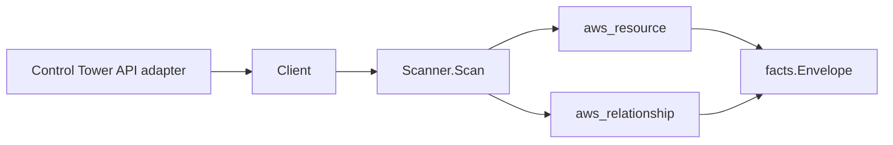

# AWS Control Tower Scanner

## Purpose

`internal/collector/awscloud/services/controltower` owns the AWS Control Tower
scanner contract for the AWS cloud collector. It converts landing-zone,
enabled-control, and enabled-baseline metadata into `aws_resource` facts and
emits relationship evidence for the Organizations targets a control or baseline
governs and for the baseline-to-landing-zone membership in the same boundary.

## Ownership boundary

This package owns scanner-level Control Tower fact selection and identity
mapping. It does not own AWS SDK pagination, STS credentials, workflow claims,
fact persistence, graph writes, reducer admission, or query behavior.

## Exported surface

See `doc.go` for the godoc contract.

- `Client` - minimal Control Tower metadata read surface consumed by `Scanner`.
- `Scanner` - emits the landing zone, enabled controls, and enabled baselines
  plus their relationships for one boundary.
- `Snapshot`, `LandingZone`, `EnabledControl`, `EnabledBaseline` - scanner-owned
  views with the manifest body and control/baseline parameter values
  intentionally absent.

## Dependencies

- `internal/collector/awscloud` for boundaries, resource constants,
  relationship constants, and envelope builders.
- `internal/facts` for emitted fact envelope kinds.

The package depends on a small `Client` interface rather than the AWS SDK for
Go v2 so tests can use fake clients and the runtime adapter can own SDK
behavior.

## Telemetry

This scanner emits no spans or logs directly. `awsruntime.ClaimedSource`
records scan duration and emitted resource counts after `Scanner.Scan` returns.
The `awssdk` adapter records Control Tower API call counts, throttles, and
pagination spans.

## Gotchas / invariants

- Control Tower facts are metadata only. The scanner must never read or persist
  the landing-zone manifest JSON body, control parameter values, baseline
  parameter values, or any governance payload, and must never enable, disable,
  reset, create, update, or delete Control Tower state.
- The landing-zone, enabled-control, and enabled-baseline nodes each publish
  their resource_id as their own ARN. A management account governs at most one
  landing zone, so the baseline-for-landing-zone edge keys that single
  landing-zone ARN.
- Control Tower reports a control's or baseline's governed target as an
  Organizations ARN (`…:ou/o-…/ou-…`, `…:account/o-…/<id>`, `…:root/o-…/r-…`).
  The organizations scanner publishes those nodes by their **bare id**
  (`ou-…`, the 12-digit account id, `r-…`), so the edge parses the bare id from
  the ARN and keys the target by it. `target_arn` is intentionally left blank on
  these edges (a populated `target_arn` would mark the edge ARN-keyed and break
  the bare-id join); the original ARN is preserved as a `target_arn` attribute
  for provenance.
- An edge is skipped, never dangled, when the target ARN is missing, is not an
  Organizations ARN, or names a family the organizations scanner does not
  publish.
- Every relationship sets a non-empty `target_type` naming a declared
  `awscloud.ResourceType*` constant and a `target_resource_id` matching how the
  target scanner publishes its resource_id.
- Emit reported evidence only. Do not infer deployment, workload, repository
  ownership, environment, or deployable-unit truth from landing-zone, control,
  or baseline identifiers, or AWS tags.

## Evidence

Collector Performance Evidence:
`go test ./internal/collector/awscloud/services/controltower/...` covers the
bounded Control Tower metadata path: one paginated ListLandingZones stream, one
GetLandingZone point read (manifest body never read), one paginated
ListEnabledBaselines stream, one paginated ListEnabledControls stream per
distinct OU target, one ListTagsForResource point read for the landing zone, no
governance payload reads, and no graph writes in the collector.

No-Regression Evidence: metadata-only control-plane scanner; new read path, no
change to existing hot paths. `go test ./internal/collector/awscloud/services/controltower/...` green.

No-Observability-Change: reuses shared AWS pagination span + API-call/throttle counters; no telemetry contract change.

Collector Deployment Evidence: Control Tower runs inside the existing hosted
`collector-aws-cloud` runtime, so `/healthz`, `/readyz`, `/metrics`, and
`/admin/status` stay covered by the command wiring and Helm collector runtime.

## Related docs

- `docs/public/services/collector-aws-cloud.md`
- `docs/public/services/collector-aws-cloud-scanners.md`
- `docs/public/services/collector-aws-cloud-security.md`
