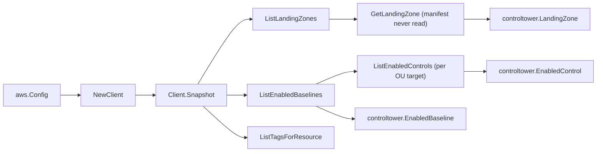

# AWS Control Tower SDK Adapter

## Purpose

`internal/collector/awscloud/services/controltower/awssdk` adapts AWS SDK for Go
v2 Control Tower responses to the scanner-owned `Client` contract. It owns
landing-zone resolution, enabled-baseline pagination, per-target enabled-control
pagination, resource-tag reads, throttle classification, and per-call AWS API
telemetry.

## Ownership boundary

This package owns SDK calls for Control Tower. It does not own workflow claims,
credential acquisition, Control Tower fact selection, graph writes, reducer
admission, or query behavior.

## Exported surface

See `doc.go` for the godoc contract.

- `Client` - AWS SDK-backed implementation of `controltower.Client`.
- `NewClient` - builds a `Client` for one claimed AWS boundary.

## Dependencies

- `internal/collector/awscloud` for account, region, and service boundary
  labels.
- `internal/collector/awscloud/services/controltower` for scanner-owned result
  types.
- `internal/telemetry` for AWS API call and throttle instruments.
- AWS SDK for Go v2 `controltower` and Smithy error contracts.

## Telemetry

Control Tower paginator pages and point reads are wrapped with:

- `aws.service.pagination.page`
- `eshu_dp_aws_api_calls_total`
- `eshu_dp_aws_throttle_total`

Metric labels stay bounded to service, account, region, operation, and result.
Control Tower identifiers, tags, and raw AWS error payloads stay out of metric
labels.

## Gotchas / invariants

- `ListEnabledControls` requires a `TargetIdentifier` (an OU ARN). The adapter
  derives the distinct OU targets to query from the enabled-baseline fleet
  (`ListEnabledBaselines` needs no target and reports every governed OU). The
  same enabled-control ARN can appear under more than one target and is
  de-duplicated by ARN so the scanner emits one node per control.
- `GetLandingZone` returns the landing-zone manifest JSON body. The adapter maps
  only the ARN, version, latest-available version, status, and drift status into
  the scanner-owned `LandingZone`, which has no manifest field by construction.
  Never copy the manifest, and never read control or baseline parameter values.
- The adapter reads metadata only. It must never call `EnableControl`,
  `DisableControl`, `EnableBaseline`, `ResetEnabledBaseline`,
  `CreateLandingZone`, `UpdateLandingZone`, `DeleteLandingZone`, or any other
  mutation API.
- `ListTagsForResource` is a metadata read; Control Tower tags carry no
  governance payload.
- SDK adapters translate AWS responses into scanner-owned types; scanner tests
  should not mock AWS SDK pagination.

## Related docs

- `docs/public/services/collector-aws-cloud-scanners.md`
- `docs/public/services/collector-aws-cloud-security.md`
