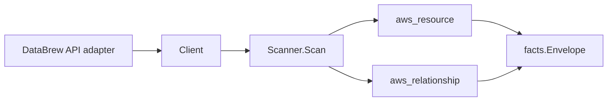

# AWS Glue DataBrew Scanner

## Purpose

`internal/collector/awscloud/services/databrew` owns the AWS Glue DataBrew
scanner contract for the AWS cloud collector. It converts DataBrew dataset,
recipe, job, and project metadata into `aws_resource` facts and emits
relationship evidence for the dataset's S3 and Glue Data Catalog inputs, the
job's S3 outputs and assumed IAM role, the job's processed dataset, and the
project's bound dataset, recipe, and assumed IAM role.

## Ownership boundary

This package owns scanner-level DataBrew fact selection and identity mapping. It
does not own AWS SDK pagination, STS credentials, workflow claims, fact
persistence, graph writes, reducer admission, or query behavior.

## Exported surface

See `doc.go` for the godoc contract.

- `Client` - minimal DataBrew metadata read surface consumed by `Scanner`.
- `Scanner` - emits dataset, recipe, job, and project resources plus their
  relationships for one boundary.
- `Snapshot`, `Dataset`, `Recipe`, `Job`, `Project` - scanner-owned views with
  recipe step expressions, custom SQL query strings, and sample-data fields
  intentionally absent.

## Dependencies

- `internal/collector/awscloud` for boundaries, resource constants,
  relationship constants, partition helpers, and envelope builders.
- `internal/facts` for emitted fact envelope kinds.

The package depends on a small `Client` interface rather than the AWS SDK for
Go v2 so tests can use fake clients and the runtime adapter can own SDK
behavior.

## Telemetry

This scanner emits no spans or logs directly. `awsruntime.ClaimedSource` records
scan duration and emitted resource counts after `Scanner.Scan` returns. The
`awssdk` adapter records DataBrew API call counts, throttles, and pagination
spans.

## Gotchas / invariants

- DataBrew facts are metadata only. The scanner must never read or persist
  recipe step expressions, transformation operations or their parameters,
  custom SQL query strings, sample data, or any data-plane payload, and must
  never call a mutation API. Only the recipe step count is recorded.
- The dataset node publishes its resource_id as the dataset NAME, and the recipe
  node as the recipe NAME, because jobs and projects reference them by name; the
  job-to-dataset, project-to-dataset, and project-to-recipe edges are keyed by
  those names so they join the internal nodes instead of dangling.
- The job and project nodes publish their resource_id as their ARN (falling back
  to name).
- The dataset-to-S3 and job-to-S3 edges are emitted only when an S3 bucket is
  configured. DataBrew reports a bucket NAME, so the scanner synthesizes the
  partition-aware bucket ARN (`arn:<partition>:s3:::<bucket>`) via
  `awscloud.PartitionForBoundary` to match the S3 scanner's published bucket
  node identity in GovCloud and China, not just commercial.
- The dataset-to-Glue-table edge is emitted only when the dataset reads a Glue
  Data Catalog table. The target is keyed by the `<database>/<table>` identity
  the Glue table scanner publishes as its resource_id.
- A dataset whose input is a Redshift/JDBC database carries NO edge to a
  Redshift cluster. DataBrew reports only a Glue connection name and table name
  for such inputs, never a Redshift cluster ARN or identifier, so an edge would
  dangle; the connection name is recorded as dataset metadata instead.
- The job-to-IAM-role and project-to-IAM-role edges are emitted only when AWS
  reports a role ARN; `target_arn` is set only for ARN-shaped identifiers,
  matching the IAM scanner's published role resource_id.
- Emit reported evidence only. Do not infer deployment, workload, repository
  ownership, environment, or deployable-unit truth from dataset, recipe, job, or
  project names, or AWS tags.

## Evidence

Collector Performance Evidence:
`go test ./internal/collector/awscloud/services/databrew/...` covers the bounded
DataBrew metadata path: one paginated ListDatasets stream, one paginated
ListRecipes stream, one paginated ListJobs stream, and one paginated
ListProjects stream per region, no recipe-step reads, no query-string reads, no
sample-data reads, no mutations, and no graph writes in the collector.

No-Regression Evidence: metadata-only control-plane scanner; new read path, no
change to existing hot paths. `go test
./internal/collector/awscloud/services/databrew/...` green.

No-Observability-Change: reuses shared AWS pagination span + API-call/throttle
counters; no telemetry contract change.

Collector Deployment Evidence: DataBrew runs inside the existing hosted
`collector-aws-cloud` runtime, so `/healthz`, `/readyz`, `/metrics`, and
`/admin/status` stay covered by the command wiring and Helm collector runtime.

## Related docs

- `docs/public/services/collector-aws-cloud.md`
- `docs/public/services/collector-aws-cloud-scanners.md`
- `docs/public/services/collector-aws-cloud-security.md`
