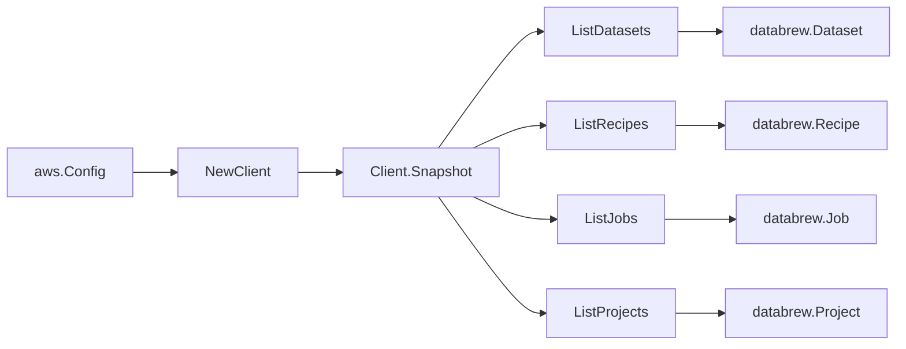

# AWS Glue DataBrew SDK Adapter

## Purpose

`internal/collector/awscloud/services/databrew/awssdk` adapts AWS SDK for Go v2
Glue DataBrew responses to the scanner-owned `Client` contract. It owns dataset,
recipe, job, and project pagination, safe metadata mapping, throttle
classification, and per-call AWS API telemetry.

## Ownership boundary

This package owns SDK calls for DataBrew. It does not own workflow claims,
credential acquisition, DataBrew fact selection, graph writes, reducer
admission, or query behavior.

## Exported surface

See `doc.go` for the godoc contract.

- `Client` - AWS SDK-backed implementation of `databrew.Client`.
- `NewClient` - builds a `Client` for one claimed AWS boundary.

## Dependencies

- `internal/collector/awscloud` for account, region, and service boundary
  labels.
- `internal/collector/awscloud/services/databrew` for scanner-owned result
  types.
- `internal/telemetry` for AWS API call and throttle instruments.
- AWS SDK for Go v2 `databrew` and Smithy error contracts.

## Telemetry

DataBrew paginator pages are wrapped with:

- `aws.service.pagination.page`
- `eshu_dp_aws_api_calls_total`
- `eshu_dp_aws_throttle_total`

Metric labels stay bounded to service, account, region, operation, and result.
DataBrew resource ARNs, names, tags, and raw AWS error payloads stay out of
metric labels.

## Gotchas / invariants

- The adapter reads metadata only. It must never call any `Describe*` detail
  read (which would expose recipe step expressions or dataset sample data), and
  never call any `Create*`, `Update*`, `Delete*`, `Start*`, `Stop*`,
  `Publish*`, `Send*`, `Tag*`, or other mutation API.
- The recipe mapper records only the step COUNT (`len(recipe.Steps)`); it never
  copies the step actions, operations, or their parameters into scanner-owned
  types.
- The dataset mapper copies only the input location references (S3 bucket and
  key, Glue catalog database/table/catalog-id, or the Glue connection name for a
  database input). It never copies the custom SQL `QueryString` a database input
  can carry, never copies dataset-parameter values, and never copies
  path-option expressions.
- The job mapper copies only the distinct S3 output bucket NAMES, the assumed
  IAM role ARN, the encryption mode, and the dataset/recipe references. It never
  copies output object data or profile sample rows.
- `No-Observability-Change`: reuses shared AWS pagination span +
  API-call/throttle counters; no telemetry contract change.
- SDK adapters translate AWS records into scanner-owned types; scanner tests
  should not mock AWS SDK pagination.

## Related docs

- `docs/public/services/collector-aws-cloud-scanners.md`
- `docs/public/services/collector-aws-cloud-security.md`
