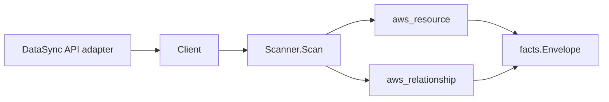

# AWS DataSync Scanner

## Purpose

`internal/collector/awscloud/services/datasync` owns the DataSync scanner
contract for the AWS cloud collector. It converts transfer task metadata,
transfer location metadata, and agent metadata into `aws_resource` facts and
emits relationship evidence for task-to-source-location,
task-to-destination-location, task-to-CloudWatch-log-group,
location-to-S3-bucket, location-to-EFS-file-system,
location-to-FSx-file-system, and location-to-IAM-role joins.

## Ownership boundary

This package owns scanner-level DataSync fact selection and identity mapping. It
does not own AWS SDK pagination, STS credentials, workflow claims, fact
persistence, graph writes, reducer admission, or query behavior.

## Exported surface

See `doc.go` for the godoc contract.

- `Client` - minimal DataSync metadata read surface consumed by `Scanner`.
- `Scanner` - emits task, location, and agent resources plus their
  relationships for one boundary.
- `Task`, `Location`, `Agent` - scanner-owned views with object contents,
  access keys, server certificates, and storage passwords intentionally
  omitted.

## Dependencies

- `internal/collector/awscloud` for boundaries, resource constants,
  relationship constants, and envelope builders.
- `internal/facts` for emitted fact envelope kinds.

The package depends on a small `Client` interface rather than the AWS SDK for
Go v2 so tests can use fake clients and runtime adapters can own SDK behavior.

## Telemetry

This scanner emits no spans or logs directly. `awsruntime.ClaimedSource`
records scan duration and emitted resource counts after `Scanner.Scan` returns.
The `awssdk` adapter records DataSync API call counts, throttles, and
pagination spans.

## Gotchas / invariants

- DataSync facts are metadata only. The scanner must not start, cancel, create,
  update, or delete a transfer task, location, or agent, and must not read the
  object or record contents a task transfers, object-storage access keys,
  server certificates, or SMB/object-storage passwords.
- Task, location, and agent ARNs come from the DataSync API and are used
  directly as the resource `resource_id`. The task-to-location and
  location-to-IAM-role edges key on those API-reported ARNs with no synthesis.
- The S3 bucket, EFS file system, and FSx file system ARNs that back a location
  are synthesized partition-aware from the bare identifiers in the location
  config (bucket name, `fs-` id) via `partition(boundary)`, never a hardcoded
  `arn:aws:`. FSx for NetApp ONTAP locations report the file system ARN
  directly and that ARN is used as-is. The synthesized forms match the
  resource_id each target scanner publishes: `arn:<partition>:s3:::<bucket>`,
  `arn:<partition>:elasticfilesystem:<region>:<account>:file-system/<fs-id>`,
  and `arn:<partition>:fsx:<region>:<account>:file-system/<fs-id>`.
- The task-to-CloudWatch-log-group edge trims a trailing `:*` wildcard from the
  DataSync log group ARN so the join key matches the canonical log-group ARN
  the CloudWatch Logs scanner publishes.
- Location storage edges are emitted only when the backing identity is present
  (an S3 bucket name, EFS file system id, or FSx file system id/ARN). NFS, SMB,
  object-storage, HDFS, and Azure Blob locations carry no AWS backing resource,
  so they are reported as location resources without a storage edge.
- Emit reported evidence only. Do not infer deployment, workload, repository
  ownership, environment, or deployable-unit truth from task, location, or
  agent names.

## Evidence

Collector Performance Evidence:
`go test ./internal/collector/awscloud/services/datasync/...` covers the bounded
DataSync metadata path: one paginated ListTasks stream with one DescribeTask
point read per task, one paginated ListLocations stream with one
flavor-specific DescribeLocation* point read per location, one paginated
ListAgents stream with one DescribeAgent point read per agent, no
StartTaskExecution or other transfer-control calls, no mutations, and no graph
writes in the collector.

No-Regression Evidence:
`go test ./internal/collector/awscloud/services/datasync/...
./internal/collector/awscloud/internal/relguard/...
./cmd/collector-aws-cloud/... -count=1` covers DataSync task, location, and
agent metadata fact emission; task-to-source-location,
task-to-destination-location, and task-to-CloudWatch-log-group relationship
emission; location-to-S3-bucket, location-to-EFS-file-system,
location-to-FSx-file-system, and location-to-IAM-role relationship emission;
the GovCloud / China / commercial / blank-region partition matrix for every
synthesized backing-storage ARN; the metadata-only exclusion reflection guards
on both the scanner `Client` interface and the SDK adapter `apiClient`
interface; the relguard runtime graph-join assertion over every emitted edge;
runtime registration; and the SDK adapter's safe metadata mapping. This is a
new metadata-only scanner with no change to any existing scanner's hot path,
queue behavior, or graph-write path.

No-Observability-Change: DataSync uses the existing AWS collector telemetry
contract. The `awssdk` adapter records each List/Describe call through the
shared `aws.service.pagination.page` span plus `eshu_dp_aws_api_calls_total`,
`eshu_dp_aws_throttle_total`, `eshu_dp_aws_resources_emitted_total`, and
`eshu_dp_aws_relationships_emitted_total`, and `aws_scan_status` rows. No new
instrument, span, or metric label is introduced; metric labels stay bounded to
service, account, region, operation, and result.

Collector Deployment Evidence: DataSync runs inside the existing hosted
`collector-aws-cloud` runtime, so `/healthz`, `/readyz`, `/metrics`, and
`/admin/status` stay covered by the command wiring and Helm collector runtime.

## Related docs

- `docs/public/services/collector-aws-cloud.md`
- `docs/public/services/collector-aws-cloud-scanners.md`
- `docs/public/services/collector-aws-cloud-security.md`
