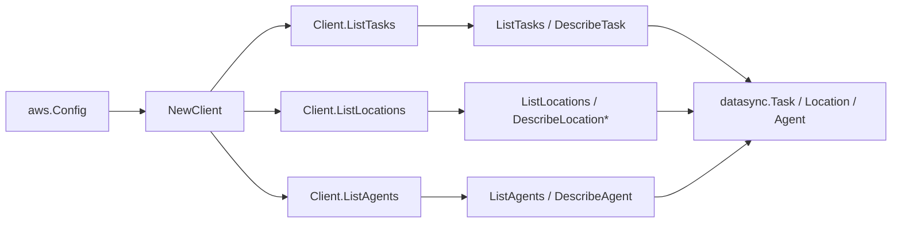

# AWS DataSync SDK Adapter

## Purpose

`internal/collector/awscloud/services/datasync/awssdk` adapts AWS SDK for Go v2
DataSync responses to the scanner-owned `Client` contract. It owns task
pagination and per-task describe reads, location pagination with
flavor-specific describe reads, agent pagination and describe reads, throttle
classification, and per-call AWS API telemetry.

## Ownership boundary

This package owns SDK calls for DataSync. It does not own workflow claims,
credential acquisition, DataSync fact selection, graph writes, reducer
admission, or query behavior.

## Exported surface

See `doc.go` for the godoc contract.

- `Client` - AWS SDK-backed implementation of `datasync.Client`.
- `NewClient` - builds a `Client` for one claimed AWS boundary.

## Dependencies

- `internal/collector/awscloud` for account, region, and service boundary
  labels.
- `internal/collector/awscloud/services/datasync` for scanner-owned result
  types.
- `internal/telemetry` for AWS API call and throttle instruments.
- AWS SDK for Go v2 `datasync` and Smithy error contracts.

## Telemetry

DataSync paginator pages and point reads are wrapped with:

- `aws.service.pagination.page`
- `eshu_dp_aws_api_calls_total`
- `eshu_dp_aws_throttle_total`

Metric labels stay bounded to service, account, region, operation, and result.
DataSync ARNs, names, URIs, and raw AWS error payloads stay out of metric
labels.

## Gotchas / invariants

- The `apiClient` seam exposes only List and Describe operations. No
  CreateTask, StartTaskExecution, CancelTaskExecution, UpdateTask, DeleteTask,
  CreateLocation*, CreateAgent, UpdateAgent, or DeleteAgent method exists, so a
  transfer or mutation is unreachable by construction. A reflection guard test
  pins the seam shape.
- The adapter reads only the safe location fields needed to join the backing
  S3 bucket, EFS file system, FSx file system, and IAM role. It never reads
  object-storage access keys, server certificates, or SMB/object-storage
  passwords; those fields are not mapped into scanner-owned types.
- Location backing identity is resolved by dispatching the describe read on the
  URI scheme (`s3://`, `efs://`, `fsxl://`, `fsxn://`/`fsxo://`, `fsxz://`,
  `fsxw://`). Unsupported schemes (NFS, SMB, object storage, HDFS, Azure Blob)
  skip the describe read and carry only the location identity and URI.
- FSx for NetApp ONTAP locations report the file system ARN directly
  (`FsxFilesystemArn`); the adapter forwards it so the scanner uses it without
  synthesis.
- SDK adapters translate AWS records into scanner-owned types; scanner tests
  should not mock AWS SDK pagination.

## Related docs

- `docs/public/services/collector-aws-cloud-scanners.md`
- `docs/public/services/collector-aws-cloud-security.md`
