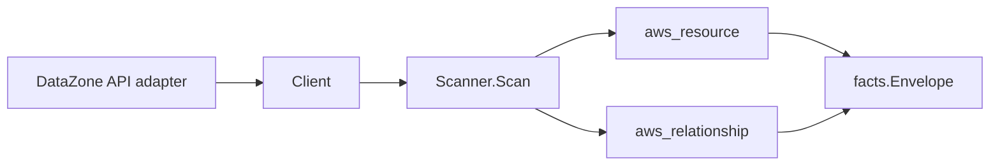

# Amazon DataZone Scanner

## Purpose

`internal/collector/awscloud/services/datazone` owns the Amazon DataZone scanner
contract for the AWS cloud collector. It converts DataZone governance
control-plane metadata into `aws_resource` facts for domains, projects,
environments, and data sources, and emits relationship evidence for the domain
KMS encryption key, the domain execution and service IAM roles, child-in-domain
membership (project, environment, data source), and the data source backing
store (AWS Glue Data Catalog database, provisioned Amazon Redshift cluster).

## Ownership boundary

This package owns scanner-level DataZone fact selection and identity mapping. It
does not own AWS SDK pagination, STS credentials, workflow claims, fact
persistence, graph writes, reducer admission, or query behavior.

## Exported surface

See `doc.go` for the godoc contract.

- `Client` - minimal DataZone metadata read surface consumed by `Scanner`.
- `Scanner` - emits domain, project, environment, and data source resources plus
  their relationships for one boundary.
- `Snapshot`, `Domain`, `Project`, `Environment`, `DataSource` - scanner-owned
  views with glossary, glossary-term, catalog asset content, subscription, and
  access-credential fields intentionally absent.

## Dependencies

- `internal/collector/awscloud` for boundaries, resource constants, relationship
  constants, partition helpers, and envelope builders.
- `internal/facts` for emitted fact envelope kinds.

The package depends on a small `Client` interface rather than the AWS SDK for Go
v2 so tests can use fake clients and the runtime adapter can own SDK behavior.

## Telemetry

This scanner emits no spans or logs directly. `awsruntime.ClaimedSource` records
scan duration and emitted resource counts after `Scanner.Scan` returns. The
`awssdk` adapter records DataZone API call counts, throttles, and pagination
spans.

## Gotchas / invariants

- DataZone facts are metadata only. The scanner must never read or persist
  business glossaries, glossary terms, catalog asset content, listings,
  subscription data, time-series data, lineage, relational filter expressions, or
  access credentials, and must never call any mutation API.
- The domain node publishes its resource_id as the DataZone domain id (falling
  back to the domain ARN). Every child-in-domain edge is keyed by that domain id
  so it joins the domain node instead of dangling.
- Projects, environments, and data sources publish their resource_id as the
  DataZone id of the resource. Each child's own edges are sourced on that id.
- The domain-to-KMS-key edge is emitted only when DataZone reports a key
  identifier. DataZone may report a key id, key ARN, or alias; the edge is keyed
  by that identifier as the KMS scanner publishes its key resource_id, and
  `target_arn` is set only for ARN-shaped identifiers.
- The domain-to-IAM-role edges are emitted only for genuine IAM role ARNs
  (`arn:<partition>:iam::<account>:role/...`), which match the IAM scanner's
  published role resource_id. A non-role principal yields no edge.
- The data-source-to-Glue-database edge is keyed by the Glue database name, which
  matches the Glue scanner's published database resource_id. The
  data-source-to-Redshift-cluster edge is keyed by the partition-aware cluster
  ARN synthesized from the cluster name plus the config account/region, matching
  the Redshift scanner's published cluster resource_id in GovCloud, China, and
  cross-account configurations. Redshift Serverless workgroups carry an opaque
  published ARN that cannot be synthesized from the workgroup name, so they are
  intentionally not edged (skipped, never dangled).
- Emit reported evidence only. Do not infer deployment, workload, repository
  ownership, environment, or deployable-unit truth from domain, project, or data
  source names, or AWS tags.

## Evidence

Collector Performance Evidence:
`go test ./internal/collector/awscloud/services/datazone/...` covers the bounded
DataZone metadata path: one paginated ListDomains stream, one GetDomain point
read per domain, one paginated ListProjects stream per domain, one paginated
ListEnvironments and ListDataSources stream per project, one GetDataSource point
read per data source, no asset/glossary/listing/subscription reads, and no graph
writes in the collector.

No-Regression Evidence: metadata-only control-plane scanner; new read path, no change to existing hot paths. `go test ./internal/collector/awscloud/services/datazone/...` green.

No-Observability-Change: reuses shared AWS pagination span + API-call/throttle counters; no telemetry contract change.

Collector Deployment Evidence: DataZone runs inside the existing hosted
`collector-aws-cloud` runtime, so `/healthz`, `/readyz`, `/metrics`, and
`/admin/status` stay covered by the command wiring and Helm collector runtime.

## Related docs

- `docs/public/services/collector-aws-cloud.md`
- `docs/public/services/collector-aws-cloud-scanners.md`
- `docs/public/services/collector-aws-cloud-security.md`
