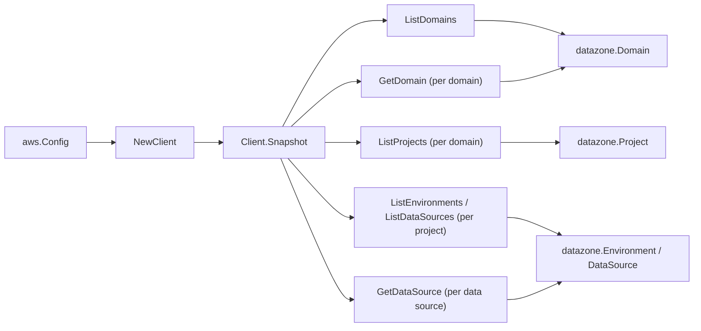

# Amazon DataZone SDK Adapter

## Purpose

`internal/collector/awscloud/services/datazone/awssdk` adapts AWS SDK for Go v2
DataZone responses to the scanner-owned `Client` contract. It owns domain
pagination, the per-domain GetDomain describe read, per-domain project
pagination, per-project environment and data source pagination, the
per-data-source GetDataSource describe read, resource-tag reads, throttle
classification, and per-call AWS API telemetry.

## Ownership boundary

This package owns SDK calls for DataZone. It does not own workflow claims,
credential acquisition, DataZone fact selection, graph writes, reducer
admission, or query behavior.

## Exported surface

See `doc.go` for the godoc contract.

- `Client` - AWS SDK-backed implementation of `datazone.Client`.
- `NewClient` - builds a `Client` for one claimed AWS boundary.

## Dependencies

- `internal/collector/awscloud` for account, region, and service boundary
  labels.
- `internal/collector/awscloud/services/datazone` for scanner-owned result
  types.
- `internal/telemetry` for AWS API call and throttle instruments.
- AWS SDK for Go v2 `datazone` and Smithy error contracts.

## Telemetry

DataZone paginator pages and point reads are wrapped with:

- `aws.service.pagination.page`
- `eshu_dp_aws_api_calls_total`
- `eshu_dp_aws_throttle_total`

Metric labels stay bounded to service, account, region, operation, and result.
DataZone ARNs, names, tags, and raw AWS error payloads stay out of metric
labels.

## Gotchas / invariants

- The adapter reads metadata only. It must never call `GetAsset`, `GetGlossary`,
  `GetGlossaryTerm`, `GetListing`, `GetSubscription`, the time-series or lineage
  reads, or any `Create*`, `Update*`, `Delete*`, `Accept*`, `Reject*`, or other
  mutation API. Only `GetDomain` and `GetDataSource` describe reads are used; the
  exclusion test fails the build if any other `Get`, content, or mutation method
  reaches the interface.
- `GetDataSource` is read only to recover the parent project id and the
  backing-store names (Glue database names, provisioned Redshift cluster name and
  its account/region). The adapter copies no relational filter expressions and no
  access credentials.
- Redshift Serverless workgroups are intentionally not copied: their published
  node ARN cannot be synthesized from the workgroup name, so the scanner skips
  rather than dangles the edge.
- `ListTagsForResource` is a metadata read; DataZone tags carry no governed
  content.
- SDK adapters translate AWS records into scanner-owned types; scanner tests
  should not mock AWS SDK pagination.

## Related docs

- `docs/public/services/collector-aws-cloud-scanners.md`
- `docs/public/services/collector-aws-cloud-security.md`
