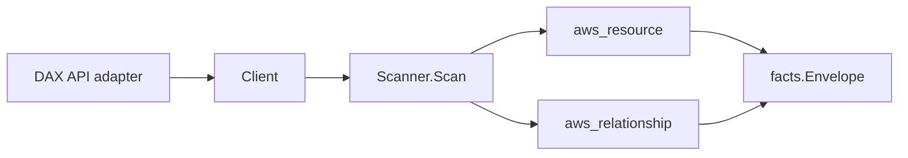

# AWS DAX Scanner

## Purpose

`internal/collector/awscloud/services/dax` owns the Amazon DynamoDB Accelerator
(DAX) scanner contract for the AWS cloud collector. It converts cluster, subnet
group, and parameter group metadata into `aws_resource` facts and emits
relationship evidence for cluster-to-subnet-group, cluster-to-security-group,
cluster-to-IAM-role, subnet-group-to-VPC, and subnet-group-to-subnet edges. DAX
is the in-memory accelerator in front of DynamoDB, so the package mirrors the
MemoryDB scanner shape.

## Ownership boundary

This package owns scanner-level DAX fact selection and identity mapping. It does
not own AWS SDK pagination, STS credentials, workflow claims, fact persistence,
graph writes, reducer admission, or query behavior.

## Exported surface

See `doc.go` for the godoc contract.

- `Client` - minimal DAX metadata read surface consumed by `Scanner`.
- `Scanner` - emits cluster, subnet group, and parameter group facts for one
  boundary.
- `Cluster`, `SubnetGroup`, `ParameterGroup` - scanner-owned metadata-only views
  with cached item data, query results, node endpoint payloads, and parameter
  values intentionally omitted.

## Dependencies

- `internal/collector/awscloud` for boundaries, resource constants,
  relationship constants, and envelope builders.
- `internal/facts` for emitted fact envelope kinds.

The package depends on a small `Client` interface rather than the AWS SDK for
Go v2 so tests can use fake clients and runtime adapters can own SDK behavior.

## Telemetry

This scanner emits no spans or logs directly. `awsruntime.ClaimedSource`
records scan duration and emitted resource counts after `Scanner.Scan` returns;
`eshu_dp_aws_resources_emitted_total{service="dax"}` covers each new resource
type. The `awssdk` adapter records DAX API call counts, throttles, and
pagination spans.

## Gotchas / invariants

- DAX facts are metadata only. The scanner must not call CreateCluster,
  DeleteCluster, UpdateCluster, IncreaseReplicationFactor,
  DecreaseReplicationFactor, RebootNode, or any mutation/data API.
- Cached DynamoDB item data, query results, and node endpoint payloads are never
  read or persisted. The discovery endpoint address is plain connection metadata,
  not a secret.
- DAX subnet groups and parameter groups have no ARN, so both are keyed by name.
  The cluster prefers its ARN as resource_id and falls back to its name.
- DAX does not report a server-side-encryption KMS key ARN through
  DescribeClusters. The scanner records only the SSE status and never synthesizes
  a `kms_key_id`, `kms_key_arn`, or a cluster-to-KMS edge. Do not invent one.
- A DAX cluster does not name a DynamoDB table, so the scanner emits no
  cluster-to-table edge.
- VPC and member-subnet edges originate from the subnet group resource (keyed by
  the subnet group name), not the cluster. The cluster owns the subnet-group,
  security-group, and IAM-role edges.
- Edge targets match the publishing scanner's resource_id: subnet group by name,
  bare VPC/subnet/security-group ids (vpc-/subnet-/sg-), and the IAM role ARN.
- Parameter group facts persist name and description only; individual parameter
  values are never fetched (DescribeParameters is not called).
- Tags are raw AWS tag evidence. Do not infer environment, owner, workload, or
  deployable-unit truth from tags in this package.

## Evidence

Collector Performance Evidence:
`go test ./internal/collector/awscloud/services/dax/...` covers the bounded DAX
metadata path: one paginated DescribeClusters stream, one paginated
DescribeSubnetGroups stream, one paginated DescribeParameterGroups stream, one
ListTags read per cluster ARN, no mutation calls, and no graph writes in the
collector.

No-Regression Evidence: metadata-only control-plane scanner; new read path, no
change to existing hot paths. `go test ./internal/collector/awscloud/services/dax/...` green.

No-Observability-Change: reuses shared AWS pagination span + API-call/throttle counters; no telemetry contract change.

Collector Observability Evidence: DAX uses the existing AWS collector
`aws.service.pagination.page` span plus `eshu_dp_aws_api_calls_total`,
`eshu_dp_aws_throttle_total`, `eshu_dp_aws_resources_emitted_total`,
`eshu_dp_aws_relationships_emitted_total`, and `aws_scan_status` rows. Metric
labels stay bounded to service, account, region, operation, result, and status.
DAX ARNs, cluster names, subnet/parameter group names, endpoint addresses, and
tags stay out of metric labels.

Collector Deployment Evidence: DAX runs inside the existing hosted
`collector-aws-cloud` runtime, so `/healthz`, `/readyz`, `/metrics`, and
`/admin/status` stay covered by the command wiring and Helm collector runtime.

## Related docs

- `docs/public/services/collector-aws-cloud.md`
- `docs/public/services/collector-aws-cloud-scanners.md`
- `docs/public/services/collector-aws-cloud-security.md`
- `docs/public/guides/collector-authoring.md`
