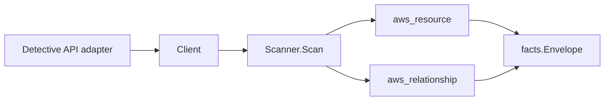

# AWS Detective Scanner

## Purpose

`internal/collector/awscloud/services/detective` owns the Amazon Detective
scanner contract for the AWS cloud collector. It converts behavior graph
metadata and graph member-account metadata into `aws_resource` facts and emits
relationship evidence for graph membership and the GuardDuty data source.

Detective is a security-investigation service. This scanner is deliberately
narrow: it reports who is enrolled in which behavior graph, not what those
graphs found. Investigations, finding groups, indicators, and usage volume stay
outside the contract.

## Ownership boundary

This package owns scanner-level Detective fact selection and identity mapping.
It does not own AWS SDK pagination, STS credentials, workflow claims, fact
persistence, graph writes, reducer admission, or query behavior.

## Exported surface

See `doc.go` for the godoc contract.

- `Client` - minimal Detective metadata read surface (`ListGraphs`,
  `ListMembers`, `ListTags`) consumed by `Scanner`.
- `Scanner` - emits behavior graph and member-account resources plus their
  relationships for one boundary.
- `Graph`, `MemberAccount` - scanner-owned views with investigation,
  indicator, usage-volume, and member-email fields intentionally omitted.

## Dependencies

- `internal/collector/awscloud` for boundaries, resource constants,
  relationship constants, and envelope builders.
- `internal/facts` for emitted fact envelope kinds.

The package depends on a small `Client` interface rather than the AWS SDK for
Go v2 so tests can use fake clients and the runtime adapter can own SDK
behavior.

## Telemetry

This scanner emits no spans or logs directly. `awsruntime.ClaimedSource`
records scan duration and emitted resource counts after `Scanner.Scan` returns.
The `awssdk` adapter records Detective API call counts, throttles, and
pagination spans.

## Gotchas / invariants

- Detective facts are metadata only. The scanner must not read investigations,
  indicators, finding groups, or per-member usage volume, and it must not
  mutate any Detective resource (no Create/Delete/Update graph or member,
  no tag mutation, no invitation or organization-admin mutation).
- A member account's contact email (`MemberDetail.EmailAddress`) is personal
  data and is never read into the scanner-owned `MemberAccount` type; the
  reflection gate in `awssdk/client_test.go` proves the type cannot carry it.
- The behavior graph ARN is both the graph node's ARN and its `resource_id`.
  Every outgoing edge is sourced on that same ARN, so the graph's edges join
  the graph node it publishes rather than dangling.
- Graph ARNs are passed through unchanged from the API, so a synthesized
  identity inherits the graph's partition (`aws`, `aws-us-gov`, `aws-cn`)
  instead of hardcoding one.
- The graph-to-member-account edge targets `aws_organizations_account` by the
  bare 12-digit account id, which is exactly the `resource_id` the
  organizations scanner publishes for an account, so the edge joins org
  context.
- The graph-to-GuardDuty-detector edge targets `aws_guardduty_detector` by the
  bare detector id, which is exactly the `resource_id` the guardduty scanner
  publishes. Detective's metadata APIs never report a detector id, so the edge
  is emitted only when a resolver supplies one on `Graph.GuardDutyDetectorID`;
  a blank id yields no edge, never a fabricated one, so the edge can never
  dangle. The `DETECTIVE_CORE` data-source package (which ingests GuardDuty) is
  still recorded as a `sources_guardduty_data` graph attribute so the GuardDuty
  relationship is an honest, resolvable signal rather than a guess.
- Member-account `resource_id` is keyed on the graph ARN and account id, never
  on Detective's list order, so identity is stable across scans.

## Evidence

Collector Performance Evidence:
`go test ./internal/collector/awscloud/services/detective/...` covers the
bounded Detective metadata path: one paginated `ListGraphs` stream, one
paginated `ListMembers` stream per graph, one `ListTagsForResource` point read
per graph, no investigation/indicator reads, no mutations, and no graph writes
in the collector.

No-Regression Evidence:
`go test ./internal/collector/awscloud/services/detective/... ./internal/collector/awscloud/internal/relguard/... ./cmd/collector-aws-cloud/... -count=1`
covers behavior graph and member-account metadata fact emission, the
graph-to-member-account edge (targets `aws_organizations_account` by bare
account id), the graph-to-GuardDuty-detector edge (targets
`aws_guardduty_detector` by bare detector id, emitted only when resolvable and
omitted otherwise), metadata-only attribute assertions, stable member
`resource_id` across list order, the scanner-port and SDK-adapter reflection
exclusion gates, the `relguard` runtime graph-join contract, the live-tree
`relguard` static guard, runtime registration, and command configuration.

No-Observability-Change: this scanner reuses the existing AWS collector
telemetry contract (`aws.service.scan`, `aws.service.pagination.page`,
`eshu_dp_aws_api_calls_total`, `eshu_dp_aws_throttle_total`,
`eshu_dp_aws_resources_emitted_total`, `eshu_dp_aws_relationships_emitted_total`,
and `aws_scan_status` rows). It adds no new instrument, span, metric label, or
status row. Metric labels stay bounded to service, account, region, operation,
result, and status; graph ARNs, detector ids, account ids, and tags never enter
metric labels.

Collector Deployment Evidence: Detective runs inside the existing hosted
`collector-aws-cloud` runtime, so `/healthz`, `/readyz`, `/metrics`, and
`/admin/status` stay covered by the command wiring and Helm collector runtime.

## Related docs

- `docs/public/services/collector-aws-cloud.md`
- `docs/public/services/collector-aws-cloud-scanners.md`
- `docs/public/services/collector-aws-cloud-security.md`
