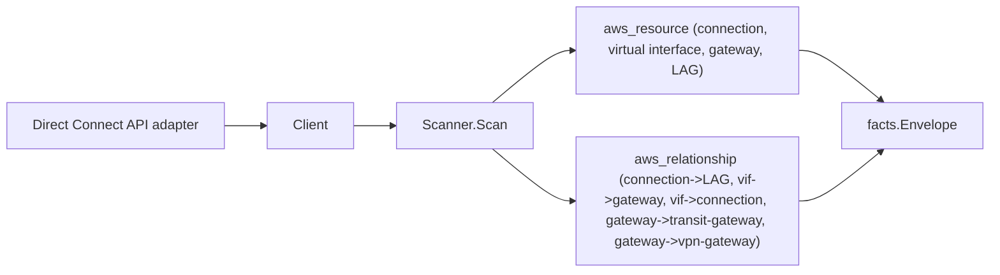

# AWS Direct Connect Scanner

## Purpose

`internal/collector/awscloud/services/directconnect` owns the Direct Connect
scanner contract for the AWS cloud collector. It converts connection, virtual
interface, Direct Connect gateway, and link aggregation group (LAG) metadata
into `aws_resource` facts and emits `aws_relationship` facts for the
hybrid-networking edges Direct Connect reports directly.

## Ownership boundary

This package owns scanner-level Direct Connect fact selection and identity
mapping. It does not own AWS SDK pagination, STS credentials, workflow claims,
fact persistence, graph writes, reducer admission, or query behavior. The
transitgateway and vpc scanners own the transit gateway and virtual private
gateway nodes this scanner only references as relationship targets.

## Exported surface

See `doc.go` for the godoc contract.

- `Client` - metadata-only Direct Connect read surface consumed by `Scanner`.
  All methods are `List*` reads; the interface excludes every mutation API.
- `Scanner` - emits Direct Connect metadata facts for one boundary. Needs no
  redaction key.
- `Connection`, `VirtualInterface`, `Gateway`, `LAG`, `GatewayAssociation` -
  scanner-owned Direct Connect records. `VirtualInterface` has no field for the
  BGP auth key; `Connection` and `LAG` have no field for MACsec key material.

## Dependencies

- `internal/collector/awscloud` for boundaries, resource constants,
  relationship constants, and envelope builders.
- `internal/facts` for emitted fact envelope kinds.

The package depends on a small `Client` interface rather than the AWS SDK for
Go v2 so tests can use fake clients and runtime adapters can own SDK behavior.

## Telemetry

This scanner emits no spans or logs directly. `awsruntime.ClaimedSource`
records scan duration and emitted resource counts after `Scanner.Scan` returns
(`eshu_dp_aws_resources_emitted_total{service="directconnect"}`). The `awssdk`
adapter records Direct Connect API call counts, throttles, and pagination spans.

## Gotchas / invariants

- Direct Connect facts are metadata only. The scanner must never read or persist
  the BGP authentication key (`authKey`) on a virtual interface or BGP peer, and
  must never persist MACsec connectivity association key names (CKN) or secret
  ARNs on connections or LAGs. The scanner-owned types have no fields for those,
  and the SDK adapter never calls `DescribeRouterConfiguration` (which renders
  the auth key into the returned router config).
- Relationships always set a non-empty `target_type`. The Direct Connect gateway
  resource uses `resource_type = aws_direct_connect_gateway` and the bare
  gateway ID as `resource_id`, which is exactly the
  `transit_gateway_attachment_to_direct_connect_gateway` edge target the
  transitgateway scanner emits, so that edge resolves once this scanner runs.
  The gateway-to-transit-gateway edge targets `aws_ec2_transit_gateway` and the
  gateway-to-virtual-private-gateway edge targets `aws_vpc_vpn_gateway`, both by
  bare AWS-reported ID.
- A gateway association whose associated gateway type is neither
  `transitGateway` nor `virtualPrivateGateway` emits no edge rather than a
  fabricated typed target.
- No `arn:aws:` partition is hardcoded; the scanner keys edges on bare AWS
  resource IDs, not synthesized ARNs.
- Tags are raw AWS tag evidence. Do not infer environment, owner, workload, or
  deployable-unit truth from tags in this package.

## Evidence

Collector Performance Evidence:
`go test ./internal/collector/awscloud/services/directconnect/... -count=1 -race`
covers the bounded Direct Connect metadata path: one NextToken loop each over
`DescribeConnections`, `DescribeLags`, `DescribeDirectConnectGateways`,
`DescribeVirtualInterfaces`, and `DescribeDirectConnectGatewayAssociations`; no
per-resource Describe fan-out; no mutations; no `DescribeRouterConfiguration`.
Cardinality is bounded by the connection, virtual interface, gateway, LAG, and
association counts Direct Connect returns for the claimed account and region.

No-Regression Evidence:
`go test ./cmd/collector-aws-cloud/... ./internal/collector/awscloud/awsruntime/... -count=1`
covers Direct Connect resource and relationship emission, the
`aws_direct_connect_gateway` join key that closes the transit-gateway edge,
gateway-to-transit-gateway and gateway-to-virtual-private-gateway association
edges, the read-only Client and SDK adapter exclusion guards (authKey and MACsec
key material never mapped), runtime registration through the derived service
guard, and command configuration not requiring a redaction key.

Collector Observability Evidence: Direct Connect uses the existing AWS collector
`aws.service.pagination.page` span plus `eshu_dp_aws_api_calls_total`,
`eshu_dp_aws_throttle_total`, `eshu_dp_aws_resources_emitted_total`,
`eshu_dp_aws_relationships_emitted_total`, and `aws_scan_status` rows. Metric
labels stay bounded to service, account, region, operation, result, and status.

No-Observability-Change: Direct Connect adds no new telemetry contract. The
existing AWS collector signals already diagnose Direct Connect scans through the
`aws.service.scan` and `aws.service.pagination.page` spans,
`eshu_dp_aws_api_calls_total`, `eshu_dp_aws_throttle_total`,
`eshu_dp_aws_resources_emitted_total{service="directconnect"}`,
`eshu_dp_aws_relationships_emitted_total{service="directconnect"}`, and
`aws_scan_status` rows. Direct Connect only adds the bounded
`service="directconnect"` label value to those existing instruments.

Collector Deployment Evidence: Direct Connect runs inside the existing hosted
`collector-aws-cloud` runtime, so `/healthz`, `/readyz`, `/metrics`, and
`/admin/status` stay covered by the command wiring and Helm collector runtime.

## Related docs

- `docs/public/services/collector-aws-cloud-scanners.md`
- `docs/public/guides/collector-authoring.md`
