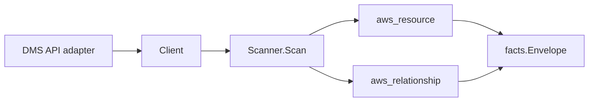

# AWS Database Migration Service Scanner

## Purpose

`internal/collector/awscloud/services/dms` owns the AWS Database Migration
Service (DMS) scanner contract for the AWS cloud collector. It converts DMS
replication instance, replication subnet group, endpoint, and replication task
metadata into `aws_resource` facts and emits relationship evidence for instance
placement, KMS encryption keys, subnet-group network membership, endpoint
data-store targets, and task endpoint/instance references.

## Ownership boundary

This package owns scanner-level DMS fact selection and identity mapping. It does
not own AWS SDK pagination, STS credentials, workflow claims, fact persistence,
graph writes, reducer admission, or query behavior.

## Exported surface

See `doc.go` for the godoc contract.

- `Client` - minimal DMS metadata read surface consumed by `Scanner`.
- `Scanner` - emits replication instance, subnet group, endpoint, and task
  resources plus their relationships for one boundary.
- `Snapshot`, `ReplicationInstance`, `ReplicationSubnetGroup`, `Endpoint`,
  `ReplicationTask` - scanner-owned views with credential, password, server-name,
  connection-attribute, SSL-key, external-table-definition, task-settings, and
  table-mapping fields intentionally absent.

## Dependencies

- `internal/collector/awscloud` for boundaries, resource constants,
  relationship constants, partition helpers, and envelope builders.
- `internal/facts` for emitted fact envelope kinds.

The package depends on a small `Client` interface rather than the AWS SDK for
Go v2 so tests can use fake clients and the runtime adapter can own SDK
behavior.

## Telemetry

This scanner emits no spans or logs directly. `awsruntime.ClaimedSource`
records scan duration and emitted resource counts after `Scanner.Scan` returns.
The `awssdk` adapter records DMS API call counts, throttles, and pagination
spans.

## Gotchas / invariants

- DMS facts are metadata only. The scanner must never read migrated rows,
  endpoint connection credentials, passwords, server names used as credentials,
  connection attributes, SSL key material, external table definitions, task
  settings, or table-mapping bodies, and must never call any mutation, start,
  stop, test-connection, or schema-refresh API.
- A replication instance publishes its resource_id as the instance ARN (falling
  back to the customer identifier). The task runs-on-instance edge is keyed by
  the instance ARN the task reports, which matches the instance node.
- An endpoint publishes its resource_id as the endpoint ARN (falling back to the
  customer identifier). The task source/target endpoint edges are keyed by the
  endpoint ARN the task reports.
- A replication subnet group publishes its resource_id as the subnet-group
  identifier (DMS reports no subnet-group ARN), and the instance
  in-subnet-group edge is keyed by that same identifier.
- Instance-to-subnet, instance-to-security-group, subnet-group-to-VPC, and
  subnet-group-to-subnet edges are keyed by the bare AWS id (`subnet-…`,
  `sg-…`, `vpc-…`) the EC2 scanner publishes.
- Instance-to-KMS and endpoint-to-KMS edges are emitted only when AWS reports a
  key identifier; `target_arn` is set only for ARN-shaped identifiers, matching
  the KMS scanner's published key resource_id.
- The endpoint-to-S3 edge is emitted only when an S3 endpoint reports a bucket
  name. DMS reports a bucket NAME, so the scanner synthesizes the
  partition-aware bucket ARN (`arn:<partition>:s3:::<bucket>`) via
  `awscloud.PartitionForBoundary` to match the S3 scanner's published bucket
  node identity in GovCloud and China, not just commercial.
- The endpoint-to-Kinesis and endpoint-to-secret edges are emitted only when DMS
  reports a resolvable stream ARN or secret reference, so an endpoint to an
  unresolvable data store never dangles. RDS and Redshift endpoint targets are
  not emitted: DMS reports only a server hostname (RDS) or S3 staging config
  (Redshift), neither of which resolves to the target scanner's published
  resource_id.
- Emit reported evidence only. Do not infer deployment, workload, repository
  ownership, environment, or deployable-unit truth from instance, endpoint,
  task, or subnet-group names, or AWS tags.

## Evidence

Collector Performance Evidence:
`go test ./internal/collector/awscloud/services/dms/...` covers the bounded DMS
metadata path: one paginated DescribeReplicationSubnetGroups stream, one
paginated DescribeReplicationInstances stream, one paginated DescribeEndpoints
stream, one paginated DescribeReplicationTasks stream, one ListTagsForResource
point read per tagged resource, no migrated-row reads, no test-connection calls,
no mutations, and no graph writes in the collector.

No-Regression Evidence: metadata-only control-plane scanner; new read path, no
change to existing hot paths. `go test ./internal/collector/awscloud/services/dms/...` green.

No-Observability-Change: reuses shared AWS pagination span + API-call/throttle counters; no telemetry contract change.

Collector Deployment Evidence: DMS runs inside the existing hosted
`collector-aws-cloud` runtime, so `/healthz`, `/readyz`, `/metrics`, and
`/admin/status` stay covered by the command wiring and Helm collector runtime.

## Related docs

- `docs/public/services/collector-aws-cloud.md`
- `docs/public/services/collector-aws-cloud-scanners.md`
- `docs/public/services/collector-aws-cloud-security.md`
