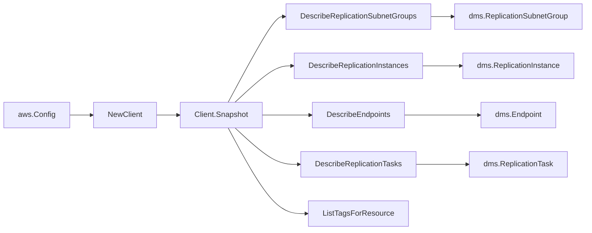

# AWS Database Migration Service SDK Adapter

## Purpose

`internal/collector/awscloud/services/dms/awssdk` adapts AWS SDK for Go v2 DMS
responses to the scanner-owned `Client` contract. It owns replication instance,
subnet group, endpoint, and replication task pagination, resource-tag reads,
throttle classification, and per-call AWS API telemetry.

## Ownership boundary

This package owns SDK calls for DMS. It does not own workflow claims, credential
acquisition, DMS fact selection, graph writes, reducer admission, or query
behavior.

## Exported surface

See `doc.go` for the godoc contract.

- `Client` - AWS SDK-backed implementation of `dms.Client`.
- `NewClient` - builds a `Client` for one claimed AWS boundary.

## Dependencies

- `internal/collector/awscloud` for account, region, and service boundary
  labels.
- `internal/collector/awscloud/services/dms` for scanner-owned result types.
- `internal/telemetry` for AWS API call and throttle instruments.
- AWS SDK for Go v2 `databasemigrationservice` and Smithy error contracts.

## Telemetry

DMS paginator pages and point reads are wrapped with:

- `aws.service.pagination.page`
- `eshu_dp_aws_api_calls_total`
- `eshu_dp_aws_throttle_total`

Metric labels stay bounded to service, account, region, operation, and result.
DMS resource ARNs, names, tags, and raw AWS error payloads stay out of metric
labels.

## Gotchas / invariants

- DMS list APIs paginate with a `Marker` token (not `NextToken`). Page each
  describe stream to exhaustion until the returned `Marker` is empty.
- The adapter reads metadata only. It must never call `TestConnection`,
  `RefreshSchemas`, `ReloadTables`, `ReloadReplicationTables`,
  `DescribeTableStatistics`, `DescribeReplicationTableStatistics`,
  `StartReplicationTask`, `StopReplicationTask`, any assessment-run API, or any
  `Create*`, `Modify*`, `Delete*`, `Move*`, or `Reboot*` mutation API.
- An endpoint's data-store and secret references are read from whichever
  engine-specific settings struct is populated. The adapter records only the S3
  bucket name, the Kinesis stream ARN, and the Secrets Manager secret id; it
  never reads the secret value, server name (a credential), username, password,
  connection attributes, external table definition, or SSL key material.
- A replication instance inherits its VPC id and member subnet ids from its
  embedded subnet group, falling back to the indexed subnet group when the
  embedded copy omits them, so the instance's subnet and VPC edges resolve.
- `ListTagsForResource` is a metadata read; DMS tags carry no migrated-row
  content.
- SDK adapters translate AWS records into scanner-owned types; scanner tests
  should not mock AWS SDK pagination.

## Related docs

- `docs/public/services/collector-aws-cloud-scanners.md`
- `docs/public/services/collector-aws-cloud-security.md`
