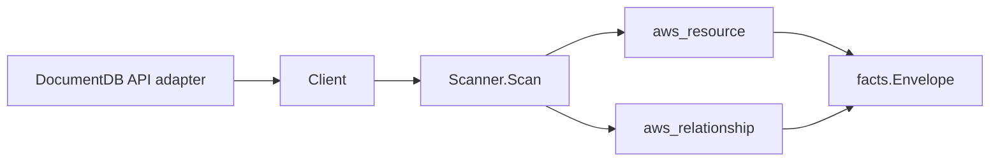

# AWS DocumentDB Scanner

## Purpose

`internal/collector/awscloud/services/docdb` owns the Amazon DocumentDB scanner
contract for the AWS cloud collector. It converts DocumentDB control-plane
metadata into `aws_resource` facts for DB clusters, cluster instances, cluster
parameter groups, cluster snapshots, subnet groups, global clusters, and event
subscriptions, and emits relationship evidence for the dependencies DocumentDB
directly reports. DocumentDB is RDS-shaped; this scanner mirrors the RDS
scanner pattern.

## Ownership boundary

This package owns scanner-level DocumentDB fact selection and identity mapping.
It does not own AWS SDK pagination, STS credentials, workflow claims, fact
persistence, graph writes, reducer admission, workload ownership, or query
behavior.

## Exported surface

See `doc.go` for the godoc contract.

- `Client` - minimal DocumentDB metadata read surface consumed by `Scanner`.
  Its method set is the only path to the DocumentDB API and is asserted by
  `contract_test.go` to exclude every mutation and data-plane call.
- `Scanner` - emits cluster, instance, parameter group, snapshot, subnet group,
  global cluster, event subscription, and direct relationship facts for one
  boundary.
- `DBCluster`, `ClusterInstance`, `ClusterParameterGroup`, `ClusterSnapshot`,
  `SubnetGroup`, `GlobalCluster`, and `EventSubscription` - scanner-owned
  metadata-only resource representations.
- `ClusterMember` and `GlobalClusterMember` - reported DocumentDB membership
  details.

## Resources and relationships

Resources: `aws_docdb_db_cluster`, `aws_docdb_db_instance`,
`aws_docdb_db_cluster_parameter_group`, `aws_docdb_db_cluster_snapshot`,
`aws_docdb_db_subnet_group`, `aws_docdb_global_cluster`,
`aws_docdb_event_subscription`.

Relationships: `docdb_db_cluster_in_vpc` (derived from the cluster's subnet
group VPC), `docdb_db_cluster_in_subnet_group`, `docdb_db_cluster_uses_kms_key`,
`docdb_db_instance_member_of_cluster`, and
`docdb_global_cluster_has_cluster`.

## Dependencies

- `internal/collector/awscloud` for boundaries, resource constants,
  relationship constants, and envelope builders.
- `internal/facts` for emitted fact envelope kinds.

The package depends on a small `Client` interface rather than the AWS SDK for Go
v2 so tests can use fake clients and runtime adapters can own SDK behavior.

## Telemetry

This scanner emits no spans or logs directly. `awsruntime.ClaimedSource`
records scan duration and emitted resource counts after `Scanner.Scan` returns;
`eshu_dp_aws_resources_emitted_total{service="docdb"}` carries the emitted
resource count. The `awssdk` adapter records DocumentDB API call counts,
throttles, and pagination spans.

## Gotchas / invariants

- DocumentDB facts are metadata only. The scanner must not connect to a
  cluster, read documents or collections, read snapshot contents, read cluster
  parameter values, or mutate any DocumentDB resource.
- Master user passwords, master user secrets, database document contents,
  collections, indexes, and cluster parameter values are never persisted.
  `DescribeDBClusters` reports `MasterUsername`; the scanner drops it. The
  password is never returned by the API and is never stored.
- Cluster parameter groups persist name, family, and parameter count only. The
  adapter counts parameters but never copies a parameter name or value into a
  fact.
- Cluster and instance endpoints are reported control-plane metadata, used only
  as resource attributes and correlation anchors, never as metric labels.
- The cluster-to-VPC edge is derived from the cluster's DB subnet group VPC,
  because `DescribeDBClusters` does not report a VPC directly.
- Global clusters and event subscriptions are region-scoped reads in this
  slice; cross-region global cluster membership is reported join evidence by
  DB cluster ARN. Correlation belongs in reducers.
- Tags are raw AWS tag evidence. Do not infer environment, owner, workload,
  repository, or deployable-unit truth from tags in this package.

## Evidence

Collector Performance Evidence: `go test
./internal/collector/awscloud/services/docdb/...` covers the bounded
DocumentDB metadata path: paginated DescribeDBClusters, DescribeDBInstances,
DescribeDBClusterParameterGroups, DescribeDBClusterParameters (counted, never
persisted), DescribeDBClusterSnapshots, DescribeDBSubnetGroups,
DescribeGlobalClusters, DescribeEventSubscriptions, and ListTagsForResource for
ARN-addressable DocumentDB resources. Every describe call sets
`MaxRecords=100` and follows `Marker` pagination, so per-account/region API
fan-out is bounded by resource count, not unbounded. No database connections,
document reads, snapshot content reads, parameter-value reads, mutations, or
graph writes occur in the collector.

No-Regression Evidence: `go test ./cmd/collector-aws-cloud
./internal/collector/awscloud/...` covers DocumentDB metadata fact emission,
direct relationship emission, omission of password/secret/document/parameter-
value fields, runtime registration, command configuration, and the SDK
adapter's safe metadata mapping. The DocumentDB scanner adds a new bounded
metadata read path and does not change any existing scanner, reducer, queue,
or graph-write hot path.

Collector Observability Evidence: DocumentDB uses the existing AWS collector
`aws.service.pagination.page` span plus `eshu_dp_aws_api_calls_total`,
`eshu_dp_aws_throttle_total`, `eshu_dp_aws_resources_emitted_total`,
`eshu_dp_aws_relationships_emitted_total`, and `aws_scan_status` rows. Metric
labels stay bounded to service, account, region, operation, result, and status.
An operator diagnoses a slow or failing DocumentDB scan from the per-operation
API call counter and throttle counter labeled `service="docdb"`.

Collector Deployment Evidence: DocumentDB runs inside the existing hosted
`collector-aws-cloud` runtime, so `/healthz`, `/readyz`, `/metrics`, and
`/admin/status` stay covered by the command wiring and Helm collector runtime.

## Related docs

- `docs/public/services/collector-aws-cloud-scanners.md`
- `docs/public/services/collector-aws-cloud.md`
- `docs/public/guides/collector-authoring.md`
