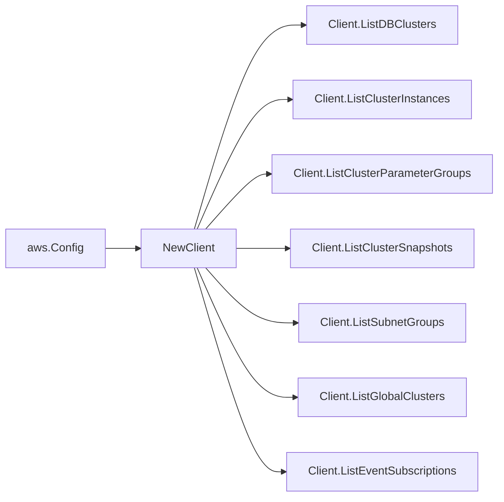

# AWS DocumentDB SDK Adapter

## Purpose

`internal/collector/awscloud/services/docdb/awssdk` adapts AWS SDK for Go v2
DocumentDB responses to the scanner-owned `Client` contract. It owns
DocumentDB pagination, resource tag reads, parameter counting, throttle
classification, and per-call AWS API telemetry.

## Ownership boundary

This package owns SDK calls for DocumentDB. It does not own workflow claims,
credential acquisition, DocumentDB fact selection, graph writes, reducer
admission, workload ownership, or query behavior.

## Exported surface

See `doc.go` for the godoc contract.

- `Client` - AWS SDK-backed implementation of `docdb.Client`.
- `NewClient` - builds a `Client` for one claimed AWS boundary.

## Dependencies

- `internal/collector/awscloud` for account, region, and service boundary
  labels.
- `internal/collector/awscloud/services/docdb` for scanner-owned result types.
- `internal/telemetry` for AWS API call and throttle instruments.
- AWS SDK for Go v2 `docdb` and Smithy error contracts.

## Telemetry

DocumentDB list pages, parameter counts, and tag reads are wrapped with:

- `aws.service.pagination.page`
- `eshu_dp_aws_api_calls_total`
- `eshu_dp_aws_throttle_total`

Metric labels stay bounded to service, account, region, operation, and result.
DocumentDB ARNs, endpoints, tags, KMS key IDs, subnet group names, parameter
names/values, and raw AWS error payloads stay out of metric labels.

## Gotchas / invariants

- The adapter calls only `DescribeDBClusters`, `DescribeDBInstances`,
  `DescribeDBClusterParameterGroups`, `DescribeDBClusterParameters`,
  `DescribeDBClusterSnapshots`, `DescribeDBSubnetGroups`,
  `DescribeGlobalClusters`, `DescribeEventSubscriptions`, and
  `ListTagsForResource`.
- `DescribeDBClusterParameters` is called only to count parameters. No
  parameter name or value is ever copied into a scanner result; the adapter
  returns the count alone.
- Describe calls set `MaxRecords=100`, the documented maximum, and follow
  DocumentDB `Marker` pagination.
- `ListTagsForResource` is called only when AWS returned an ARN. Global
  clusters carry an inline `TagList`, so the adapter does not issue a separate
  tag call for them.
- The adapter maps safe control-plane fields and drops master usernames, master
  user secrets, database document contents, and snapshot contents.
- The adapter must not call DocumentDB mutation APIs (Create/Delete/Modify/
  Restore/Failover/Reboot), snapshot-write APIs, or any data-plane access.

## Related docs

- `docs/public/services/collector-aws-cloud-scanners.md`
- `docs/public/services/collector-aws-cloud.md`
- `docs/public/guides/collector-authoring.md`
